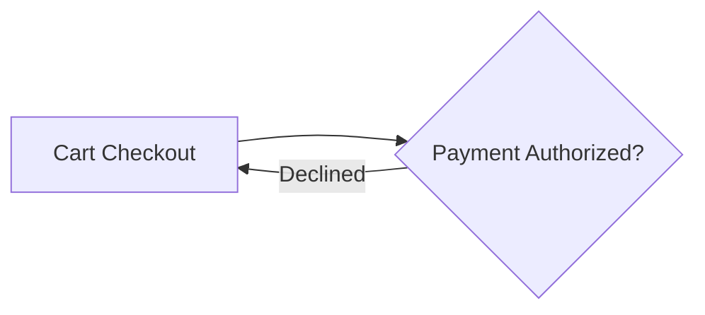

# FlowMaker

Turns a markdown file containing a mermaid flowchart plus per-step detail
sections into a styled, animated, self-contained HTML flow diagram.

Built for horizontal flows that have to read from across a trade-show floor and
still work on a phone. Zero dependencies: no npm packages, no CDN, no web fonts,
no network requests at runtime.

## Run it

```bash
node server.js                 # http://localhost:8321
node --test 'test/*.test.js'   # 105 tests, no devDependencies
node build.js                  # dist/ — one self-contained file, opens by double-click
```

`dist/` is generated and not committed. `build.js` writes `dist/flowmaker.html`
(and an identical `dist/index.html`, which is what gets deployed). The bundle
embeds all five samples, so the hosted site is that single file and nothing else.

## Deploying

The repo is a static site with no framework. `vercel.json` already pins the
settings, so the Vercel dashboard preset does not matter:

```json
{ "framework": null, "buildCommand": "node build.js", "outputDirectory": "dist" }
```

## The document format

```markdown
---
title: Order Processing
subtitle: From cart to fulfillment
style: infographic       # neon-circuit | executive-clean | blueprint | soft-depth
                         # bold-brutal | infographic | accent-rail
palette: ember           # harbor | ember | forest | midnight
                         # slate | candy | mono | signal
direction: LR            # LR | RL | TD | BT
density: marquee         # marquee | standard | compact
---



## A — Cart Checkout
> This blockquote becomes the hover tooltip.

Everything after the blockquote becomes the click-through detail card. Lists,
tables, links, and code all render.
```

The mermaid block stays plain and portable, so the same file renders correctly
on GitHub and in VS Code preview. Node IDs are exact and case-sensitive; the
studio reports any section that matches no node, and any node with no section.

## What it does

- **Seven styles** — Neon Circuit, Executive Clean, Blueprint, Soft Depth,
  Bold Brutal, Infographic (outlined cards with ringed icons), and Accent Rail
  (quiet cards with a coloured bar down the leading edge). Any style composes
  with any palette.
- **Four-swatch palettes** — `c1` flow, `c2` decision, `c3` accent, `c4` alert.
  Surface and text tones are derived in OKLCH, so body text always clears 7:1
  against its background and node labels always clear 4.5:1.
- **Icons** — the Infographic style resolves an inline SVG icon per step from
  the label (`Capture Payment` → money, `Review Contract` → document), falling
  back to the mermaid shape, and sets it in a ring. Force one with
  `A:::icon-money`. No emoji, no icon fonts, no images.
- **Loop-backs read as loops** — a short cycle routes through a reserved gutter
  beneath the spine in the alert colour. A cycle spanning three or more ranks
  becomes a matching pair of lettered connectors instead, the way an off-page
  connector works on a flowchart, so the eye jumps rather than tracking a line
  back across everything in between.
- **Motion** — a traveling pulse along the edges, or a sequential walkthrough
  that lights each step in turn. Pulse also crawls the view along the flow.
  Hover, focus, or an open detail card freezes everything.
- **Present mode** — full-screen, no interface, just the flow, a restart button,
  and an × (or Esc). Entering it restarts the flow from the beginning.
- **Panels** — the diagram flips to a rendered reading view of the document; the
  editor holds the markdown, the mermaid on its own (edits splice back without
  touching frontmatter or detail sections), and the generated export.
- **Export** — one inline HTML file that re-runs layout on load, so the same
  file is correct on a 4K marquee and on a phone.

## Samples

`samples/` holds five complete flows: a linear spine with retry loops
(Order Processing), four subgraph lanes with cross-lane rework
(Product Development Lifecycle), fan-out with three terminal states
(Interviewing and Selection), compliance gates with resubmission cycles
(Customer Onboarding and KYC), and the heaviest loop-back case
(Incident Response).

## Layout

`src/parse.js` → `src/mermaid.js` → `src/layout.js` are pure, deterministic
functions with no DOM dependency, unit-tested under `node --test`. `render.js`
returns SVG markup as a string, which is why the studio preview and the exported
file cannot drift apart — they run the same renderer. `build.js` concatenates
the ES modules into one file with no build dependencies.
