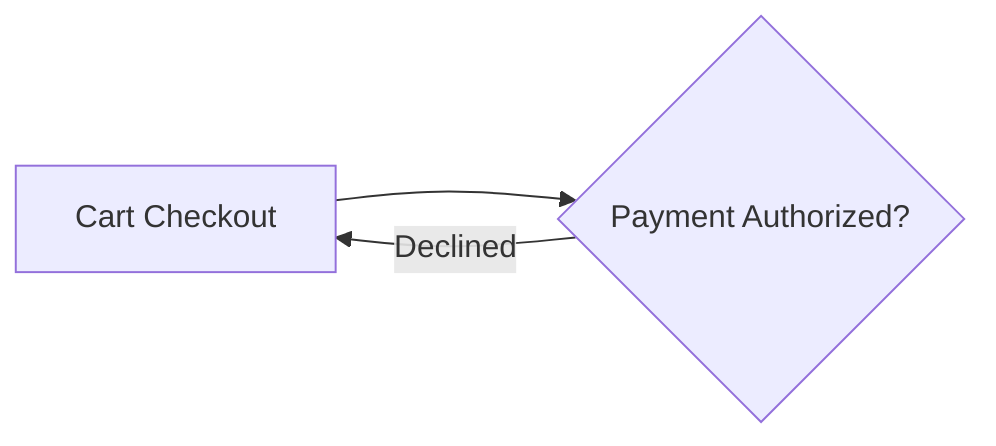

# FlowMaker

Turns a markdown file containing a mermaid flowchart plus per-step detail
sections into a styled, animated, self-contained HTML flow diagram.

Built for horizontal flows that have to read from across a trade-show floor and
still work on a phone. Zero dependencies: no npm packages, no CDN, no web fonts,
no network requests at runtime.

## Run it

```bash
node server.js                 # http://localhost:8321
node --test 'test/*.test.js'   # 246 tests, no devDependencies
node build.js                  # dist/ — one self-contained file, opens by double-click
```

`dist/` is generated and not committed. `build.js` writes `dist/flowmaker.html`
(and an identical `dist/index.html`, which is what gets deployed). The bundle
embeds every sample, so the hosted site is that single file and nothing else.

## Deploying

The repo is a static site with no framework. `vercel.json` already pins the
settings, so the Vercel dashboard preset does not matter:

```json
{ "framework": null, "buildCommand": "node build.js", "outputDirectory": "dist" }
```

## The document format

```markdown
---
title: Order Processing
subtitle: From cart to fulfillment
style: infographic       # neon-circuit | executive-clean | blueprint | soft-depth
                         # bold-brutal | infographic | accent-rail
palette: ember           # harbor | ember | forest | midnight
                         # slate | candy | mono | signal
direction: LR            # LR | RL | TD | BT
density: marquee         # marquee | standard | compact
loops: auto              # auto | line | wrap
layout: flow             # flow | tree (tree is an org chart: one box above each)
colorBy: type            # type | level | group | tag
---



## A — Cart Checkout
> This blockquote becomes the hover tooltip.

Everything after the blockquote becomes the click-through detail card. Lists,
tables, links, and code all render.
```

The mermaid block stays plain and portable, so the same file renders correctly
on GitHub and in VS Code preview. Node IDs are exact and case-sensitive; the
studio reports any section that matches no node, and any node with no section.

## What it does

- **Seven styles** — Neon Circuit, Executive Clean, Blueprint, Soft Depth,
  Bold Brutal, Infographic (outlined cards with ringed icons), and Accent Rail
  (quiet cards with a coloured bar down the leading edge). Any style composes
  with any palette.
- **Four-swatch palettes** — `c1` flow, `c2` decision, `c3` accent, `c4` alert.
  Surface and text tones are derived in OKLCH, so body text always clears 7:1
  against its background and node labels always clear 4.5:1.
- **Colour by node type, level, group, or tag** — the palette chooses the
  colours; `colorBy` chooses who wears which. `type` colours decisions and
  terminals apart (the default), `level` gives each rank or tier its own swatch
  (what an org chart wants), `group` gives each subgraph lane its own, and `tag`
  gives each category you name one — write `:::vp`, `:::contractor`, and every
  node carrying that tag matches, in the order the tags first appear. Pin a
  single node with `ESCALATE:::c4`, which beats every mode. Styles ask for
  `var(--tone)` and stay out of the decision, so the modes cost each style
  nothing.
- **Save as SVG** — one vector file with the palette, the style, and the pulse
  inlined, named after the diagram (`Order_Processing.svg`). No script, no
  network, no embedded fonts.
- **A detail card during the walkthrough** — as each step lights up, the detail
  a click would open is docked clear of it: a wide band below a left-to-right
  flow, a column beside a top-down one, flipping to the other side when the
  step itself is in the way. Hovering the card holds the walk while you read.
- **Icons** — the Infographic style resolves an inline SVG icon per step from
  the label (`Capture Payment` → money, `Review Contract` → document), falling
  back to the mermaid shape, and sets it in a ring. Force one with
  `A:::icon-money`. No emoji, no icon fonts, no images.
- **Org charts** — `layout: tree` arranges a reporting hierarchy instead of a
  flow: every box is hung over the midpoint of its first and last report, levels
  are sized by their tallest box, and lines run out, along a shared bus, and in.
  A chart that is not a hierarchy — a box reporting to two others, or a cycle —
  says which box broke it and falls back to the flow layout rather than drawing
  something wrong. Use `<br/>` in a label to put a name over a role.
- **Loop-backs read as loops** — a short cycle routes through a reserved gutter
  beneath the spine in the alert colour. A cycle spanning three or more ranks
  becomes a matching pair of lettered connectors instead, the way an off-page
  connector works on a flowchart, so the eye jumps rather than tracking a line
  back across everything in between. `loops` forces one or the other.
- **Motion** — a traveling pulse along the edges, or a sequential walkthrough
  that lights each step in turn. Pulse also crawls the view along the flow.
  Hover, focus, or an open detail card freezes everything.
- **Present mode** — full-screen, no interface, just the flow, a restart button,
  and an × (or Esc). Entering it restarts the flow from the beginning.
- **Copy prompt** — hands you a prompt to paste into an AI assistant. It
  explains this file format and tells the assistant to interview you first, for
  the steps, the decisions and their branch labels, what sends work backwards
  and to where, the phases, and each step's owner, target, and failure mode,
  before writing the file. The prompt is generated from the same constants the
  renderer uses, so it cannot drift when a style, palette, or icon is added.
- **The style themes the diagram, not the tool** — the style CSS is scoped to
  the diagram wrapper, so the studio's own chrome stays on a fixed neutral theme
  no matter which style or palette is selected.
- **Three views of the diagram** — the styled flow, a plain baseline in
  mermaid's default look, and a rendered reading view (the flow followed by every
  step's detail). The editor below holds the markdown, the mermaid on its own
  (edits splice back without touching frontmatter or detail sections), and the
  generated export.
- **Embed HTML** — the editor's third pane is a self-contained snippet: the
  diagram with every choice already applied, no toolbar and no script, for
  pasting inline into another document. Its styles are scoped to its own
  wrapper so they cannot reach the host page, step summaries become native
  browser tooltips, and the pulse runs on CSS alone. **Export HTML** still
  produces the full standalone page with controls.
- **Playback speed** — 0.5x, 1x, and 2x beside the zoom controls, scaling the
  crawl, the walkthrough, and the pulse together.
- **Auto-scroll loops** — the flow travels one way and comes round again with
  no reverse, no jump, and no dead time. The strip is flow, gap, title, gap,
  followed by that strip's own opening repeated for one viewport: scrolling
  exactly one strip length and resetting lands on identical pixels, so the wrap
  is invisible without reserving any blank runway. The loop opens on the title,
  positioned so the tail of the flow is not still showing behind it.
- **Walkthrough follows the view** — the active step is centred, and scrolling
  the canvas by hand moves the highlight to whatever you scrolled to and holds
  the auto-advance while you look around.
- **Export** — one inline HTML file that re-runs layout on load, so the same
  file is correct on a 4K marquee and on a phone.

## Samples

`samples/` holds five flows and one hierarchy: a linear spine with retry loops
(Order Processing), four subgraph lanes with cross-lane rework
(Product Development Lifecycle), fan-out with three terminal states
(Interviewing and Selection), compliance gates with resubmission cycles
(Customer Onboarding and KYC), and the heaviest loop-back case
(Incident Response), plus a twelve-box reporting hierarchy
(Engineering Organisation) for the tree layout.

## Layout

`src/parse.js` → `src/mermaid.js` → `src/layout.js` are pure, deterministic
functions with no DOM dependency, unit-tested under `node --test`. `render.js`
returns SVG markup as a string, which is why the studio preview and the exported
file cannot drift apart — they run the same renderer. `build.js` concatenates
the ES modules into one file with no build dependencies.
