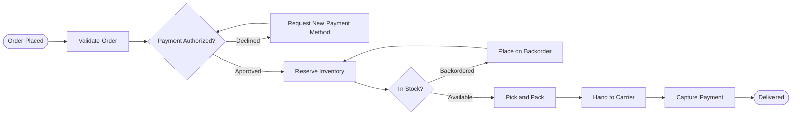

# FlowMaker Implementation Plan

> **For agentic workers:** REQUIRED SUB-SKILL: Use superpowers:subagent-driven-development (recommended) or superpowers:executing-plans to implement this plan task-by-task. Steps use checkbox (`- [ ]`) syntax for tracking.

**Goal:** Build a zero-dependency, single-file HTML studio that turns a markdown file containing a mermaid flowchart plus per-step detail sections into a styled, animated, self-contained HTML flow diagram.

**Architecture:** A pure-function core (`parse` -> `mermaid` -> `layout`) feeds a renderer and an interaction runtime. The same renderer and runtime code serves both the studio preview and the exported single file, so the two cannot diverge. Development uses real ES modules over a static server; `build.js` concatenates them into `dist/flowmaker.html`.

**Tech Stack:** Vanilla ES modules, SVG, CSS custom properties, `node --test`. **No runtime and no build dependencies whatsoever** — `package.json` has an empty `dependencies` and an empty `devDependencies`.

**Spec:** `docs/superpowers/specs/2026-08-27-flowmaker-design.md` — read it alongside this plan.

## Global Constraints

- **Zero dependencies.** No npm packages at runtime or build time. Node's built-in `node:test`, `node:assert/strict`, `node:fs`, and `node:http` only.
- **Node 20+** (for stable `node --test` with ESM).
- All source files are ES modules (`.js` with `import`/`export`); `package.json` sets `"type": "module"`.
- No network requests at runtime. No CDN links, no `@import url()`, no web font fetches. System font stacks only.
- Everything must work from `file://`.
- The exported file must re-run layout on load — never bake fixed coordinates into the export.
- Pure functions (`parse.js`, `mermaid.js`, `layout.js`, `palettes.js`) must be deterministic: identical input yields identical output. No `Date.now()`, no `Math.random()`.
- Mermaid node ID matching is exact and case-sensitive.
- Every parse anomaly produces a warning object, never a silent drop and never a thrown exception. Warning shape: `{ code: string, message: string }`.
- Density keys are exactly `marquee` | `standard` | `compact`. Direction keys are exactly `LR` | `RL` | `TD` | `BT` (`TB` normalizes to `TD`).
- Style keys are exactly `neon-circuit` | `executive-clean` | `blueprint` | `soft-depth` | `bold-brutal` | `infographic`.
- Icons are inline SVG paths only. **No emoji, no icon fonts, no image files, no network requests.**
- Palette swatch keys are exactly `c1` | `c2` | `c3` | `c4`.
- Commit after every task. Use conventional-commit prefixes (`feat:`, `test:`, `chore:`, `docs:`).

---

### Task 1: Project scaffold and test harness

**Files:**
- Create: `package.json`
- Create: `.gitignore`
- Create: `src/constants.js`
- Create: `test/constants.test.js`

**Interfaces:**
- Consumes: nothing.
- Produces: `src/constants.js` exporting `STYLE_KEYS: string[]`, `DENSITY_KEYS: string[]`, `DIRECTION_KEYS: string[]`, `DEFAULTS: { style, palette, direction, density }`, and `DENSITY: Record<string, DensitySpec>` where `DensitySpec = { fontSize, labelFontSize, padX, padY, rankGap, laneGap, stroke, minNodeW, nodeH, corner }`. Every later task imports these rather than hard-coding values.

- [ ] **Step 1: Write the failing test**

Create `test/constants.test.js`:

```javascript
import { test } from 'node:test';
import assert from 'node:assert/strict';
import { STYLE_KEYS, DENSITY_KEYS, DIRECTION_KEYS, DEFAULTS, DENSITY } from '../src/constants.js';

test('style keys are the six spec styles in order', () => {
  assert.deepEqual(STYLE_KEYS, [
    'neon-circuit', 'executive-clean', 'blueprint', 'soft-depth', 'bold-brutal', 'infographic',
  ]);
});

test('density and direction keys match the spec', () => {
  assert.deepEqual(DENSITY_KEYS, ['marquee', 'standard', 'compact']);
  assert.deepEqual(DIRECTION_KEYS, ['LR', 'RL', 'TD', 'BT']);
});

test('defaults match the spec', () => {
  assert.deepEqual(DEFAULTS, {
    style: 'executive-clean', palette: 'harbor', direction: 'LR', density: 'standard',
  });
});

test('every density key has a complete spec and marquee floors type at 28px', () => {
  for (const key of DENSITY_KEYS) {
    const d = DENSITY[key];
    for (const field of ['fontSize', 'labelFontSize', 'padX', 'padY', 'rankGap', 'laneGap', 'stroke', 'minNodeW', 'nodeH', 'corner']) {
      assert.equal(typeof d[field], 'number', `${key}.${field} must be a number`);
    }
  }
  assert.ok(DENSITY.marquee.fontSize >= 28, 'marquee font size must be at least 28px');
  assert.ok(DENSITY.marquee.fontSize > DENSITY.standard.fontSize);
  assert.ok(DENSITY.standard.fontSize > DENSITY.compact.fontSize);
});
```

- [ ] **Step 2: Run the test to verify it fails**

Run: `node --test test/constants.test.js`
Expected: FAIL — `Cannot find module .../src/constants.js`

- [ ] **Step 3: Write the minimal implementation**

Create `package.json`:

```json
{
  "name": "flowmaker",
  "version": "0.1.0",
  "private": true,
  "type": "module",
  "description": "Mermaid flowcharts to beautiful, animated, self-contained HTML flow diagrams",
  "scripts": {
    "test": "node --test test/",
    "build": "node build.js",
    "serve": "node server.js"
  },
  "dependencies": {},
  "devDependencies": {}
}
```

Create `.gitignore`:

```
node_modules/
dist/
.DS_Store
*.log
```

Create `src/constants.js`:

```javascript
export const STYLE_KEYS = [
  'neon-circuit', 'executive-clean', 'blueprint', 'soft-depth', 'bold-brutal', 'infographic',
];

export const DENSITY_KEYS = ['marquee', 'standard', 'compact'];

export const DIRECTION_KEYS = ['LR', 'RL', 'TD', 'BT'];

export const DEFAULTS = {
  style: 'executive-clean',
  palette: 'harbor',
  direction: 'LR',
  density: 'standard',
};

// fontSize      - node label type size in px at 100% zoom
// labelFontSize - edge label type size in px
// padX / padY   - node interior padding
// rankGap       - distance between successive ranks (columns in LR)
// laneGap       - distance between lanes within a rank
// stroke        - edge and node border stroke width
// minNodeW      - minimum node width
// nodeH         - base node height before multi-line growth
// corner        - border radius for rounded shapes
export const DENSITY = {
  marquee:  { fontSize: 30, labelFontSize: 22, padX: 40, padY: 28, rankGap: 190, laneGap: 76, stroke: 5, minNodeW: 260, nodeH: 104, corner: 18 },
  standard: { fontSize: 18, labelFontSize: 13, padX: 24, padY: 16, rankGap: 120, laneGap: 46, stroke: 2.5, minNodeW: 170, nodeH: 66, corner: 12 },
  compact:  { fontSize: 13, labelFontSize: 10, padX: 14, padY: 10, rankGap: 82, laneGap: 30, stroke: 1.5, minNodeW: 120, nodeH: 46, corner: 8 },
};
```

- [ ] **Step 4: Run the test to verify it passes**

Run: `node --test test/constants.test.js`
Expected: PASS, 4/4

- [ ] **Step 5: Commit**

```bash
git add package.json .gitignore src/constants.js test/constants.test.js
git commit -m "chore: scaffold project with zero-dependency test harness and shared constants"
```

---

### Task 2: Document parser (`parse.js`)

**Files:**
- Create: `src/parse.js`
- Create: `test/parse.test.js`

**Interfaces:**
- Consumes: nothing from earlier tasks.
- Produces:
  - `parseDocument(mdText: string) -> { meta, mermaidSrc, details, warnings }`
  - `meta: { title, subtitle, style, palette, direction, density }` — raw string values or `null`; unvalidated. Task 15 applies `DEFAULTS`.
  - `mermaidSrc: string` — empty string when absent.
  - `details: Record<string, { id, title, tooltip, bodyMd }>` — plain object keyed by node ID.
  - `warnings` codes: `NO_MERMAID_BLOCK`, `EXTRA_MERMAID_BLOCK`, `EMPTY_DETAIL_SECTION`.
  - Note: the `UNMATCHED_DETAIL` warning is *not* produced here — `parse.js` does not know the node list. Task 15 cross-checks details against the graph.

- [ ] **Step 1: Write the failing test**

Create `test/parse.test.js`:

```javascript
import { test } from 'node:test';
import assert from 'node:assert/strict';
import { parseDocument } from '../src/parse.js';

const DOC = [
  '---',
  'title: Order Processing',
  'subtitle: From cart to fulfillment',
  'style: neon-circuit',
  'palette: ember',
  'direction: LR',
  'density: marquee',
  '---',
  '',
  '```mermaid',
  'flowchart LR',
  '  A[Cart Checkout] --> B{Payment Authorized?}',
  '```',
  '',
  '## A — Cart Checkout',
  '> Customer confirms items, shipping, and payment method.',
  '',
  '**Owner:** Storefront team',
  '',
  '## B - Payment Authorized?',
  'Gateway auth for the full order total.',
  '',
  'Retries twice before failing.',
  '',
].join('\n');

test('reads every frontmatter key', () => {
  const { meta } = parseDocument(DOC);
  assert.equal(meta.title, 'Order Processing');
  assert.equal(meta.subtitle, 'From cart to fulfillment');
  assert.equal(meta.style, 'neon-circuit');
  assert.equal(meta.palette, 'ember');
  assert.equal(meta.direction, 'LR');
  assert.equal(meta.density, 'marquee');
});

test('extracts the mermaid block without its fences', () => {
  const { mermaidSrc } = parseDocument(DOC);
  assert.equal(mermaidSrc, 'flowchart LR\n  A[Cart Checkout] --> B{Payment Authorized?}');
});

test('splits heading into id and title on an em dash', () => {
  const { details } = parseDocument(DOC);
  assert.equal(details.A.id, 'A');
  assert.equal(details.A.title, 'Cart Checkout');
});

test('splits heading into id and title on a spaced hyphen', () => {
  const { details } = parseDocument(DOC);
  assert.equal(details.B.id, 'B');
  assert.equal(details.B.title, 'Payment Authorized?');
});

test('blockquote becomes the tooltip and is excluded from the body', () => {
  const { details } = parseDocument(DOC);
  assert.equal(details.A.tooltip, 'Customer confirms items, shipping, and payment method.');
  assert.equal(details.A.bodyMd, '**Owner:** Storefront team');
});

test('with no blockquote the first paragraph is the tooltip and the whole section is the body', () => {
  const { details } = parseDocument(DOC);
  assert.equal(details.B.tooltip, 'Gateway auth for the full order total.');
  assert.equal(details.B.bodyMd, 'Gateway auth for the full order total.\n\nRetries twice before failing.');
});

test('a heading with no separator is entirely a node id', () => {
  const { details } = parseDocument('## ShipOrder\n> Ships it.\n');
  assert.equal(details.ShipOrder.id, 'ShipOrder');
  assert.equal(details.ShipOrder.title, 'ShipOrder');
});

test('missing frontmatter yields all-null meta and no crash', () => {
  const { meta, warnings } = parseDocument('```mermaid\nflowchart LR\nA-->B\n```\n');
  assert.equal(meta.title, null);
  assert.equal(meta.style, null);
  assert.equal(warnings.length, 0);
});

test('missing mermaid block warns rather than throwing', () => {
  const { mermaidSrc, warnings } = parseDocument('# Just prose\n\nNothing here.\n');
  assert.equal(mermaidSrc, '');
  assert.equal(warnings[0].code, 'NO_MERMAID_BLOCK');
});

test('a second mermaid block is ignored with a warning', () => {
  const src = '```mermaid\nflowchart LR\nA-->B\n```\n\n```mermaid\nflowchart TD\nC-->D\n```\n';
  const { mermaidSrc, warnings } = parseDocument(src);
  assert.equal(mermaidSrc, 'flowchart LR\nA-->B');
  assert.equal(warnings.filter((w) => w.code === 'EXTRA_MERMAID_BLOCK').length, 1);
});

test('non-mermaid fenced code inside a detail section is preserved, not treated as the diagram', () => {
  const src = '```mermaid\nflowchart LR\nA-->B\n```\n\n## A — Step\n> Tip.\n\n```json\n{"k": 1}\n```\n';
  const { mermaidSrc, details } = parseDocument(src);
  assert.equal(mermaidSrc, 'flowchart LR\nA-->B');
  assert.ok(details.A.bodyMd.includes('{"k": 1}'));
});

test('an empty detail section warns and still registers the node id', () => {
  const { details, warnings } = parseDocument('## A —\n\n## B — Real\n> Tip.\n');
  assert.ok('A' in details);
  assert.equal(details.A.tooltip, '');
  assert.equal(warnings.filter((w) => w.code === 'EMPTY_DETAIL_SECTION').length, 1);
});

test('parsing is deterministic', () => {
  assert.deepEqual(parseDocument(DOC), parseDocument(DOC));
});
```

- [ ] **Step 2: Run the test to verify it fails**

Run: `node --test test/parse.test.js`
Expected: FAIL — `Cannot find module .../src/parse.js`

- [ ] **Step 3: Write the minimal implementation**

Create `src/parse.js`:

```javascript
const META_KEYS = ['title', 'subtitle', 'style', 'palette', 'direction', 'density'];

// Matches "## A — Title", "## A – Title", "## A - Title", or a bare "## A".
// Group 1 is the node id; group 2 (optional) is the display title.
const HEADING_RE = /^##[ \t]+(.+?)(?:[ \t]*[—–][ \t]*|[ \t]+-[ \t]+)(.*)$/;
const BARE_HEADING_RE = /^##[ \t]+(.+?)[ \t]*$/;

function emptyMeta() {
  return Object.fromEntries(META_KEYS.map((k) => [k, null]));
}

function stripQuotes(value) {
  const v = value.trim();
  if (v.length >= 2 && ((v[0] === '"' && v.at(-1) === '"') || (v[0] === "'" && v.at(-1) === "'"))) {
    return v.slice(1, -1);
  }
  return v;
}

// Splits leading YAML-ish frontmatter. Only flat `key: value` pairs are supported,
// which is all the spec requires. Unknown keys are ignored silently.
function splitFrontmatter(lines) {
  const meta = emptyMeta();
  if (lines[0]?.trim() !== '---') return { meta, rest: lines };
  const close = lines.findIndex((line, i) => i > 0 && line.trim() === '---');
  if (close === -1) return { meta, rest: lines };
  for (const line of lines.slice(1, close)) {
    const idx = line.indexOf(':');
    if (idx === -1) continue;
    const key = line.slice(0, idx).trim();
    if (META_KEYS.includes(key)) meta[key] = stripQuotes(line.slice(idx + 1)) || null;
  }
  return { meta, rest: lines.slice(close + 1) };
}

// Removes every fenced block tagged `mermaid`. The first is the diagram; any
// further ones are dropped with a warning. Blocks with any other info string
// (```json, ```bash, plain ```) are left in place so detail sections keep them.
function extractMermaid(lines, warnings) {
  const kept = [];
  const blocks = [];
  let fence = null;
  let buffer = [];
  let isMermaid = false;

  for (const line of lines) {
    const open = line.match(/^([ \t]*)(`{3,}|~{3,})[ \t]*([^`\s]*)[ \t]*$/);
    if (fence === null && open) {
      fence = open[2];
      isMermaid = open[3].toLowerCase() === 'mermaid';
      buffer = [];
      if (!isMermaid) kept.push(line);
      continue;
    }
    if (fence !== null) {
      const close = line.match(/^[ \t]*(`{3,}|~{3,})[ \t]*$/);
      if (close && close[1][0] === fence[0] && close[1].length >= fence.length) {
        if (isMermaid) blocks.push(buffer.join('\n').trim());
        else kept.push(line);
        fence = null;
        isMermaid = false;
        continue;
      }
      if (isMermaid) buffer.push(line);
      else kept.push(line);
      continue;
    }
    kept.push(line);
  }
  // An unterminated fence: keep whatever we buffered so nothing is lost.
  if (fence !== null) {
    if (isMermaid) blocks.push(buffer.join('\n').trim());
    else kept.push(...buffer);
  }

  if (blocks.length === 0) {
    warnings.push({
      code: 'NO_MERMAID_BLOCK',
      message: 'No mermaid block found. Add one fenced ```mermaid block containing a flowchart.',
    });
  }
  if (blocks.length > 1) {
    warnings.push({
      code: 'EXTRA_MERMAID_BLOCK',
      message: `Found ${blocks.length} mermaid blocks; using the first and ignoring the rest.`,
    });
  }
  return { mermaidSrc: blocks[0] ?? '', rest: kept };
}

// Splits a section body into a tooltip and a modal body per the spec rules.
function splitSection(bodyLines) {
  const text = bodyLines.join('\n').trim();
  if (text === '') return { tooltip: '', bodyMd: '' };

  const quoteStart = bodyLines.findIndex((l) => l.trimStart().startsWith('>'));
  if (quoteStart !== -1) {
    let end = quoteStart;
    const quote = [];
    while (end < bodyLines.length && bodyLines[end].trimStart().startsWith('>')) {
      quote.push(bodyLines[end].trimStart().replace(/^>[ \t]?/, ''));
      end += 1;
    }
    const remainder = [...bodyLines.slice(0, quoteStart), ...bodyLines.slice(end)];
    return { tooltip: quote.join(' ').trim(), bodyMd: remainder.join('\n').trim() };
  }

  // No blockquote: the first paragraph is the tooltip, the whole section is the body.
  const trimmed = [...bodyLines];
  while (trimmed.length && trimmed[0].trim() === '') trimmed.shift();
  const blank = trimmed.findIndex((l) => l.trim() === '');
  const firstPara = (blank === -1 ? trimmed : trimmed.slice(0, blank)).join(' ').trim();
  return { tooltip: firstPara, bodyMd: text };
}

function parseDetails(lines, warnings) {
  const details = {};
  let current = null;
  let buffer = [];

  const flush = () => {
    if (!current) return;
    const { tooltip, bodyMd } = splitSection(buffer);
    if (tooltip === '' && bodyMd === '') {
      warnings.push({
        code: 'EMPTY_DETAIL_SECTION',
        message: `Detail section "${current.id}" has no content. It will render without a tooltip or modal.`,
      });
    }
    details[current.id] = { id: current.id, title: current.title, tooltip, bodyMd };
    current = null;
    buffer = [];
  };

  for (const line of lines) {
    const withTitle = line.match(HEADING_RE);
    const bare = line.match(BARE_HEADING_RE);
    if (withTitle || bare) {
      flush();
      const id = (withTitle ? withTitle[1] : bare[1]).trim();
      const title = withTitle ? (withTitle[2].trim() || id) : id;
      current = { id, title };
      continue;
    }
    if (current) buffer.push(line);
  }
  flush();
  return details;
}

export function parseDocument(mdText) {
  const warnings = [];
  const lines = String(mdText).replace(/\r\n?/g, '\n').split('\n');
  const { meta, rest } = splitFrontmatter(lines);
  const { mermaidSrc, rest: afterMermaid } = extractMermaid(rest, warnings);
  const details = parseDetails(afterMermaid, warnings);
  return { meta, mermaidSrc, details, warnings };
}
```

- [ ] **Step 4: Run the test to verify it passes**

Run: `node --test test/parse.test.js`
Expected: PASS, 13/13. If the empty-section or first-paragraph tests fail, fix `splitSection` — do not weaken the assertions.

- [ ] **Step 5: Commit**

```bash
git add src/parse.js test/parse.test.js
git commit -m "feat: parse FlowMaker markdown into meta, mermaid source, and detail sections"
```

---

### Task 3: Mermaid flowchart parser (`mermaid.js`)

**Files:**
- Create: `src/mermaid.js`
- Create: `test/mermaid.test.js`

**Interfaces:**
- Consumes: nothing.
- Produces: `parseMermaid(src: string) -> { direction, nodes, edges, subgraphs, warnings }`
  - `direction: 'LR'|'RL'|'TD'|'BT'` — `TB` normalizes to `TD`; absent or unrecognized defaults to `'LR'`.
  - `nodes: Array<{ id, label, shape, classes: string[], subgraph: string|null }>` in first-appearance order.
  - `shape`: one of `rect`, `round`, `stadium`, `subroutine`, `cylinder`, `circle`, `doublecircle`, `rhombus`, `hexagon`, `parallelogram`, `trapezoid`.
  - `edges: Array<{ from, to, label, kind, arrow }>`; `kind: 'solid'|'dotted'|'thick'`; `arrow: 'arrow'|'none'|'bidirectional'`.
  - `subgraphs: Array<{ id, label, nodeIds: string[] }>`.
  - `warnings` codes: `UNSUPPORTED_DIAGRAM_TYPE`, `UNPARSED_LINE`.

- [ ] **Step 1: Write the failing test**

Create `test/mermaid.test.js`:

```javascript
import { test } from 'node:test';
import assert from 'node:assert/strict';
import { parseMermaid } from '../src/mermaid.js';

test('reads the direction and normalizes TB to TD', () => {
  assert.equal(parseMermaid('flowchart LR\nA-->B').direction, 'LR');
  assert.equal(parseMermaid('graph TB\nA-->B').direction, 'TD');
  assert.equal(parseMermaid('flowchart BT\nA-->B').direction, 'BT');
  assert.equal(parseMermaid('flowchart\nA-->B').direction, 'LR');
});

test('recognizes every node shape', () => {
  const src = [
    'flowchart LR',
    'a[Rect] --> b(Round)',
    'c([Stadium]) --> d[[Subroutine]]',
    'e[(Cylinder)] --> f((Circle))',
    'g{Rhombus} --> h{{Hexagon}}',
    'i[/Parallelogram/] --> j[/Trapezoid\\]',
    'k(((Double)))',
  ].join('\n');
  const shapes = Object.fromEntries(parseMermaid(src).nodes.map((n) => [n.id, n.shape]));
  assert.deepEqual(shapes, {
    a: 'rect', b: 'round', c: 'stadium', d: 'subroutine', e: 'cylinder',
    f: 'circle', g: 'rhombus', h: 'hexagon', i: 'parallelogram', j: 'trapezoid',
    k: 'doublecircle',
  });
});

test('a bare id with no bracket is a rect labelled with its id', () => {
  const { nodes } = parseMermaid('flowchart LR\nStart --> End');
  assert.deepEqual(nodes.map((n) => [n.id, n.label, n.shape]), [
    ['Start', 'Start', 'rect'], ['End', 'End', 'rect'],
  ]);
});

test('a later definition supplies the label for an id first seen bare', () => {
  const { nodes } = parseMermaid('flowchart LR\nA --> B\nB[Real Label]');
  assert.equal(nodes.find((n) => n.id === 'B').label, 'Real Label');
});

test('reads edge labels in both syntaxes', () => {
  const { edges } = parseMermaid('flowchart LR\nA -->|Yes| B\nA -- No --> C');
  assert.equal(edges[0].label, 'Yes');
  assert.equal(edges[1].label, 'No');
});

test('reads edge kinds and arrow variants', () => {
  const src = 'flowchart LR\nA --> B\nB -.-> C\nC ==> D\nD --- E\nE <--> F';
  const { edges } = parseMermaid(src);
  assert.deepEqual(edges.map((e) => [e.kind, e.arrow]), [
    ['solid', 'arrow'], ['dotted', 'arrow'], ['thick', 'arrow'],
    ['solid', 'none'], ['solid', 'bidirectional'],
  ]);
});

test('expands a chained edge into individual edges', () => {
  const { edges } = parseMermaid('flowchart LR\nA --> B --> C');
  assert.deepEqual(edges.map((e) => [e.from, e.to]), [['A', 'B'], ['B', 'C']]);
});

test('captures subgraphs and their membership', () => {
  const src = [
    'flowchart LR',
    'subgraph design [Business Design]',
    '  A[Ideate] --> B[Validate]',
    'end',
    'B --> C[Build]',
  ].join('\n');
  const { subgraphs, nodes } = parseMermaid(src);
  assert.equal(subgraphs.length, 1);
  assert.equal(subgraphs[0].id, 'design');
  assert.equal(subgraphs[0].label, 'Business Design');
  assert.deepEqual(subgraphs[0].nodeIds, ['A', 'B']);
  assert.equal(nodes.find((n) => n.id === 'A').subgraph, 'design');
  assert.equal(nodes.find((n) => n.id === 'C').subgraph, null);
});

test('records class assignments on nodes', () => {
  const { nodes } = parseMermaid('flowchart LR\nA --> B\nclass A,B hot\nB:::cool');
  assert.deepEqual(nodes.find((n) => n.id === 'A').classes, ['hot']);
  assert.deepEqual(nodes.find((n) => n.id === 'B').classes.slice().sort(), ['cool', 'hot']);
});

test('a self loop is a real edge', () => {
  const { edges } = parseMermaid('flowchart LR\nA --> A');
  assert.deepEqual(edges, [{ from: 'A', to: 'A', label: '', kind: 'solid', arrow: 'arrow' }]);
});

test('an unsupported diagram type warns and names the type', () => {
  const { warnings, nodes } = parseMermaid('sequenceDiagram\n  Alice->>Bob: Hi');
  assert.equal(warnings[0].code, 'UNSUPPORTED_DIAGRAM_TYPE');
  assert.ok(warnings[0].message.includes('sequenceDiagram'));
  assert.deepEqual(nodes, []);
});

test('comments and blank lines are ignored', () => {
  const { edges } = parseMermaid('flowchart LR\n%% a comment\n\nA --> B\n');
  assert.equal(edges.length, 1);
});

test('quoted labels keep their brackets and punctuation', () => {
  const { nodes } = parseMermaid('flowchart LR\nA["Ship [expedited]"] --> B');
  assert.equal(nodes[0].label, 'Ship [expedited]');
});

test('an empty source yields an empty graph and no crash', () => {
  const g = parseMermaid('');
  assert.deepEqual(g.nodes, []);
  assert.deepEqual(g.edges, []);
});

test('parsing is deterministic', () => {
  const src = 'flowchart LR\nA[One] -->|go| B{Two}\nB --> A';
  assert.deepEqual(parseMermaid(src), parseMermaid(src));
});
```

- [ ] **Step 2: Run the test to verify it fails**

Run: `node --test test/mermaid.test.js`
Expected: FAIL — `Cannot find module .../src/mermaid.js`

- [ ] **Step 3: Write the minimal implementation**

Create `src/mermaid.js`:

```javascript
// Ordered longest-first so that `[[` is tried before `[` and `(((` before `((`.
const SHAPES = [
  { shape: 'doublecircle', open: '(((', close: ')))' },
  { shape: 'subroutine', open: '[[', close: ']]' },
  { shape: 'cylinder', open: '[(', close: ')]' },
  { shape: 'stadium', open: '([', close: '])' },
  { shape: 'circle', open: '((', close: '))' },
  { shape: 'hexagon', open: '{{', close: '}}' },
  { shape: 'trapezoid', open: '[/', close: '\\]' },
  { shape: 'parallelogram', open: '[/', close: '/]' },
  { shape: 'parallelogram', open: '[\\', close: '\\]' },
  { shape: 'rhombus', open: '{', close: '}' },
  { shape: 'round', open: '(', close: ')' },
  { shape: 'rect', open: '[', close: ']' },
];

// Connector forms, longest-first so `<-->` beats `-->` and `-.->` beats `---`.
const CONNECTORS = [
  { re: /^<==+>/, kind: 'thick', arrow: 'bidirectional' },
  { re: /^<-\.-*>/, kind: 'dotted', arrow: 'bidirectional' },
  { re: /^<-+>/, kind: 'solid', arrow: 'bidirectional' },
  { re: /^==+>/, kind: 'thick', arrow: 'arrow' },
  { re: /^-\.-*>/, kind: 'dotted', arrow: 'arrow' },
  { re: /^--+>/, kind: 'solid', arrow: 'arrow' },
  { re: /^==+/, kind: 'thick', arrow: 'none' },
  { re: /^-\.-+/, kind: 'dotted', arrow: 'none' },
  { re: /^---+/, kind: 'solid', arrow: 'none' },
];

const DIRECTIONS = { LR: 'LR', RL: 'RL', TD: 'TD', TB: 'TD', BT: 'BT' };

function unquote(text) {
  const t = text.trim();
  if (t.length >= 2 && t[0] === '"' && t.at(-1) === '"') return t.slice(1, -1);
  return t;
}

// Reads one node reference starting at `i`.
function readNode(line, i) {
  let j = i;
  while (j < line.length && /[A-Za-z0-9_.\-]/.test(line[j])) j += 1;
  const id = line.slice(i, j);
  if (id === '') return null;

  // Optional inline class: A:::className
  let classes = [];
  if (line.startsWith(':::', j)) {
    let k = j + 3;
    const start = k;
    while (k < line.length && /[A-Za-z0-9_-]/.test(line[k])) k += 1;
    classes = [line.slice(start, k)];
    j = k;
  }

  for (const { shape, open, close } of SHAPES) {
    if (!line.startsWith(open, j)) continue;
    const end = line.indexOf(close, j + open.length);
    if (end === -1) continue;
    return {
      id, classes, shape,
      label: unquote(line.slice(j + open.length, end)),
      next: end + close.length,
      labelled: true,
    };
  }
  return { id, classes, shape: 'rect', label: id, next: j, labelled: false };
}

function readConnector(line, i) {
  const rest = line.slice(i);
  for (const { re, kind, arrow } of CONNECTORS) {
    const m = rest.match(re);
    if (m) return { kind, arrow, next: i + m[0].length };
  }
  return null;
}

export function parseMermaid(src) {
  const warnings = [];
  const nodeMap = new Map();
  const edges = [];
  const subgraphs = [];
  const classAssignments = new Map(); // id -> Set<string>
  let direction = 'LR';

  const lines = String(src)
    .replace(/\r\n?/g, '\n')
    .split('\n')
    .map((l) => l.replace(/%%.*$/, '').trimEnd())
    .filter((l) => l.trim() !== '');

  if (lines.length === 0) return { direction, nodes: [], edges: [], subgraphs: [], warnings };

  const header = lines[0].trim();
  const headerMatch = header.match(/^(flowchart|graph)\b[ \t]*([A-Za-z]{2})?/);
  if (!headerMatch) {
    const type = header.split(/[\s({]/)[0];
    warnings.push({
      code: 'UNSUPPORTED_DIAGRAM_TYPE',
      message: `"${type}" is not a supported diagram type. FlowMaker renders mermaid flowchart / graph diagrams only.`,
    });
    return { direction, nodes: [], edges: [], subgraphs: [], warnings };
  }
  direction = DIRECTIONS[(headerMatch[2] ?? '').toUpperCase()] ?? 'LR';

  const stack = []; // open subgraph ids

  const touch = (ref) => {
    const existing = nodeMap.get(ref.id);
    if (!existing) {
      nodeMap.set(ref.id, {
        id: ref.id, label: ref.label, shape: ref.shape,
        classes: [...ref.classes], subgraph: stack.at(-1) ?? null,
      });
    } else {
      if (ref.labelled) { existing.label = ref.label; existing.shape = ref.shape; }
      for (const c of ref.classes) if (!existing.classes.includes(c)) existing.classes.push(c);
      if (existing.subgraph === null && stack.length > 0) existing.subgraph = stack.at(-1);
    }
    if (stack.length > 0) {
      const sg = subgraphs.find((s) => s.id === stack.at(-1));
      if (sg && !sg.nodeIds.includes(ref.id)) sg.nodeIds.push(ref.id);
    }
  };

  for (const raw of lines.slice(1)) {
    const line = raw.trim();

    const sg = line.match(/^subgraph[ \t]+([A-Za-z0-9_.\-]+)(?:[ \t]*\[[ \t]*(.*?)[ \t]*\])?[ \t]*$/);
    if (sg) {
      const id = sg[1];
      subgraphs.push({ id, label: unquote(sg[2] ?? id), nodeIds: [] });
      stack.push(id);
      continue;
    }
    if (/^end$/i.test(line)) { stack.pop(); continue; }

    const cls = line.match(/^class[ \t]+([A-Za-z0-9_.,\- \t]+?)[ \t]+([A-Za-z0-9_-]+)[ \t]*$/);
    if (cls) {
      for (const id of cls[1].split(',').map((s) => s.trim()).filter(Boolean)) {
        if (!classAssignments.has(id)) classAssignments.set(id, new Set());
        classAssignments.get(id).add(cls[2]);
      }
      continue;
    }
    // Directives we accept but do not act on in v1.
    if (/^(classDef|style|linkStyle|click|direction)\b/.test(line)) continue;

    // Edge chain: node (connector [label] node)*
    let i = 0;
    const first = readNode(line, i);
    if (!first) { warnings.push({ code: 'UNPARSED_LINE', message: `Could not parse: "${line}"` }); continue; }
    touch(first);
    let prev = first;
    i = first.next;

    while (i < line.length) {
      while (line[i] === ' ' || line[i] === '\t') i += 1;

      // "-- label -->" form: opener, label, connector tail.
      const midLabel = line.slice(i).match(/^(--|-\.|==)[ \t]+([^->|]+?)[ \t]+(--+>|-\.-*>|==+>|--+|==+)/);
      let conn = null;
      let label = '';
      if (midLabel) {
        conn = readConnector(midLabel[3], 0);
        label = unquote(midLabel[2]);
        i += midLabel[0].length;
      } else {
        conn = readConnector(line, i);
        if (!conn) break;
        i = conn.next;
        // "|label|" form directly after the connector.
        if (line[i] === '|') {
          const close = line.indexOf('|', i + 1);
          if (close !== -1) { label = unquote(line.slice(i + 1, close)); i = close + 1; }
        }
      }
      if (!conn) break;

      while (line[i] === ' ' || line[i] === '\t') i += 1;
      const next = readNode(line, i);
      if (!next) break;
      touch(next);
      edges.push({ from: prev.id, to: next.id, label, kind: conn.kind, arrow: conn.arrow });
      prev = next;
      i = next.next;
    }
  }

  for (const [id, set] of classAssignments) {
    const node = nodeMap.get(id);
    if (!node) continue;
    for (const c of set) if (!node.classes.includes(c)) node.classes.push(c);
  }

  return { direction, nodes: [...nodeMap.values()], edges, subgraphs, warnings };
}
```

- [ ] **Step 4: Run the test to verify it passes**

Run: `node --test test/mermaid.test.js`
Expected: PASS, 15/15. The shape and connector ordering is the usual source of failure — both lists are longest-first on purpose; do not reorder them.

- [ ] **Step 5: Commit**

```bash
git add src/mermaid.js test/mermaid.test.js
git commit -m "feat: parse mermaid flowchart source into the FlowMaker graph model"
```

---

### Task 4: Layout — cycle removal and ranking

**Files:**
- Create: `src/layout.js`
- Create: `test/layout-rank.test.js`

**Interfaces:**
- Consumes: `DENSITY` from Task 1.
- Produces (both exported for testing; `layout` itself lands in Task 5):
  - `removeCycles(nodes, edges) -> { forward: Edge[], back: Edge[] }` — `back` holds the edges that close a cycle, in their original orientation. Self-loops go straight to `back`.
  - `assignRanks(nodes, forwardEdges) -> Map<string, number>` — longest-path ranking; every node gets a rank, disconnected components start at 0.

- [ ] **Step 1: Write the failing test**

Create `test/layout-rank.test.js`:

```javascript
import { test } from 'node:test';
import assert from 'node:assert/strict';
import { removeCycles, assignRanks } from '../src/layout.js';

const N = (...ids) => ids.map((id) => ({ id, label: id, shape: 'rect', classes: [], subgraph: null }));
const E = (...pairs) => pairs.map(([from, to]) => ({ from, to, label: '', kind: 'solid', arrow: 'arrow' }));

test('an acyclic graph loses no edges', () => {
  const { forward, back } = removeCycles(N('A', 'B', 'C'), E(['A', 'B'], ['B', 'C']));
  assert.equal(forward.length, 2);
  assert.deepEqual(back, []);
});

test('a simple cycle has exactly one edge classified as a back edge', () => {
  const { forward, back } = removeCycles(N('A', 'B', 'C'), E(['A', 'B'], ['B', 'C'], ['C', 'A']));
  assert.equal(forward.length, 2);
  assert.equal(back.length, 1);
  assert.deepEqual([back[0].from, back[0].to], ['C', 'A']);
});

test('a self loop is a back edge and never reaches ranking', () => {
  const { forward, back } = removeCycles(N('A'), E(['A', 'A']));
  assert.deepEqual(forward, []);
  assert.equal(back.length, 1);
});

test('two independent cycles each yield one back edge', () => {
  const edges = E(['A', 'B'], ['B', 'A'], ['C', 'D'], ['D', 'C']);
  assert.equal(removeCycles(N('A', 'B', 'C', 'D'), edges).back.length, 2);
});

test('the remaining forward graph is acyclic', () => {
  const edges = E(['A', 'B'], ['B', 'C'], ['C', 'D'], ['D', 'B'], ['C', 'A']);
  const { forward } = removeCycles(N('A', 'B', 'C', 'D'), edges);
  const adj = new Map(['A', 'B', 'C', 'D'].map((id) => [id, []]));
  for (const e of forward) adj.get(e.from).push(e.to);
  const state = new Map();
  const hasCycle = (id) => {
    if (state.get(id) === 1) return true;
    if (state.get(id) === 2) return false;
    state.set(id, 1);
    for (const next of adj.get(id)) if (hasCycle(next)) return true;
    state.set(id, 2);
    return false;
  };
  assert.equal(['A', 'B', 'C', 'D'].some(hasCycle), false);
});

test('longest-path ranking places each node after all its predecessors', () => {
  const ranks = assignRanks(N('A', 'B', 'C', 'D'), E(['A', 'B'], ['A', 'C'], ['B', 'D'], ['C', 'D']));
  assert.equal(ranks.get('A'), 0);
  assert.equal(ranks.get('B'), 1);
  assert.equal(ranks.get('C'), 1);
  assert.equal(ranks.get('D'), 2);
});

test('a long path pushes the sink to the far rank rather than the earliest possible one', () => {
  const ranks = assignRanks(N('A', 'B', 'C', 'D'), E(['A', 'B'], ['B', 'C'], ['C', 'D'], ['A', 'D']));
  assert.equal(ranks.get('D'), 3);
});

test('a disconnected node still gets rank 0', () => {
  const ranks = assignRanks(N('A', 'B', 'Z'), E(['A', 'B']));
  assert.equal(ranks.get('Z'), 0);
});

test('ranking is deterministic', () => {
  const nodes = N('A', 'B', 'C');
  const edges = E(['A', 'B'], ['A', 'C'], ['B', 'C']);
  assert.deepEqual([...assignRanks(nodes, edges)], [...assignRanks(nodes, edges)]);
});
```

- [ ] **Step 2: Run the test to verify it fails**

Run: `node --test test/layout-rank.test.js`
Expected: FAIL — `Cannot find module .../src/layout.js`

- [ ] **Step 3: Write the minimal implementation**

Create `src/layout.js`:

```javascript
import { DENSITY } from './constants.js';

export { DENSITY };

// Depth-first search in node-declaration order. An edge pointing at a node that
// is currently on the DFS stack closes a cycle, so it becomes a back edge. This
// is deterministic because both the node order and each adjacency list preserve
// source order.
export function removeCycles(nodes, edges) {
  const forward = [];
  const back = [];
  const adj = new Map(nodes.map((n) => [n.id, []]));
  for (const e of edges) {
    if (e.from === e.to) { back.push(e); continue; }
    if (!adj.has(e.from)) adj.set(e.from, []);
    if (!adj.has(e.to)) adj.set(e.to, []);
    adj.get(e.from).push(e);
  }

  const WHITE = 0, GREY = 1, BLACK = 2;
  const state = new Map([...adj.keys()].map((id) => [id, WHITE]));

  const visit = (id) => {
    state.set(id, GREY);
    for (const e of adj.get(id)) {
      const s = state.get(e.to);
      if (s === GREY) {
        back.push(e);
      } else {
        forward.push(e);
        if (s === WHITE) visit(e.to);
      }
    }
    state.set(id, BLACK);
  };

  for (const n of nodes) if (state.get(n.id) === WHITE) visit(n.id);
  for (const id of adj.keys()) if (state.get(id) === WHITE) visit(id);
  return { forward, back };
}

// Longest-path ranking: rank(n) = 0 for sources, else 1 + max(rank(predecessors)).
// Expects an acyclic edge set (feed it removeCycles().forward).
export function assignRanks(nodes, forwardEdges) {
  const preds = new Map(nodes.map((n) => [n.id, []]));
  for (const e of forwardEdges) {
    if (!preds.has(e.to)) preds.set(e.to, []);
    if (!preds.has(e.from)) preds.set(e.from, []);
    preds.get(e.to).push(e.from);
  }

  const ranks = new Map();
  const resolving = new Set();
  const rankOf = (id) => {
    if (ranks.has(id)) return ranks.get(id);
    if (resolving.has(id)) return 0; // defensive: unreachable on a DAG
    resolving.add(id);
    let r = 0;
    for (const p of preds.get(id) ?? []) r = Math.max(r, rankOf(p) + 1);
    resolving.delete(id);
    ranks.set(id, r);
    return r;
  };

  for (const n of nodes) rankOf(n.id);
  return ranks;
}
```

- [ ] **Step 4: Run the test to verify it passes**

Run: `node --test test/layout-rank.test.js`
Expected: PASS, 9/9

- [ ] **Step 5: Commit**

```bash
git add src/layout.js test/layout-rank.test.js
git commit -m "feat: add cycle removal and longest-path ranking to the layout engine"
```

---

### Task 5: Layout — ordering, coordinates, edge routing, subgraphs

**Files:**
- Modify: `src/layout.js` (append; leave Task 4's exports unchanged)
- Create: `test/layout.test.js`

**Interfaces:**
- Consumes: `removeCycles`, `assignRanks`, `DENSITY`, `parseMermaid`.
- Produces:
  - `layout(graph, opts = {}) -> LayoutModel`
    - `graph` is the `parseMermaid` output shape.
    - `opts: { direction?, density?, measure? }`. `direction` defaults to `graph.direction`; `density` defaults to `'standard'`; `measure(label, densitySpec) -> { w, h }` defaults to a built-in character-width estimator so layout runs headlessly in Node.
    - `LayoutModel = { nodes, edges, subgraphs, bounds, direction, density }`
      - `nodes: Array<{ id, label, shape, classes, subgraph, rank, order, x, y, w, h }>` — `x`/`y` are the **top-left corner**.
      - `edges: Array<{ from, to, label, kind, arrow, isBackEdge, path, labelPos: { x, y } }>` — `path` is an SVG path `d` string.
      - `subgraphs: Array<{ id, label, x, y, w, h }>`
      - `bounds: { w, h }`
  - `orderRanks(nodes, edges, ranks) -> Map<string, number>` — also exported for testing.

- [ ] **Step 1: Write the failing test**

Create `test/layout.test.js`:

```javascript
import { test } from 'node:test';
import assert from 'node:assert/strict';
import { layout, orderRanks, assignRanks, removeCycles } from '../src/layout.js';
import { parseMermaid } from '../src/mermaid.js';

const build = (src, opts = {}) => layout(parseMermaid(src), opts);
const byId = (m, id) => m.nodes.find((n) => n.id === id);
const overlaps = (a, b) =>
  a.x < b.x + b.w && b.x < a.x + a.w && a.y < b.y + b.h && b.y < a.y + a.h;

test('LR places later ranks strictly to the right', () => {
  const m = build('flowchart LR\nA[Start] --> B[Middle] --> C[End]');
  assert.ok(byId(m, 'A').x + byId(m, 'A').w <= byId(m, 'B').x);
  assert.ok(byId(m, 'B').x + byId(m, 'B').w <= byId(m, 'C').x);
});

test('TD places later ranks strictly below', () => {
  const m = build('flowchart TD\nA --> B --> C');
  assert.ok(byId(m, 'A').y + byId(m, 'A').h <= byId(m, 'B').y);
});

test('RL and BT mirror LR and TD', () => {
  const lr = build('flowchart LR\nA --> B');
  assert.ok(byId(lr, 'A').x < byId(lr, 'B').x);
  const rl = build('flowchart RL\nA --> B');
  assert.ok(byId(rl, 'A').x > byId(rl, 'B').x);
  const bt = build('flowchart BT\nA --> B');
  assert.ok(byId(bt, 'A').y > byId(bt, 'B').y);
});

test('no two nodes overlap in a branching graph', () => {
  const m = build('flowchart LR\nA --> B\nA --> C\nA --> D\nB --> E\nC --> E\nD --> E');
  for (let i = 0; i < m.nodes.length; i += 1) {
    for (let j = i + 1; j < m.nodes.length; j += 1) {
      assert.equal(overlaps(m.nodes[i], m.nodes[j]), false,
        `${m.nodes[i].id} overlaps ${m.nodes[j].id}`);
    }
  }
});

test('siblings in the same rank are separated by a real gap', () => {
  const m = build('flowchart LR\nA --> B\nA --> C');
  const b = byId(m, 'B');
  const c = byId(m, 'C');
  const top = b.y < c.y ? b : c;
  const bottom = b.y < c.y ? c : b;
  assert.ok(bottom.y - (top.y + top.h) >= 20);
});

test('a back edge is flagged and its endpoints keep forward rank order', () => {
  const m = build('flowchart LR\nA --> B --> C\nC --> A');
  const backs = m.edges.filter((e) => e.isBackEdge);
  assert.equal(backs.length, 1);
  assert.deepEqual([backs[0].from, backs[0].to], ['C', 'A']);
  assert.ok(byId(m, 'A').x < byId(m, 'C').x, 'the cycle must not scramble left-to-right order');
});

test('a back edge routes through the gutter, below every node', () => {
  const m = build('flowchart LR\nA --> B --> C\nC --> A');
  const back = m.edges.find((e) => e.isBackEdge);
  const lowestBottom = Math.max(...m.nodes.map((n) => n.y + n.h));
  const ys = [...back.path.matchAll(/-?\d+(?:\.\d+)?[ ,](-?\d+(?:\.\d+)?)/g)].map((mm) => Number(mm[1]));
  assert.ok(Math.max(...ys) > lowestBottom, 'back edge must dip below every node');
});

test('every edge produces a non-empty SVG path', () => {
  const m = build('flowchart LR\nA -->|Yes| B\nB -.-> C\nC ==> A');
  for (const e of m.edges) {
    assert.ok(e.path.startsWith('M'), `${e.from}->${e.to} has no path`);
    assert.ok(e.path.length > 6);
  }
});

test('a labelled edge gets a numeric label position', () => {
  const m = build('flowchart LR\nA -->|Approved| B');
  assert.equal(typeof m.edges[0].labelPos.x, 'number');
  assert.equal(typeof m.edges[0].labelPos.y, 'number');
});

test('a self loop renders an arc anchored on its node', () => {
  const m = build('flowchart LR\nA --> A');
  assert.ok(m.edges[0].isBackEdge);
  assert.ok(m.edges[0].path.startsWith('M'));
});

test('a subgraph box encloses every one of its members', () => {
  const m = build([
    'flowchart LR',
    'subgraph sdlc [SDLC]',
    '  B[Build] --> T[Test]',
    'end',
    'A[Plan] --> B',
    'T --> D[Deploy]',
  ].join('\n'));
  const box = m.subgraphs.find((s) => s.id === 'sdlc');
  for (const id of ['B', 'T']) {
    const n = byId(m, id);
    assert.ok(n.x >= box.x && n.x + n.w <= box.x + box.w, `${id} escapes horizontally`);
    assert.ok(n.y >= box.y && n.y + n.h <= box.y + box.h, `${id} escapes vertically`);
  }
});

test('bounds contain every node and no coordinate is negative', () => {
  const m = build('flowchart LR\nA --> B --> C\nC --> A');
  for (const n of m.nodes) {
    assert.ok(n.x >= 0 && n.y >= 0, `${n.id} has a negative coordinate`);
    assert.ok(n.x + n.w <= m.bounds.w + 0.5);
    assert.ok(n.y + n.h <= m.bounds.h + 0.5);
  }
});

test('marquee density produces larger nodes than compact', () => {
  const big = build('flowchart LR\nA[Reserve Inventory] --> B', { density: 'marquee' });
  const small = build('flowchart LR\nA[Reserve Inventory] --> B', { density: 'compact' });
  assert.ok(byId(big, 'A').w > byId(small, 'A').w);
  assert.ok(byId(big, 'A').h > byId(small, 'A').h);
});

test('a long label wraps, growing height while width stays capped', () => {
  const m = build('flowchart LR\nA[This is a considerably longer step label that must wrap onto several lines] --> B');
  assert.ok(byId(m, 'A').h > byId(m, 'B').h, 'a wrapped label must increase node height');
  assert.ok(byId(m, 'A').w <= 460, `node width must be capped, got ${byId(m, 'A').w}`);
});

test('ordering assigns every node an integer position', () => {
  const g = parseMermaid('flowchart LR\nA1 --> B2\nA2 --> B1\nA1 --> B1\nA2 --> B2');
  const { forward } = removeCycles(g.nodes, g.edges);
  const order = orderRanks(g.nodes, forward, assignRanks(g.nodes, forward));
  assert.equal(order.size, g.nodes.length);
  for (const v of order.values()) assert.equal(Number.isInteger(v), true);
});

test('a disconnected component does not overlap the main flow', () => {
  const m = build('flowchart LR\nA --> B\nX --> Y');
  for (const id of ['X', 'Y']) assert.ok(byId(m, id));
  assert.equal(overlaps(byId(m, 'B'), byId(m, 'X')), false);
});

test('an empty graph yields empty, valid bounds', () => {
  const m = layout({ direction: 'LR', nodes: [], edges: [], subgraphs: [], warnings: [] });
  assert.deepEqual(m.nodes, []);
  assert.ok(m.bounds.w >= 0 && m.bounds.h >= 0);
});

test('layout is deterministic', () => {
  const src = 'flowchart LR\nA --> B\nA --> C\nB --> D\nC --> D\nD --> A';
  assert.deepEqual(build(src), build(src));
});
```

- [ ] **Step 2: Run the test to verify it fails**

Run: `node --test test/layout.test.js`
Expected: FAIL — `layout is not a function`

- [ ] **Step 3: Write the minimal implementation**

Append to `src/layout.js` (keep the existing `removeCycles`, `assignRanks`, and the `DENSITY` re-export exactly as they are):

```javascript
const MAX_LABEL_W = 460;   // hard width cap; beyond this, labels wrap
const SUBGRAPH_PAD = 26;   // padding inside a subgraph container
const SUBGRAPH_HEADER = 30;

const round = (n) => Math.round(n * 100) / 100;

// Headless text measurement. Deliberately crude and deterministic: the renderer
// re-measures with the real font in the browser and re-runs layout, so this only
// needs to be close enough for tests and for first paint.
function estimateTextSize(label, { fontSize, padX, padY, minNodeW, nodeH }) {
  const charW = fontSize * 0.58;
  const maxTextW = MAX_LABEL_W - padX * 2;
  const oneLineW = label.length * charW;
  const lines = Math.max(1, Math.ceil(oneLineW / maxTextW));
  const w = Math.min(MAX_LABEL_W, Math.max(minNodeW, oneLineW + padX * 2));
  const h = Math.max(nodeH, lines * fontSize * 1.35 + padY * 2);
  return { w: Math.round(w), h: Math.round(h) };
}

// Shapes that need extra room so the label does not spill outside the outline.
const SHAPE_INFLATE = {
  rhombus: { w: 1.35, h: 1.5 },
  hexagon: { w: 1.2, h: 1 },
  circle: { w: 1.25, h: 1.6 },
  doublecircle: { w: 1.3, h: 1.7 },
  parallelogram: { w: 1.2, h: 1 },
  trapezoid: { w: 1.25, h: 1 },
  cylinder: { w: 1, h: 1.2 },
};

// Median heuristic: repeatedly move each node to the median position of its
// neighbours in the adjacent rank, then re-sort. Four sweeps is the standard
// cost/benefit point and is what the spec calls for.
export function orderRanks(nodes, edges, ranks) {
  const byRank = new Map();
  for (const n of nodes) {
    const r = ranks.get(n.id) ?? 0;
    if (!byRank.has(r)) byRank.set(r, []);
    byRank.get(r).push(n.id);
  }
  const rankNums = [...byRank.keys()].sort((a, b) => a - b);
  const pos = new Map();
  for (const r of rankNums) byRank.get(r).forEach((id, i) => pos.set(id, i));

  const preds = new Map(nodes.map((n) => [n.id, []]));
  const succs = new Map(nodes.map((n) => [n.id, []]));
  for (const e of edges) {
    if (preds.has(e.to)) preds.get(e.to).push(e.from);
    if (succs.has(e.from)) succs.get(e.from).push(e.to);
  }

  const median = (id, side) => {
    const neighbours = (side === 'pred' ? preds : succs).get(id) ?? [];
    const values = neighbours.map((x) => pos.get(x)).filter((v) => v !== undefined).sort((a, b) => a - b);
    if (values.length === 0) return pos.get(id);
    const mid = Math.floor(values.length / 2);
    return values.length % 2 ? values[mid] : (values[mid - 1] + values[mid]) / 2;
  };

  for (let sweep = 0; sweep < 4; sweep += 1) {
    const forward = sweep % 2 === 0;
    const order = forward ? rankNums : [...rankNums].reverse();
    for (const r of order) {
      const ids = byRank.get(r);
      const keyed = ids.map((id, i) => ({ id, key: median(id, forward ? 'pred' : 'succ'), tie: i }));
      keyed.sort((a, b) => (a.key - b.key) || (a.tie - b.tie));
      byRank.set(r, keyed.map((k) => k.id));
      byRank.get(r).forEach((id, i) => pos.set(id, i));
    }
  }
  return pos;
}

function roundedPath(points, radius) {
  if (points.length < 2) return '';
  let d = `M ${round(points[0].x)} ${round(points[0].y)}`;
  for (let i = 1; i < points.length - 1; i += 1) {
    const prev = points[i - 1];
    const cur = points[i];
    const next = points[i + 1];
    const inLen = Math.hypot(cur.x - prev.x, cur.y - prev.y) || 1;
    const outLen = Math.hypot(next.x - cur.x, next.y - cur.y) || 1;
    const r = Math.min(radius, inLen / 2, outLen / 2);
    const a = { x: cur.x - ((cur.x - prev.x) / inLen) * r, y: cur.y - ((cur.y - prev.y) / inLen) * r };
    const b = { x: cur.x + ((next.x - cur.x) / outLen) * r, y: cur.y + ((next.y - cur.y) / outLen) * r };
    d += ` L ${round(a.x)} ${round(a.y)} Q ${round(cur.x)} ${round(cur.y)} ${round(b.x)} ${round(b.y)}`;
  }
  const last = points.at(-1);
  d += ` L ${round(last.x)} ${round(last.y)}`;
  return d;
}

export function layout(graph, opts = {}) {
  const direction = opts.direction ?? graph.direction ?? 'LR';
  const densityKey = opts.density ?? 'standard';
  const spec = DENSITY[densityKey] ?? DENSITY.standard;
  const measure = opts.measure ?? ((label) => estimateTextSize(label, spec));
  const horizontal = direction === 'LR' || direction === 'RL';

  const nodes = graph.nodes.map((n) => ({ ...n }));
  if (nodes.length === 0) {
    return { nodes: [], edges: [], subgraphs: [], bounds: { w: 0, h: 0 }, direction, density: densityKey };
  }

  const { forward, back } = removeCycles(nodes, graph.edges);
  const backSet = new Set(back.map((e) => `${e.from}${e.to}${e.label}`));
  const ranks = assignRanks(nodes, forward);
  const order = orderRanks(nodes, forward, ranks);

  for (const n of nodes) {
    const base = measure(n.label, spec);
    const inflate = SHAPE_INFLATE[n.shape] ?? { w: 1, h: 1 };
    n.w = Math.round(Math.min(MAX_LABEL_W, base.w * inflate.w));
    n.h = Math.round(base.h * inflate.h);
    n.rank = ranks.get(n.id) ?? 0;
    n.order = order.get(n.id) ?? 0;
  }

  const byRank = new Map();
  for (const n of nodes) {
    if (!byRank.has(n.rank)) byRank.set(n.rank, []);
    byRank.get(n.rank).push(n);
  }
  const rankNums = [...byRank.keys()].sort((a, b) => a - b);
  for (const r of rankNums) byRank.get(r).sort((a, b) => a.order - b.order || a.id.localeCompare(b.id));

  const mainSizeOf = (n) => (horizontal ? n.w : n.h);
  const crossSizeOf = (n) => (horizontal ? n.h : n.w);

  // Main-axis offsets: each rank starts after the largest node of the previous rank.
  const rankMain = new Map();
  const rankMainSize = new Map();
  let cursor = 0;
  for (const r of rankNums) {
    const size = Math.max(...byRank.get(r).map(mainSizeOf));
    rankMain.set(r, cursor);
    rankMainSize.set(r, size);
    cursor += size + spec.rankGap;
  }
  const mainExtent = Math.max(0, cursor - spec.rankGap);

  // Cross-axis: stack within the rank, then centre each rank on the widest rank.
  const rankCross = new Map();
  for (const r of rankNums) {
    const list = byRank.get(r);
    rankCross.set(r, list.reduce((sum, n) => sum + crossSizeOf(n), 0) + spec.laneGap * (list.length - 1));
  }
  const crossExtent = Math.max(...rankCross.values());

  for (const r of rankNums) {
    const list = byRank.get(r);
    let c = (crossExtent - rankCross.get(r)) / 2;
    for (const n of list) {
      const main = rankMain.get(r) + (rankMainSize.get(r) - mainSizeOf(n)) / 2;
      if (horizontal) { n.x = main; n.y = c; } else { n.y = main; n.x = c; }
      c += crossSizeOf(n) + spec.laneGap;
    }
  }

  if (direction === 'RL') for (const n of nodes) n.x = mainExtent - n.x - n.w;
  if (direction === 'BT') for (const n of nodes) n.y = mainExtent - n.y - n.h;

  const nodeById = new Map(nodes.map((n) => [n.id, n]));
  const subgraphs = graph.subgraphs.map((sg) => {
    const members = sg.nodeIds.map((id) => nodeById.get(id)).filter(Boolean);
    if (members.length === 0) return { id: sg.id, label: sg.label, x: 0, y: 0, w: 0, h: 0 };
    const x = Math.min(...members.map((n) => n.x)) - SUBGRAPH_PAD;
    const y = Math.min(...members.map((n) => n.y)) - SUBGRAPH_PAD - SUBGRAPH_HEADER;
    return {
      id: sg.id,
      label: sg.label,
      x,
      y,
      w: Math.max(...members.map((n) => n.x + n.w)) + SUBGRAPH_PAD - x,
      h: Math.max(...members.map((n) => n.y + n.h)) + SUBGRAPH_PAD - y,
    };
  });

  // Shift everything positive: subgraph headers can push above the origin.
  const dx = -Math.min(0, ...nodes.map((n) => n.x), ...subgraphs.map((s) => s.x));
  const dy = -Math.min(0, ...nodes.map((n) => n.y), ...subgraphs.map((s) => s.y));
  for (const n of nodes) { n.x = round(n.x + dx); n.y = round(n.y + dy); }
  for (const s of subgraphs) { s.x = round(s.x + dx); s.y = round(s.y + dy); }

  const nodeBottom = Math.max(...nodes.map((n) => n.y + n.h), ...subgraphs.map((s) => s.y + s.h));
  const nodeRight = Math.max(...nodes.map((n) => n.x + n.w), ...subgraphs.map((s) => s.x + s.w));
  const gutter = spec.laneGap + spec.rankGap * 0.35;

  const anchorsOf = (n) => ({
    out: horizontal ? { x: n.x + n.w, y: n.y + n.h / 2 } : { x: n.x + n.w / 2, y: n.y + n.h },
    in: horizontal ? { x: n.x, y: n.y + n.h / 2 } : { x: n.x + n.w / 2, y: n.y },
    outRev: horizontal ? { x: n.x, y: n.y + n.h / 2 } : { x: n.x + n.w / 2, y: n.y },
    inRev: horizontal ? { x: n.x + n.w, y: n.y + n.h / 2 } : { x: n.x + n.w / 2, y: n.y + n.h },
    bottom: { x: n.x + n.w / 2, y: n.y + n.h },
  });
  const reversed = direction === 'RL' || direction === 'BT';

  let backIndex = 0;
  const edges = graph.edges.map((e) => {
    const from = nodeById.get(e.from);
    const to = nodeById.get(e.to);
    const isBackEdge = backSet.has(`${e.from}${e.to}${e.label}`);
    if (!from || !to) return { ...e, isBackEdge, path: '', labelPos: { x: 0, y: 0 } };

    const a = anchorsOf(from);
    const b = anchorsOf(to);
    let points;

    if (e.from === e.to) {
      const drop = from.h * 0.75;
      points = [
        { x: from.x + from.w * 0.3, y: from.y + from.h },
        { x: from.x + from.w * 0.3, y: from.y + from.h + drop },
        { x: from.x + from.w * 0.7, y: from.y + from.h + drop },
        { x: from.x + from.w * 0.7, y: from.y + from.h },
      ];
    } else if (isBackEdge) {
      // Dip into the reserved gutter beneath every node, travel against the
      // flow, and rise into the target. Each back edge gets its own lane so
      // multiple loops never overlap.
      const lane = nodeBottom + gutter * 0.5 + backIndex * (spec.laneGap * 0.8);
      backIndex += 1;
      points = [a.bottom, { x: a.bottom.x, y: lane }, { x: b.bottom.x, y: lane }, b.bottom];
    } else {
      const start = reversed ? a.outRev : a.out;
      const end = reversed ? b.inRev : b.in;
      const mid = horizontal ? (start.x + end.x) / 2 : (start.y + end.y) / 2;
      points = horizontal
        ? [start, { x: mid, y: start.y }, { x: mid, y: end.y }, end]
        : [start, { x: start.x, y: mid }, { x: end.x, y: mid }, end];
    }

    const half = Math.floor(points.length / 2);
    const midPoint = points[half];
    const prevPoint = points[half - 1] ?? midPoint;
    return {
      ...e,
      isBackEdge,
      path: roundedPath(points, Math.min(spec.corner * 1.5, 26)),
      labelPos: { x: round((midPoint.x + prevPoint.x) / 2), y: round((midPoint.y + prevPoint.y) / 2) },
    };
  });

  const backDepth = backIndex > 0 ? gutter * 0.5 + backIndex * (spec.laneGap * 0.8) + spec.laneGap : 0;
  const selfDepth = edges.some((e) => e.from === e.to) ? spec.nodeH : 0;

  return {
    nodes,
    edges,
    subgraphs,
    direction,
    density: densityKey,
    bounds: {
      w: round(nodeRight + spec.laneGap),
      h: round(nodeBottom + Math.max(backDepth, selfDepth) + spec.laneGap),
    },
  };
}
```

- [ ] **Step 4: Run the test to verify it passes**

Run: `node --test test/layout.test.js`
Expected: PASS, 18/18. If the subgraph-enclosure or bounds tests fail, look at the coordinate-shift step — every box must be shifted by the same `dx`/`dy` as the nodes.

- [ ] **Step 5: Run the whole suite and commit**

```bash
node --test test/
git add src/layout.js test/layout.test.js
git commit -m "feat: add ordering, coordinates, edge routing, and subgraph boxes to layout"
```

---

### Task 6: Palette system (`palettes.js`)

**Files:**
- Create: `src/palettes.js`
- Create: `test/palettes.test.js`

**Interfaces:**
- Consumes: nothing.
- Produces:
  - `PALETTES: Array<{ key, name, c1, c2, c3, c4 }>` — eight curated palettes; `harbor` is first and is `DEFAULTS.palette`.
  - `getPalette(key) -> Palette` — falls back to `harbor` for an unknown key.
  - `deriveTokens(palette, { dark }) -> Record<string, string>` — CSS custom-property map containing `--c1`..`--c4`, `--c1-soft`..`--c4-soft`, `--c1-ink`..`--c4-ink`, `--surface`, `--surface-2`, `--ink`, `--ink-dim`, `--border`, `--ground`.
  - `contrastRatio(hexA, hexB) -> number` — WCAG 2.1 relative-luminance ratio.
  - `hexToOklch(hex) -> { l, c, h }` and `oklchToHex({ l, c, h }) -> string`.

- [ ] **Step 1: Write the failing test**

Create `test/palettes.test.js`:

```javascript
import { test } from 'node:test';
import assert from 'node:assert/strict';
import { PALETTES, getPalette, deriveTokens, contrastRatio, hexToOklch, oklchToHex } from '../src/palettes.js';

test('ships eight palettes, harbor first', () => {
  assert.equal(PALETTES.length, 8);
  assert.equal(PALETTES[0].key, 'harbor');
});

test('every palette defines exactly the four contract swatches as hex', () => {
  for (const p of PALETTES) {
    for (const k of ['c1', 'c2', 'c3', 'c4']) {
      assert.match(p[k], /^#[0-9a-f]{6}$/i, `${p.key}.${k} must be a 6-digit hex`);
    }
    assert.equal(typeof p.name, 'string');
  }
});

test('an unknown palette key falls back to harbor', () => {
  assert.equal(getPalette('nope').key, 'harbor');
  assert.equal(getPalette('ember').key, 'ember');
});

test('oklch conversion round-trips within two steps per channel', () => {
  for (const hex of ['#ff0000', '#0a84ff', '#123456', '#ffffff', '#000000']) {
    const back = oklchToHex(hexToOklch(hex));
    for (let i = 1; i < 7; i += 2) {
      const a = parseInt(hex.slice(i, i + 2), 16);
      const b = parseInt(back.slice(i, i + 2), 16);
      assert.ok(Math.abs(a - b) <= 2, `${hex} -> ${back} drifted on channel ${i}`);
    }
  }
});

test('contrast ratio matches known WCAG values', () => {
  assert.ok(Math.abs(contrastRatio('#ffffff', '#000000') - 21) < 0.01);
  assert.ok(Math.abs(contrastRatio('#ffffff', '#ffffff') - 1) < 0.01);
});

test('derived ink is readable on its swatch in both modes', () => {
  for (const p of PALETTES) {
    for (const dark of [false, true]) {
      const t = deriveTokens(p, { dark });
      for (const k of ['c1', 'c2', 'c3', 'c4']) {
        const ratio = contrastRatio(t[`--${k}-ink`], p[k]);
        assert.ok(ratio >= 4.5, `${p.key}.${k} ink contrast ${ratio.toFixed(2)} (dark=${dark})`);
      }
    }
  }
});

test('body ink clears 7:1 against the surface, the marquee floor', () => {
  for (const p of PALETTES) {
    for (const dark of [false, true]) {
      const t = deriveTokens(p, { dark });
      const ratio = contrastRatio(t['--ink'], t['--surface']);
      assert.ok(ratio >= 7, `${p.key} ink/surface ${ratio.toFixed(2)} (dark=${dark})`);
    }
  }
});

test('derived tokens include every key the styles consume', () => {
  const t = deriveTokens(getPalette('harbor'), { dark: false });
  for (const key of ['--c1', '--c2', '--c3', '--c4', '--c1-soft', '--c4-ink', '--surface', '--surface-2', '--ink', '--ink-dim', '--border', '--ground']) {
    assert.ok(key in t, `missing ${key}`);
  }
});

test('derivation is deterministic', () => {
  assert.deepEqual(deriveTokens(getPalette('ember'), { dark: true }), deriveTokens(getPalette('ember'), { dark: true }));
});
```

- [ ] **Step 2: Run the test to verify it fails**

Run: `node --test test/palettes.test.js`
Expected: FAIL — `Cannot find module .../src/palettes.js`

- [ ] **Step 3: Write the minimal implementation**

Create `src/palettes.js`:

```javascript
// The four-swatch contract, spec section 7.2:
//   c1 Flow | c2 Decision | c3 Accent | c4 Alert
export const PALETTES = [
  { key: 'harbor',   name: 'Harbor',     c1: '#2563eb', c2: '#7c3aed', c3: '#0d9488', c4: '#dc2626' },
  { key: 'ember',    name: 'Ember',      c1: '#f97316', c2: '#eab308', c3: '#14b8a6', c4: '#e11d48' },
  { key: 'forest',   name: 'Forest',     c1: '#15803d', c2: '#a16207', c3: '#0891b2', c4: '#b91c1c' },
  { key: 'midnight', name: 'Midnight',   c1: '#6366f1', c2: '#a855f7', c3: '#22d3ee', c4: '#f43f5e' },
  { key: 'slate',    name: 'Slate',      c1: '#475569', c2: '#0f766e', c3: '#2563eb', c4: '#c2410c' },
  { key: 'candy',    name: 'Candy',      c1: '#db2777', c2: '#8b5cf6', c3: '#06b6d4', c4: '#f59e0b' },
  { key: 'mono',     name: 'Monochrome', c1: '#374151', c2: '#6b7280', c3: '#111827', c4: '#9ca3af' },
  { key: 'signal',   name: 'Signal',     c1: '#0ea5e9', c2: '#facc15', c3: '#22c55e', c4: '#ef4444' },
];

export function getPalette(key) {
  return PALETTES.find((p) => p.key === key) ?? PALETTES[0];
}

const clamp01 = (n) => Math.min(1, Math.max(0, n));

function hexToRgb(hex) {
  const h = hex.replace('#', '');
  return [0, 2, 4].map((i) => parseInt(h.slice(i, i + 2), 16) / 255);
}

function rgbToHex([r, g, b]) {
  return `#${[r, g, b].map((v) => Math.round(clamp01(v) * 255).toString(16).padStart(2, '0')).join('')}`;
}

const srgbToLinear = (v) => (v <= 0.04045 ? v / 12.92 : ((v + 0.055) / 1.055) ** 2.4);
const linearToSrgb = (v) => (v <= 0.0031308 ? v * 12.92 : 1.055 * v ** (1 / 2.4) - 0.055);

// sRGB <-> Oklab, per Bjorn Ottosson's reference conversion.
export function hexToOklch(hex) {
  const [r, g, b] = hexToRgb(hex).map(srgbToLinear);
  const l = Math.cbrt(0.4122214708 * r + 0.5363325363 * g + 0.0514459929 * b);
  const m = Math.cbrt(0.2119034982 * r + 0.6806995451 * g + 0.1073969566 * b);
  const s = Math.cbrt(0.0883024619 * r + 0.2817188376 * g + 0.6299787005 * b);
  const L = 0.2104542553 * l + 0.793617785 * m - 0.0040720468 * s;
  const A = 1.9779984951 * l - 2.428592205 * m + 0.4505937099 * s;
  const B = 0.0259040371 * l + 0.7827717662 * m - 0.808675766 * s;
  return { l: L, c: Math.hypot(A, B), h: (Math.atan2(B, A) * 180) / Math.PI };
}

export function oklchToHex({ l, c, h }) {
  const rad = (h * Math.PI) / 180;
  const A = c * Math.cos(rad);
  const B = c * Math.sin(rad);
  const l_ = (l + 0.3963377774 * A + 0.2158037573 * B) ** 3;
  const m_ = (l - 0.1055613458 * A - 0.0638541728 * B) ** 3;
  const s_ = (l - 0.0894841775 * A - 1.291485548 * B) ** 3;
  const rgb = [
    4.0767416621 * l_ - 3.3077115913 * m_ + 0.2309699292 * s_,
    -1.2684380046 * l_ + 2.6097574011 * m_ - 0.3413193965 * s_,
    -0.0041960863 * l_ - 0.7034186147 * m_ + 1.707614701 * s_,
  ].map((v) => linearToSrgb(clamp01(v)));
  return rgbToHex(rgb);
}

function relativeLuminance(hex) {
  const [r, g, b] = hexToRgb(hex).map(srgbToLinear);
  return 0.2126 * r + 0.7152 * g + 0.0722 * b;
}

export function contrastRatio(a, b) {
  const la = relativeLuminance(a);
  const lb = relativeLuminance(b);
  return (Math.max(la, lb) + 0.05) / (Math.min(la, lb) + 0.05);
}

// Picks whichever of near-white or near-black has the higher contrast on the
// given swatch. Every palette swatch is chosen so that the winner clears 4.5:1.
function inkFor(hex) {
  const light = '#ffffff';
  const dark = '#0b0f14';
  return contrastRatio(light, hex) >= contrastRatio(dark, hex) ? light : dark;
}

// Shifts a swatch toward the ground so it can serve as a fill behind ink.
function soften(hex, dark) {
  const { l, c, h } = hexToOklch(hex);
  return oklchToHex(dark
    ? { l: Math.max(0.18, l * 0.34), c: c * 0.55, h }
    : { l: Math.min(0.97, 0.93 + l * 0.05), c: Math.min(c * 0.34, 0.06), h });
}

export function deriveTokens(palette, { dark = false } = {}) {
  const p = palette;
  const anchor = hexToOklch(p.c1);

  // Surfaces borrow the primary hue at very low chroma so the whole diagram
  // reads as one temperature rather than colored shapes on neutral grey.
  const surface = dark
    ? oklchToHex({ l: 0.19, c: Math.min(anchor.c * 0.12, 0.02), h: anchor.h })
    : oklchToHex({ l: 0.99, c: Math.min(anchor.c * 0.06, 0.006), h: anchor.h });
  const surface2 = dark
    ? oklchToHex({ l: 0.26, c: Math.min(anchor.c * 0.14, 0.025), h: anchor.h })
    : oklchToHex({ l: 0.965, c: Math.min(anchor.c * 0.09, 0.012), h: anchor.h });
  const ground = dark
    ? oklchToHex({ l: 0.13, c: Math.min(anchor.c * 0.1, 0.02), h: anchor.h })
    : oklchToHex({ l: 0.975, c: Math.min(anchor.c * 0.05, 0.008), h: anchor.h });

  // Ink is pushed until it clears 7:1 against the surface (the marquee floor).
  let ink = dark ? '#f5f8fc' : '#0a0e14';
  for (let i = 0; i < 24 && contrastRatio(ink, surface) < 7.2; i += 1) {
    const t = hexToOklch(ink);
    ink = oklchToHex({ l: clamp01(dark ? t.l + 0.02 : t.l - 0.02), c: t.c, h: t.h });
  }
  const inkTone = hexToOklch(ink);
  const inkDim = oklchToHex({ l: clamp01(dark ? inkTone.l - 0.22 : inkTone.l + 0.3), c: inkTone.c, h: inkTone.h });
  const border = dark
    ? oklchToHex({ l: 0.38, c: Math.min(anchor.c * 0.2, 0.03), h: anchor.h })
    : oklchToHex({ l: 0.87, c: Math.min(anchor.c * 0.15, 0.02), h: anchor.h });

  const tokens = {
    '--surface': surface,
    '--surface-2': surface2,
    '--ground': ground,
    '--ink': ink,
    '--ink-dim': inkDim,
    '--border': border,
  };
  for (const k of ['c1', 'c2', 'c3', 'c4']) {
    tokens[`--${k}`] = p[k];
    tokens[`--${k}-soft`] = soften(p[k], dark);
    tokens[`--${k}-ink`] = inkFor(p[k]);
  }
  return tokens;
}
```

- [ ] **Step 4: Run the test to verify it passes**

Run: `node --test test/palettes.test.js`
Expected: PASS, 9/9. If a contrast assertion fails for one palette, adjust that palette's hex value — do **not** lower the threshold; 7:1 is a spec requirement.

- [ ] **Step 5: Commit**

```bash
git add src/palettes.js test/palettes.test.js
git commit -m "feat: add OKLCH-derived four-swatch palette system with contrast guarantees"
```

---

### Task 7: SVG renderer and the first style

**Files:**
- Create: `src/measure.js`
- Create: `src/icons.js`
- Create: `src/render.js`
- Create: `src/styles/executive-clean.js`
- Create: `src/styles/index.js`
- Create: `test/render.test.js`
- Create: `test/icons.test.js`

**Interfaces:**
- Consumes: `layout` (Task 5), `deriveTokens`/`getPalette` (Task 6), `DENSITY` (Task 1).
- Produces:
  - `ICONS: Record<string, string>` and `iconFor(node) -> string|null` from `src/icons.js` — a small library of inline SVG path markup drawn on a 24x24 grid, plus the resolver that picks one per node. **Inline SVG only: no emoji, no icon font, no raster, no network.** Resolution is two-stage and deterministic: first an explicit `:::icon-<name>` class on the node, then a keyword match against the node label, then a fallback derived from the mermaid shape. Returns `null` when nothing matches, and the renderer simply omits the icon slot.
  - `renderSvg(model, opts) -> string` — returns a complete `<svg>...</svg>` markup string. Keeping the renderer string-producing (rather than DOM-mutating) is what makes it testable under Node and reusable verbatim in the export.
    - `opts: { styleKey, palette, dark, meta, details, idPrefix }`
    - Every node element carries `data-node-id`, `class="fm-node"`, `tabindex="0"`, `role="button"`, and `aria-label`. Nodes with a matching detail entry additionally carry `data-has-detail="true"`.
    - When `iconFor` resolves an icon, the node also carries `data-icon="<name>"` and contains a `<g class="fm-node-icon" aria-hidden="true">` holding the glyph. **The icon slot is emitted for every style**; styles that do not want icons hide it with `.fm-node-icon { display: none }`. Only `infographic` shows it by default. Emitting it universally keeps one renderer path and lets any style opt in later.
    - Every edge path carries `data-edge="<from>__<to>"`, `class="fm-edge"`, and `data-back="true"` when `isBackEdge`.
  - `styleCss(styleKey, tokens, densityKey) -> string` — the CSS for one style, already substituted with palette tokens.
  - `getStyle(key) -> StyleModule` and `STYLES: StyleModule[]` from `src/styles/index.js`. A `StyleModule` is `{ key, name, dark: boolean, css(tokens, spec): string }`.
  - `browserMeasure(densitySpec) -> (label) => { w, h }` from `src/measure.js` — real text measurement using a detached SVG `<text>` node; falls back to the headless estimator when `document` is undefined.

- [ ] **Step 1: Write the failing test**

Create `test/render.test.js`:

```javascript
import { test } from 'node:test';
import assert from 'node:assert/strict';
import { renderSvg, styleCss } from '../src/render.js';
import { STYLES, getStyle } from '../src/styles/index.js';
import { layout } from '../src/layout.js';
import { parseMermaid } from '../src/mermaid.js';
import { getPalette, deriveTokens } from '../src/palettes.js';

const model = layout(parseMermaid('flowchart LR\nA[Start] -->|Yes| B{Choose}\nB --> C[Done]\nC --> A'));
const opts = {
  styleKey: 'executive-clean',
  palette: getPalette('harbor'),
  meta: { title: 'Demo', subtitle: null },
  details: { A: { id: 'A', title: 'Start', tooltip: 'Begin here.', bodyMd: 'More.' } },
};

test('produces a well-formed svg root with a viewBox matching the bounds', () => {
  const svg = renderSvg(model, opts);
  assert.ok(svg.startsWith('<svg'));
  assert.ok(svg.trimEnd().endsWith('</svg>'));
  assert.ok(svg.includes(`viewBox="0 0 ${model.bounds.w} ${model.bounds.h}"`));
});

test('renders one addressable element per node', () => {
  const svg = renderSvg(model, opts);
  for (const n of model.nodes) {
    assert.ok(svg.includes(`data-node-id="${n.id}"`), `missing node ${n.id}`);
  }
});

test('marks only nodes that have detail content as interactive', () => {
  const svg = renderSvg(model, opts);
  const withDetail = svg.match(/data-node-id="A"[^>]*data-has-detail="true"/);
  assert.ok(withDetail, 'node A has a detail section and must be marked');
  assert.equal(/data-node-id="C"[^>]*data-has-detail="true"/.test(svg), false);
});

test('every node is keyboard reachable with an accessible name', () => {
  const svg = renderSvg(model, opts);
  const groups = svg.match(/<g class="fm-node"[^>]*>/g) ?? [];
  assert.equal(groups.length, model.nodes.length);
  for (const g of groups) {
    assert.ok(g.includes('tabindex="0"'), 'node must be focusable');
    assert.ok(/aria-label="[^"]+"/.test(g), 'node must have an accessible name');
  }
});

test('renders one path per edge and flags back edges', () => {
  const svg = renderSvg(model, opts);
  for (const e of model.edges) {
    assert.ok(svg.includes(`data-edge="${e.from}__${e.to}"`), `missing edge ${e.from}->${e.to}`);
  }
  assert.ok(/data-edge="C__A"[^>]*data-back="true"/.test(svg), 'C->A is a back edge');
});

test('renders edge labels', () => {
  assert.ok(renderSvg(model, opts).includes('>Yes<'));
});

test('escapes markup in labels rather than emitting it', () => {
  const m = layout(parseMermaid('flowchart LR\nA["<script>alert(1)</script> & co"] --> B'));
  const svg = renderSvg(m, opts);
  assert.equal(svg.includes('<script>'), false);
  assert.ok(svg.includes('&lt;script&gt;'));
  assert.ok(svg.includes('&amp; co'));
});

test('renders a subgraph container with its label', () => {
  const m = layout(parseMermaid('flowchart LR\nsubgraph ops [Operations]\nX[Run] --> Y[Watch]\nend'));
  const svg = renderSvg(m, opts);
  assert.ok(svg.includes('data-subgraph="ops"'));
  assert.ok(svg.includes('>Operations<'));
});

test('emits a distinct shape element for each mermaid shape', () => {
  const m = layout(parseMermaid('flowchart LR\na[R] --> b{D} --> c((C)) --> d([S])'));
  const svg = renderSvg(m, opts);
  assert.ok(/data-node-id="b"[\s\S]*?<(polygon|path)/.test(svg), 'a rhombus must not be a plain rect');
  assert.ok(/data-node-id="c"[\s\S]*?<(ellipse|circle)/.test(svg), 'a circle must be an ellipse or circle');
});

test('an empty model renders a valid empty svg instead of throwing', () => {
  const empty = layout({ direction: 'LR', nodes: [], edges: [], subgraphs: [], warnings: [] });
  assert.ok(renderSvg(empty, opts).startsWith('<svg'));
});

test('all five styles are registered and produce css using the palette tokens', () => {
  assert.deepEqual(STYLES.map((s) => s.key).slice(0, 1), ['executive-clean']);
  const tokens = deriveTokens(getPalette('harbor'), { dark: false });
  const css = styleCss('executive-clean', tokens, 'standard');
  assert.ok(css.includes('--c1'));
  assert.ok(css.includes('.fm-node'));
  assert.ok(css.includes('.fm-edge'));
  assert.equal(css.includes('@import'), false, 'no external imports are permitted');
  assert.equal(/https?:\/\//.test(css), false, 'no network URLs are permitted');
});

test('an unknown style key falls back rather than throwing', () => {
  assert.ok(getStyle('nonexistent'));
  assert.ok(styleCss('nonexistent', deriveTokens(getPalette('harbor'), { dark: false }), 'standard').length > 0);
});

test('rendering is deterministic', () => {
  assert.equal(renderSvg(model, opts), renderSvg(model, opts));
});

test('nodes carry an icon slot when an icon resolves', () => {
  const m = layout(parseMermaid('flowchart LR\nA[Review Contract Document] --> B{Approve?}'));
  const svg = renderSvg(m, opts);
  assert.ok(/data-node-id="A"[^>]*data-icon="document"/.test(svg), 'a document step should resolve the document icon');
  assert.ok(svg.includes('class="fm-node-icon"'));
  assert.ok(svg.includes('aria-hidden="true"'), 'the icon must be hidden from assistive technology');
});
```

Create `test/icons.test.js`:

```javascript
import { test } from 'node:test';
import assert from 'node:assert/strict';
import { ICONS, ICON_NAMES, iconFor } from '../src/icons.js';

const node = (over) => ({ id: 'N', label: '', shape: 'rect', classes: [], ...over });

test('every icon is inline svg markup with no raster, emoji, or network reference', () => {
  for (const name of ICON_NAMES) {
    const svg = ICONS[name];
    assert.equal(typeof svg, 'string', `${name} is missing`);
    assert.ok(/<(path|circle|rect|line|polyline|polygon|ellipse)\b/.test(svg), `${name} has no vector geometry`);
    assert.equal(/https?:\/\//.test(svg), false, `${name} references the network`);
    assert.equal(/data:image/.test(svg), false, `${name} embeds a raster`);
    // Emoji live above the BMP or in the misc-symbols blocks; neither belongs here.
    assert.equal(/[\u{1F000}-\u{1FAFF}\u{2600}-\u{27BF}]/u.test(svg), false, `${name} contains emoji`);
  }
});

test('the library covers the requested vocabulary', () => {
  for (const name of ['document', 'table', 'decision', 'person', 'agent', 'money', 'folder', 'start', 'end', 'database', 'clock', 'check', 'alert', 'gear', 'mail', 'search']) {
    assert.ok(ICON_NAMES.includes(name), `missing icon "${name}"`);
  }
});

test('an explicit :::icon-<name> class wins over everything else', () => {
  assert.equal(iconFor(node({ label: 'Send Invoice', classes: ['icon-gear'] })), 'gear');
});

test('an unknown explicit icon name falls through rather than breaking', () => {
  assert.notEqual(iconFor(node({ label: 'Approve?', shape: 'rhombus', classes: ['icon-nonsense'] })), 'nonsense');
});

test('label keywords resolve to the obvious icon', () => {
  const cases = [
    ['Capture Payment', 'money'],
    ['Review Contract Document', 'document'],
    ['Update Inventory Table', 'table'],
    ['Hiring Manager Debrief', 'person'],
    ['Automated Risk Scoring Agent', 'agent'],
    ['Archive Case Folder', 'folder'],
    ['Write to Ledger Database', 'database'],
    ['Notify Customer by Email', 'mail'],
    ['Wait 24 Hours', 'clock'],
    ['Verify Results', 'check'],
    ['Page the On-Call Engineer', 'alert'],
    ['Screen Applications', 'search'],
    ['Configure Pipeline', 'gear'],
  ];
  for (const [label, expected] of cases) {
    assert.equal(iconFor(node({ label })), expected, `"${label}" should resolve "${expected}"`);
  }
});

test('keyword matching is case-insensitive and matches whole words only', () => {
  assert.equal(iconFor(node({ label: 'CAPTURE PAYMENT' })), 'money');
  assert.equal(iconFor(node({ label: 'Repayment history' })), null, '"Repayment" must not match "payment"');
});

test('shape supplies the fallback when no keyword matches', () => {
  assert.equal(iconFor(node({ label: 'Zzz', shape: 'rhombus' })), 'decision');
  assert.equal(iconFor(node({ label: 'Zzz', shape: 'cylinder' })), 'database');
  assert.equal(iconFor(node({ label: 'Zzz', shape: 'stadium' })), 'start');
  assert.equal(iconFor(node({ label: 'Zzz', shape: 'rect' })), null, 'a plain rect with no signal gets no icon');
});

test('resolution is deterministic', () => {
  const n = node({ label: 'Capture Payment from Customer Account' });
  assert.equal(iconFor(n), iconFor(n));
});
```

- [ ] **Step 2: Run the tests to verify they fail**

Run: `node --test test/render.test.js test/icons.test.js`
Expected: FAIL — `Cannot find module .../src/render.js` and `.../src/icons.js`

- [ ] **Step 3: Write the minimal implementation**

Create `src/measure.js`:

```javascript
const MAX_LABEL_W = 460;

function estimate(label, { fontSize, padX, padY, minNodeW, nodeH }) {
  const charW = fontSize * 0.58;
  const maxTextW = MAX_LABEL_W - padX * 2;
  const oneLineW = label.length * charW;
  const lines = Math.max(1, Math.ceil(oneLineW / maxTextW));
  return {
    w: Math.round(Math.min(MAX_LABEL_W, Math.max(minNodeW, oneLineW + padX * 2))),
    h: Math.round(Math.max(nodeH, lines * fontSize * 1.35 + padY * 2)),
  };
}

// Real measurement with the actual font, so a browser layout matches what the
// user sees. Falls back to the estimator under Node so layout stays testable.
export function browserMeasure(spec, fontFamily) {
  if (typeof document === 'undefined') return (label) => estimate(label, spec);

  const svg = document.createElementNS('http://www.w3.org/2000/svg', 'svg');
  svg.setAttribute('aria-hidden', 'true');
  svg.style.cssText = 'position:absolute;width:0;height:0;overflow:hidden;visibility:hidden';
  const text = document.createElementNS('http://www.w3.org/2000/svg', 'text');
  text.setAttribute('font-size', String(spec.fontSize));
  text.setAttribute('font-family', fontFamily);
  text.setAttribute('font-weight', '600');
  svg.appendChild(text);
  document.body.appendChild(svg);

  const widthOf = (s) => { text.textContent = s; return text.getComputedTextLength(); };

  return (label) => {
    const maxTextW = MAX_LABEL_W - spec.padX * 2;
    const words = String(label).split(/\s+/).filter(Boolean);
    const lines = [];
    let line = '';
    for (const word of words) {
      const candidate = line ? `${line} ${word}` : word;
      if (line && widthOf(candidate) > maxTextW) { lines.push(line); line = word; } else { line = candidate; }
    }
    if (line) lines.push(line);
    const widest = lines.length ? Math.max(...lines.map(widthOf)) : 0;
    return {
      w: Math.round(Math.min(MAX_LABEL_W, Math.max(spec.minNodeW, widest + spec.padX * 2))),
      h: Math.round(Math.max(spec.nodeH, Math.max(1, lines.length) * spec.fontSize * 1.35 + spec.padY * 2)),
      lines,
    };
  };
}

export function cleanupMeasure() {
  if (typeof document === 'undefined') return;
  for (const el of document.querySelectorAll('svg[aria-hidden="true"][style*="visibility:hidden"]')) el.remove();
}
```

Create `src/icons.js`:

```javascript
// Every icon is inline SVG geometry on a 24x24 grid, stroke-based so it inherits
// currentColor and the style's stroke weight. No emoji, no icon font, no raster,
// no network. Keep each one to a handful of primitives: these are read from
// across a room, not inspected up close.
const S = 'fill="none" stroke="currentColor" stroke-width="2" stroke-linecap="round" stroke-linejoin="round"';

export const ICONS = {
  document: `<path ${S} d="M14 3H7a2 2 0 0 0-2 2v14a2 2 0 0 0 2 2h10a2 2 0 0 0 2-2V8z"/><polyline ${S} points="14 3 14 8 19 8"/><line ${S} x1="9" y1="13" x2="15" y2="13"/><line ${S} x1="9" y1="17" x2="13" y2="17"/>`,
  table: `<rect ${S} x="3" y="4" width="18" height="16" rx="2"/><line ${S} x1="3" y1="9" x2="21" y2="9"/><line ${S} x1="3" y1="14" x2="21" y2="14"/><line ${S} x1="10" y1="9" x2="10" y2="20"/>`,
  decision: `<path ${S} d="M12 2.5 21.5 12 12 21.5 2.5 12z"/><line ${S} x1="12" y1="8.5" x2="12" y2="13"/><circle cx="12" cy="16.2" r="1.1" fill="currentColor"/>`,
  person: `<circle ${S} cx="12" cy="8" r="3.6"/><path ${S} d="M4.8 20a7.2 7.2 0 0 1 14.4 0"/>`,
  agent: `<rect ${S} x="4" y="7" width="16" height="12" rx="3"/><line ${S} x1="12" y1="3" x2="12" y2="7"/><circle cx="9" cy="13" r="1.4" fill="currentColor"/><circle cx="15" cy="13" r="1.4" fill="currentColor"/><line ${S} x1="1.8" y1="12" x2="4" y2="12"/><line ${S} x1="20" y1="12" x2="22.2" y2="12"/>`,
  money: `<circle ${S} cx="12" cy="12" r="9"/><path ${S} d="M14.8 9.2a3 3 0 0 0-2.8-1.7c-1.6 0-2.8.9-2.8 2.1 0 2.9 5.9 1.4 5.9 4.4 0 1.3-1.3 2.3-3.1 2.3a3.2 3.2 0 0 1-3-1.8"/><line ${S} x1="12" y1="5.4" x2="12" y2="18.6"/>`,
  folder: `<path ${S} d="M3 7.5A1.5 1.5 0 0 1 4.5 6h4.2l2 2.5h8.8A1.5 1.5 0 0 1 21 10v7.5a1.5 1.5 0 0 1-1.5 1.5h-15A1.5 1.5 0 0 1 3 17.5z"/>`,
  database: `<ellipse ${S} cx="12" cy="6" rx="7.5" ry="3"/><path ${S} d="M4.5 6v12c0 1.7 3.4 3 7.5 3s7.5-1.3 7.5-3V6"/><path ${S} d="M4.5 12c0 1.7 3.4 3 7.5 3s7.5-1.3 7.5-3"/>`,
  clock: `<circle ${S} cx="12" cy="12" r="9"/><polyline ${S} points="12 6.8 12 12 15.6 14"/>`,
  check: `<circle ${S} cx="12" cy="12" r="9"/><polyline ${S} points="7.8 12.4 10.8 15.4 16.4 9"/>`,
  alert: `<path ${S} d="M12 3.4 22 20.6H2z"/><line ${S} x1="12" y1="9.6" x2="12" y2="14"/><circle cx="12" cy="17.2" r="1.1" fill="currentColor"/>`,
  gear: `<circle ${S} cx="12" cy="12" r="3.2"/><path ${S} d="M19.6 14.4a1.6 1.6 0 0 0 .3 1.8l.1.1a2 2 0 1 1-2.8 2.8l-.1-.1a1.6 1.6 0 0 0-1.8-.3 1.6 1.6 0 0 0-1 1.5V21a2 2 0 1 1-4 0v-.1a1.6 1.6 0 0 0-1-1.5 1.6 1.6 0 0 0-1.8.3l-.1.1a2 2 0 1 1-2.8-2.8l.1-.1a1.6 1.6 0 0 0 .3-1.8 1.6 1.6 0 0 0-1.5-1H3a2 2 0 1 1 0-4h.1a1.6 1.6 0 0 0 1.5-1 1.6 1.6 0 0 0-.3-1.8l-.1-.1a2 2 0 1 1 2.8-2.8l.1.1a1.6 1.6 0 0 0 1.8.3H9a1.6 1.6 0 0 0 1-1.5V3a2 2 0 1 1 4 0v.1a1.6 1.6 0 0 0 1 1.5 1.6 1.6 0 0 0 1.8-.3l.1-.1a2 2 0 1 1 2.8 2.8l-.1.1a1.6 1.6 0 0 0-.3 1.8V9a1.6 1.6 0 0 0 1.5 1H21a2 2 0 1 1 0 4h-.1a1.6 1.6 0 0 0-1.5 1z"/>`,
  mail: `<rect ${S} x="2.5" y="5" width="19" height="14" rx="2"/><polyline ${S} points="3.4 6.6 12 13 20.6 6.6"/>`,
  search: `<circle ${S} cx="10.6" cy="10.6" r="6.6"/><line ${S} x1="15.4" y1="15.4" x2="21" y2="21"/>`,
  start: `<circle ${S} cx="12" cy="12" r="9"/><polygon points="10 8.4 16.4 12 10 15.6" fill="currentColor"/>`,
  end: `<circle ${S} cx="12" cy="12" r="9"/><rect x="9" y="9" width="6" height="6" rx="1" fill="currentColor"/>`,
  shield: `<path ${S} d="M12 2.8 20 6v6c0 4.6-3.3 8.2-8 9.2-4.7-1-8-4.6-8-9.2V6z"/><polyline ${S} points="8.8 12 11.2 14.4 15.4 10"/>`,
  box: `<path ${S} d="M21 8.2 12 3 3 8.2v7.6L12 21l9-5.2z"/><polyline ${S} points="3 8.2 12 13.4 21 8.2"/><line ${S} x1="12" y1="13.4" x2="12" y2="21"/>`,
  truck: `<path ${S} d="M2.5 6.5h11v9h-11z"/><path ${S} d="M13.5 10h4l4 3.4v2.1h-8z"/><circle ${S} cx="6.6" cy="18" r="1.9"/><circle ${S} cx="17.4" cy="18" r="1.9"/>`,
  chart: `<line ${S} x1="4" y1="20" x2="20" y2="20"/><rect x="6" y="12" width="3.2" height="6" fill="currentColor"/><rect x="10.4" y="8" width="3.2" height="10" fill="currentColor"/><rect x="14.8" y="4.5" width="3.2" height="13.5" fill="currentColor"/>`,
  code: `<polyline ${S} points="8.4 8 4 12 8.4 16"/><polyline ${S} points="15.6 8 20 12 15.6 16"/><line ${S} x1="13.4" y1="5.6" x2="10.6" y2="18.4"/>`,
  lock: `<rect ${S} x="4.6" y="10.4" width="14.8" height="10" rx="2"/><path ${S} d="M8.4 10.4V7.6a3.6 3.6 0 0 1 7.2 0v2.8"/>`,
};

export const ICON_NAMES = Object.keys(ICONS);

// Ordered: the first matching entry wins, so put the more specific words first.
// Every term is matched on a whole-word boundary, which is why "repayment"
// does not resolve to money.
const KEYWORDS = [
  ['money', ['payment', 'pay', 'invoice', 'billing', 'bill', 'charge', 'refund', 'capture', 'price', 'pricing', 'cost', 'budget', 'revenue', 'payout', 'fee', 'salary', 'compensation', 'offer']],
  ['agent', ['agent', 'automated', 'automation', 'bot', 'model', 'ai', 'ml', 'scoring', 'classifier', 'inference']],
  ['person', ['manager', 'recruiter', 'candidate', 'customer', 'applicant', 'reviewer', 'interviewer', 'engineer', 'analyst', 'staff', 'team', 'human', 'debrief', 'committee', 'panel', 'stakeholder', 'owner']],
  ['table', ['table', 'spreadsheet', 'ledger entry', 'roster', 'matrix', 'scorecard', 'inventory']],
  ['database', ['database', 'db', 'warehouse', 'ledger', 'store', 'persist', 'record', 'index']],
  ['document', ['document', 'doc', 'contract', 'report', 'form', 'application', 'resume', 'policy', 'spec', 'brief', 'statement', 'receipt', 'manifest', 'postmortem']],
  ['folder', ['folder', 'archive', 'case', 'file', 'files', 'repository', 'bundle', 'collection']],
  ['mail', ['email', 'mail', 'notify', 'notification', 'message', 'communicate', 'announce', 'inform', 'alert customer']],
  ['clock', ['wait', 'delay', 'hold', 'sla', 'timeout', 'schedule', 'queue', 'pending', 'hours', 'days']],
  ['check', ['verify', 'validate', 'confirm', 'approve', 'approved', 'complete', 'accept', 'accepted', 'pass', 'sign-off', 'signoff']],
  ['alert', ['alert', 'incident', 'escalate', 'escalation', 'page', 'severity', 'failure', 'fail', 'error', 'reject', 'rejected', 'decline', 'declined', 'rollback', 'breach']],
  ['search', ['screen', 'search', 'investigate', 'triage', 'detect', 'detection', 'audit', 'inspect', 'diagnose', 'scan']],
  ['shield', ['security', 'compliance', 'kyc', 'sanctions', 'risk', 'fraud', 'governance', 'privacy']],
  ['lock', ['authorize', 'authorization', 'authenticate', 'credential', 'permission', 'access', 'identity', 'verification']],
  ['truck', ['ship', 'shipment', 'carrier', 'deliver', 'delivery', 'dispatch', 'fulfil', 'fulfill', 'fulfillment']],
  ['box', ['pack', 'picking', 'pick', 'warehouse', 'parcel', 'stock', 'reserve', 'provision', 'package']],
  ['chart', ['metrics', 'analytics', 'dashboard', 'measure', 'monitor', 'monitoring', 'report on', 'forecast', 'score']],
  ['code', ['build', 'deploy', 'release', 'commit', 'merge', 'develop', 'implement', 'code', 'test', 'ci', 'pipeline']],
  ['gear', ['configure', 'configuration', 'setup', 'process', 'run', 'execute', 'operate', 'maintain', 'tune']],
];

// A shape is a weak signal, used only when nothing stronger matched.
const SHAPE_FALLBACK = {
  rhombus: 'decision',
  hexagon: 'decision',
  cylinder: 'database',
  stadium: 'start',
  circle: 'start',
  doublecircle: 'end',
  subroutine: 'gear',
  parallelogram: 'document',
  trapezoid: 'document',
};

const escapeRe = (s) => s.replace(/[.*+?^${}()|[\]\\]/g, '\\$&');

export function iconFor(node) {
  if (!node) return null;

  // 1. An explicit author choice: A:::icon-money
  for (const cls of node.classes ?? []) {
    if (cls.startsWith('icon-')) {
      const name = cls.slice(5);
      if (name in ICONS) return name;
    }
  }

  // 2. A whole-word keyword match on the label.
  const label = String(node.label ?? '').toLowerCase();
  for (const [name, terms] of KEYWORDS) {
    for (const term of terms) {
      if (new RegExp(`(^|[^a-z0-9])${escapeRe(term)}([^a-z0-9]|$)`).test(label)) return name;
    }
  }

  // 3. The shape, as a last resort.
  return SHAPE_FALLBACK[node.shape] ?? null;
}
```

Create `src/styles/executive-clean.js`:

```javascript
export default {
  key: 'executive-clean',
  name: 'Executive Clean',
  dark: false,
  css: (t, spec) => `
.fm-root {
  ${Object.entries(t).map(([k, v]) => `${k}: ${v};`).join('\n  ')}
  --font: -apple-system, BlinkMacSystemFont, "Segoe UI", Roboto, Helvetica, Arial, sans-serif;
  --stroke: ${spec.stroke}px;
  --corner: ${spec.corner}px;
  background: var(--ground);
  font-family: var(--font);
  color: var(--ink);
}
.fm-svg { display: block; }
.fm-subgraph rect {
  fill: var(--surface-2);
  stroke: var(--border);
  stroke-width: var(--stroke);
  rx: calc(var(--corner) + 6px);
}
.fm-subgraph text { fill: var(--ink-dim); font-size: ${spec.labelFontSize + 3}px; font-weight: 700; letter-spacing: .08em; text-transform: uppercase; }
.fm-node-shape {
  fill: var(--surface);
  stroke: var(--c1);
  stroke-width: var(--stroke);
  transition: filter .18s ease, stroke-width .18s ease;
}
.fm-node[data-kind="decision"] .fm-node-shape { stroke: var(--c2); fill: var(--c2-soft); }
.fm-node[data-kind="terminal"] .fm-node-shape { stroke: var(--c3); fill: var(--c3-soft); }
.fm-node-label { fill: var(--ink); font-size: ${spec.fontSize}px; font-weight: 650; }
.fm-node-icon { display: none; }
.fm-node[data-has-detail="true"] { cursor: pointer; }
.fm-node:hover .fm-node-shape,
.fm-node:focus-visible .fm-node-shape { filter: drop-shadow(0 4px 14px rgb(0 0 0 / .18)); stroke-width: calc(var(--stroke) * 1.6); }
.fm-node:focus-visible { outline: none; }
.fm-node:focus-visible .fm-node-shape { stroke: var(--c2); }
.fm-node[data-dimmed="true"] { opacity: .28; }
.fm-node[data-active="true"] .fm-node-shape { stroke: var(--c3); stroke-width: calc(var(--stroke) * 2); filter: drop-shadow(0 0 18px var(--c3)); }
.fm-edge { fill: none; stroke: var(--c1); stroke-width: var(--stroke); stroke-linecap: round; }
.fm-edge[data-kind="dotted"] { stroke-dasharray: 2 10; }
.fm-edge[data-kind="thick"] { stroke-width: calc(var(--stroke) * 1.9); }
.fm-edge[data-back="true"] { stroke: var(--c4); stroke-dasharray: 12 9; }
.fm-edge-label { fill: var(--ink-dim); font-size: ${spec.labelFontSize}px; font-weight: 700; }
.fm-edge-label-bg { fill: var(--ground); }
.fm-arrow { fill: var(--c1); }
.fm-arrow-alert { fill: var(--c4); }
`.trim(),
};
```

Create `src/styles/index.js`:

```javascript
import executiveClean from './executive-clean.js';

export const STYLES = [executiveClean];

export function getStyle(key) {
  return STYLES.find((s) => s.key === key) ?? STYLES[0];
}
```

Create `src/render.js`:

```javascript
import { DENSITY } from './constants.js';
import { getStyle } from './styles/index.js';
import { deriveTokens } from './palettes.js';
import { ICONS, iconFor } from './icons.js';

const esc = (s) => String(s)
  .replace(/&/g, '&amp;')
  .replace(/</g, '&lt;')
  .replace(/>/g, '&gt;')
  .replace(/"/g, '&quot;');

// Decision-ish and terminal-ish shapes get semantic colouring from the palette.
const KIND = {
  rhombus: 'decision', hexagon: 'decision',
  circle: 'terminal', doublecircle: 'terminal', stadium: 'terminal',
};
const kindOf = (shape) => KIND[shape] ?? 'process';

function shapeMarkup(n, spec) {
  const { x, y, w, h } = n;
  const r = spec.corner;
  switch (n.shape) {
    case 'rhombus':
      return `<polygon class="fm-node-shape" points="${x + w / 2},${y} ${x + w},${y + h / 2} ${x + w / 2},${y + h} ${x},${y + h / 2}"/>`;
    case 'hexagon': {
      const i = w * 0.18;
      return `<polygon class="fm-node-shape" points="${x + i},${y} ${x + w - i},${y} ${x + w},${y + h / 2} ${x + w - i},${y + h} ${x + i},${y + h} ${x},${y + h / 2}"/>`;
    }
    case 'parallelogram': {
      const i = w * 0.15;
      return `<polygon class="fm-node-shape" points="${x + i},${y} ${x + w},${y} ${x + w - i},${y + h} ${x},${y + h}"/>`;
    }
    case 'trapezoid': {
      const i = w * 0.14;
      return `<polygon class="fm-node-shape" points="${x + i},${y} ${x + w - i},${y} ${x + w},${y + h} ${x},${y + h}"/>`;
    }
    case 'circle':
      return `<ellipse class="fm-node-shape" cx="${x + w / 2}" cy="${y + h / 2}" rx="${w / 2}" ry="${h / 2}"/>`;
    case 'doublecircle':
      return `<ellipse class="fm-node-shape" cx="${x + w / 2}" cy="${y + h / 2}" rx="${w / 2}" ry="${h / 2}"/>`
        + `<ellipse class="fm-node-shape fm-node-inner" cx="${x + w / 2}" cy="${y + h / 2}" rx="${w / 2 - 7}" ry="${h / 2 - 7}" fill="none"/>`;
    case 'stadium':
      return `<rect class="fm-node-shape" x="${x}" y="${y}" width="${w}" height="${h}" rx="${h / 2}"/>`;
    case 'round':
      return `<rect class="fm-node-shape" x="${x}" y="${y}" width="${w}" height="${h}" rx="${r * 1.8}"/>`;
    case 'subroutine':
      return `<rect class="fm-node-shape" x="${x}" y="${y}" width="${w}" height="${h}" rx="${r * 0.4}"/>`
        + `<line class="fm-node-rule" x1="${x + 10}" y1="${y}" x2="${x + 10}" y2="${y + h}"/>`
        + `<line class="fm-node-rule" x1="${x + w - 10}" y1="${y}" x2="${x + w - 10}" y2="${y + h}"/>`;
    case 'cylinder': {
      const e = h * 0.16;
      return `<path class="fm-node-shape" d="M ${x} ${y + e} a ${w / 2} ${e} 0 0 1 ${w} 0 v ${h - e * 2} a ${w / 2} ${e} 0 0 1 ${-w} 0 Z"/>`;
    }
    default:
      return `<rect class="fm-node-shape" x="${x}" y="${y}" width="${w}" height="${h}" rx="${r}"/>`;
  }
}

// Greedy wrap on the pre-computed node width, mirroring measure.js.
function wrapLabel(label, n, spec) {
  const maxChars = Math.max(6, Math.floor((n.w - spec.padX * 2) / (spec.fontSize * 0.58)));
  const words = String(label).split(/\s+/).filter(Boolean);
  const lines = [];
  let line = '';
  for (const word of words) {
    const candidate = line ? `${line} ${word}` : word;
    if (line && candidate.length > maxChars) { lines.push(line); line = word; } else { line = candidate; }
  }
  if (line) lines.push(line);
  return lines.length ? lines : [''];
}

// The icon sits above the label on a 24x24 grid, scaled to the density and
// translated into place. It is always emitted; styles decide whether to show it.
function iconMarkup(n, spec, iconName) {
  if (!iconName) return { markup: '', shift: 0 };
  const size = spec.fontSize * 1.5;
  const scale = size / 24;
  const shift = size * 0.62;
  const x = n.x + n.w / 2 - size / 2;
  const y = n.y + n.h / 2 - shift - size / 2 + spec.fontSize * 0.1;
  return {
    markup: `<g class="fm-node-icon" aria-hidden="true" transform="translate(${x.toFixed(2)} ${y.toFixed(2)}) scale(${scale.toFixed(4)})">${ICONS[iconName]}</g>`,
    shift,
  };
}

function nodeMarkup(n, spec, details) {
  const detail = details?.[n.id];
  const iconName = iconFor(n);
  const icon = iconMarkup(n, spec, iconName);
  const lines = wrapLabel(n.label, n, spec);
  const lineH = spec.fontSize * 1.28;
  // Nudge the label down by half the icon's footprint so the pair stays centred.
  const startY = n.y + n.h / 2 - ((lines.length - 1) * lineH) / 2 + icon.shift * 0.5;
  const tspans = lines
    .map((line, i) => `<tspan x="${n.x + n.w / 2}" y="${(startY + i * lineH).toFixed(2)}">${esc(line)}</tspan>`)
    .join('');
  const name = detail?.tooltip ? `${n.label}. ${detail.tooltip}` : n.label;
  return [
    `<g class="fm-node" data-node-id="${esc(n.id)}" data-kind="${kindOf(n.shape)}"`,
    iconName ? ` data-icon="${esc(iconName)}"` : '',
    detail ? ' data-has-detail="true"' : '',
    ` tabindex="0" role="button" aria-label="${esc(name)}">`,
    shapeMarkup(n, spec),
    icon.markup,
    `<text class="fm-node-label" text-anchor="middle" dominant-baseline="middle">${tspans}</text>`,
    '</g>',
  ].join('');
}

function edgeMarkup(e, spec) {
  const marker = e.isBackEdge ? 'fm-arrow-alert' : 'fm-arrow-head';
  const attrs = [
    `data-edge="${esc(e.from)}__${esc(e.to)}"`,
    `data-kind="${e.kind}"`,
    e.isBackEdge ? 'data-back="true"' : '',
    e.arrow === 'none' ? '' : `marker-end="url(#${marker})"`,
    e.arrow === 'bidirectional' ? `marker-start="url(#${marker}-start)"` : '',
  ].filter(Boolean).join(' ');
  const path = `<path class="fm-edge" d="${e.path}" ${attrs}/>`;
  if (!e.label) return path;
  const halfW = e.label.length * spec.labelFontSize * 0.32 + 8;
  const halfH = spec.labelFontSize * 0.85;
  return path
    + `<rect class="fm-edge-label-bg" x="${e.labelPos.x - halfW}" y="${e.labelPos.y - halfH}" width="${halfW * 2}" height="${halfH * 2}" rx="4"/>`
    + `<text class="fm-edge-label" x="${e.labelPos.x}" y="${e.labelPos.y}" text-anchor="middle" dominant-baseline="middle">${esc(e.label)}</text>`;
}

export function styleCss(styleKey, tokens, densityKey) {
  const style = getStyle(styleKey);
  const spec = DENSITY[densityKey] ?? DENSITY.standard;
  return style.css(tokens, spec);
}

export function renderSvg(model, opts = {}) {
  const spec = DENSITY[model.density] ?? DENSITY.standard;
  const details = opts.details ?? {};
  const arrowSize = Math.max(6, spec.stroke * 2.6);

  const defs = `<defs>
  <marker id="fm-arrow-head" viewBox="0 0 10 10" refX="9" refY="5" markerWidth="${arrowSize}" markerHeight="${arrowSize}" orient="auto-start-reverse"><path class="fm-arrow" d="M 0 0 L 10 5 L 0 10 z"/></marker>
  <marker id="fm-arrow-alert" viewBox="0 0 10 10" refX="9" refY="5" markerWidth="${arrowSize}" markerHeight="${arrowSize}" orient="auto-start-reverse"><path class="fm-arrow-alert" d="M 0 0 L 10 5 L 0 10 z"/></marker>
  <marker id="fm-arrow-head-start" viewBox="0 0 10 10" refX="1" refY="5" markerWidth="${arrowSize}" markerHeight="${arrowSize}" orient="auto"><path class="fm-arrow" d="M 10 0 L 0 5 L 10 10 z"/></marker>
  <marker id="fm-arrow-alert-start" viewBox="0 0 10 10" refX="1" refY="5" markerWidth="${arrowSize}" markerHeight="${arrowSize}" orient="auto"><path class="fm-arrow-alert" d="M 10 0 L 0 5 L 10 10 z"/></marker>
</defs>`;

  const subgraphs = model.subgraphs
    .filter((s) => s.w > 0)
    .map((s) => `<g class="fm-subgraph" data-subgraph="${esc(s.id)}">`
      + `<rect x="${s.x}" y="${s.y}" width="${s.w}" height="${s.h}"/>`
      + `<text x="${s.x + 18}" y="${s.y + 22}">${esc(s.label)}</text></g>`)
    .join('');

  const edges = model.edges.map((e) => edgeMarkup(e, spec)).join('');
  const nodes = model.nodes.map((n) => nodeMarkup(n, spec, details)).join('');
  const title = opts.meta?.title ? `<title>${esc(opts.meta.title)}</title>` : '';

  return `<svg class="fm-svg" xmlns="http://www.w3.org/2000/svg" viewBox="0 0 ${model.bounds.w} ${model.bounds.h}" `
    + `width="${model.bounds.w}" height="${model.bounds.h}" role="img" `
    + `aria-label="${esc(opts.meta?.title ?? 'Flow diagram')}">`
    + `${title}${defs}<g class="fm-layer-subgraphs">${subgraphs}</g>`
    + `<g class="fm-layer-edges">${edges}</g><g class="fm-layer-nodes">${nodes}</g></svg>`;
}

export { deriveTokens };
```

- [ ] **Step 4: Run the test to verify it passes**

Run: `node --test test/render.test.js test/icons.test.js`
Expected: PASS, 14/14 for the renderer and 9/9 for the icons.

- [ ] **Step 5: Run the whole suite and commit**

```bash
node --test test/
git add src/measure.js src/icons.js src/render.js src/styles/ test/render.test.js test/icons.test.js
git commit -m "feat: add the SVG renderer, the inline icon library, and the Executive Clean style"
```

---

### Task 8: First sample and the format-freeze conformance test

This task **freezes the `.md` contract**. Task 9 authors four more samples against it in parallel, so the conformance test written here is the gate every sample must pass.

**Files:**
- Create: `samples/order-processing.md`
- Create: `test/samples.test.js`

**Interfaces:**
- Consumes: `parseDocument`, `parseMermaid`, `layout`, `renderSvg`, `PALETTES`, `STYLE_KEYS`.
- Produces: `samples/*.md`. The conformance test discovers every `.md` file in `samples/` automatically, so Task 9's files are covered the moment they land.

- [ ] **Step 1: Write the failing test**

Create `test/samples.test.js`:

```javascript
import { test } from 'node:test';
import assert from 'node:assert/strict';
import { readdirSync, readFileSync } from 'node:fs';
import { join } from 'node:path';
import { parseDocument } from '../src/parse.js';
import { parseMermaid } from '../src/mermaid.js';
import { layout } from '../src/layout.js';
import { renderSvg } from '../src/render.js';
import { PALETTES, getPalette } from '../src/palettes.js';
import { STYLE_KEYS, DENSITY_KEYS } from '../src/constants.js';

const DIR = new URL('../samples/', import.meta.url).pathname;
const files = readdirSync(DIR).filter((f) => f.endsWith('.md')).sort();

test('the samples directory is not empty', () => {
  assert.ok(files.length > 0, 'expected at least one sample');
});

for (const file of files) {
  const md = readFileSync(join(DIR, file), 'utf8');
  const doc = parseDocument(md);
  const graph = parseMermaid(doc.mermaidSrc);

  test(`${file}: parses with no warnings`, () => {
    assert.deepEqual(doc.warnings, [], `document warnings: ${JSON.stringify(doc.warnings)}`);
    assert.deepEqual(graph.warnings, [], `mermaid warnings: ${JSON.stringify(graph.warnings)}`);
  });

  test(`${file}: frontmatter is complete and every value is valid`, () => {
    assert.ok(doc.meta.title, 'title is required');
    assert.ok(doc.meta.subtitle, 'subtitle is required');
    assert.ok(STYLE_KEYS.includes(doc.meta.style), `unknown style ${doc.meta.style}`);
    assert.ok(PALETTES.some((p) => p.key === doc.meta.palette), `unknown palette ${doc.meta.palette}`);
    assert.ok(DENSITY_KEYS.includes(doc.meta.density), `unknown density ${doc.meta.density}`);
    assert.equal(doc.meta.direction, 'LR', 'v1 samples are horizontal');
  });

  test(`${file}: has a substantial graph`, () => {
    assert.ok(graph.nodes.length >= 8, `expected at least 8 nodes, got ${graph.nodes.length}`);
    assert.ok(graph.edges.length >= graph.nodes.length - 1);
  });

  test(`${file}: every node has a detail section with a tooltip and a modal body`, () => {
    for (const n of graph.nodes) {
      const d = doc.details[n.id];
      assert.ok(d, `node "${n.id}" (${n.label}) has no "## ${n.id} — ..." section`);
      assert.ok(d.tooltip.length >= 20, `tooltip for "${n.id}" is too short to be useful`);
      assert.ok(d.tooltip.length <= 160, `tooltip for "${n.id}" is too long for a tooltip`);
      assert.ok(d.bodyMd.length >= 80, `modal body for "${n.id}" is too thin`);
    }
  });

  test(`${file}: every detail section matches a real node`, () => {
    const ids = new Set(graph.nodes.map((n) => n.id));
    for (const id of Object.keys(doc.details)) {
      assert.ok(ids.has(id), `detail section "${id}" matches no node in the diagram`);
    }
  });

  test(`${file}: lays out and renders in every style and density`, () => {
    for (const density of DENSITY_KEYS) {
      const model = layout(graph, { density });
      assert.ok(model.nodes.length === graph.nodes.length);
      for (let i = 0; i < model.nodes.length; i += 1) {
        for (let j = i + 1; j < model.nodes.length; j += 1) {
          const a = model.nodes[i];
          const b = model.nodes[j];
          const hit = a.x < b.x + b.w && b.x < a.x + a.w && a.y < b.y + b.h && b.y < a.y + a.h;
          assert.equal(hit, false, `${file} @${density}: ${a.id} overlaps ${b.id}`);
        }
      }
      for (const styleKey of STYLE_KEYS) {
        const svg = renderSvg(model, {
          styleKey, palette: getPalette(doc.meta.palette), meta: doc.meta, details: doc.details,
        });
        assert.ok(svg.startsWith('<svg'), `${file} @${density}/${styleKey} did not render`);
      }
    }
  });
}
```

- [ ] **Step 2: Run the test to verify it fails**

Run: `node --test test/samples.test.js`
Expected: FAIL — `ENOENT` on the `samples/` directory.

- [ ] **Step 3: Write the sample**

Create `samples/order-processing.md`. It must satisfy every assertion above: complete frontmatter, at least 8 nodes, one `## <id> — <Title>` section per node with a 20–160 character blockquote tooltip and an 80+ character modal body, and no orphan sections.

```markdown
---
title: Order Processing
subtitle: From cart confirmation to delivered shipment
style: executive-clean
palette: harbor
direction: LR
density: standard
---



## START — Order Placed

> The customer has confirmed the cart, shipping address, and payment method at checkout.

The storefront writes an immutable order record and emits an `order.placed` event. Everything downstream reads from that record rather than from the session, so a customer closing the browser never loses an order.

| Field | Source |
| --- | --- |
| Line items | Cart service |
| Shipping address | Address book or guest form |
| Payment token | Gateway vault reference |

**Owner:** Storefront team · **Target:** under 2 seconds at p95

## VALIDATE — Validate Order

> Checks addresses, item availability signals, pricing, and fraud score before any money moves.

Validation is intentionally cheap and runs before authorization so that obviously bad orders never reach the payment gateway and never count against authorization rate limits.

- Address normalization and deliverability check
- Repricing against the current catalog to catch stale cart prices
- Fraud score from the risk service; anything above the threshold routes to manual review

**Owner:** Order management · **Failure mode:** rejected orders return to the cart with a specific reason code.

## AUTH — Payment Authorized?

> The gateway places a hold on the full order total, including tax and shipping.

Authorization is a hold, not a charge. The funds are captured later, only once the parcel is actually handed to the carrier, which keeps the business on the right side of card network rules about charging before shipment.

Declines split into two groups. Soft declines (insufficient funds, temporary issuer block) are worth retrying with the same instrument. Hard declines (stolen card, closed account) must not be retried and route straight to a new payment method.

**Owner:** Payments · **Target:** under 1.5 seconds at p95

## RETRY — Request New Payment Method

> Asks the customer for a different card or payment method after a decline, then re-attempts authorization.

The customer receives an email and an in-app prompt with the decline reason expressed in plain language. The order stays open for 72 hours, holding its place in the fulfillment queue, before it is cancelled automatically.

This is a genuine loop: a customer may cycle through several instruments. The loop is capped at five attempts to avoid triggering issuer fraud heuristics.

**Owner:** Payments · **Loops back to:** Payment Authorized?

## RESERVE — Reserve Inventory

> Places a soft hold on each line item in the warehouse nearest the destination.

Reservation is what stops two customers buying the last unit. The hold is soft and expires after 30 minutes, so an abandoned or failed order releases stock automatically rather than requiring a compensating transaction.

Allocation prefers the warehouse that can ship the whole order in one parcel, falling back to a split shipment only when no single site holds everything.

**Owner:** Inventory · **Target:** under 500 milliseconds

## STOCK — In Stock?

> Confirms that every reserved line item is physically available at the allocated warehouse.

The reservation is optimistic and reads from the inventory ledger. This gate reconciles against the actual bin count, which can differ after damage, shrinkage, or a mis-scan on receipt.

A partial shortfall does not fail the order. The available lines proceed to picking while the short lines go to backorder, and the customer is told exactly which items are delayed.

**Owner:** Inventory · **Failure mode:** short lines route to backorder rather than cancelling.

## BACKORDER — Place on Backorder

> Holds unavailable lines and re-attempts reservation when the replenishment shipment lands.

The customer is notified with a projected availability date drawn from the open purchase order. They can cancel the backordered lines at any point without affecting the lines already shipping.

When replenishment is received, the backorder queue is drained oldest-first, and each order re-enters reservation.

**Owner:** Inventory · **Loops back to:** Reserve Inventory

## PICK — Pick and Pack

> Warehouse staff pick each line, verify it by scan, and pack it into a right-sized carton.

Every unit is scanned at pick and again at pack. The double scan is the single largest driver of the mis-ship rate, so it is never skipped, even for single-line orders.

Cartonization picks the smallest box that fits, which reduces both dimensional-weight shipping cost and damage in transit.

**Owner:** Fulfillment · **Target:** same day for orders placed before the cut-off

## SHIP — Hand to Carrier

> The parcel is manifested, labelled, and physically transferred to the carrier.

The handoff scan is the legal and financial moment of shipment. It is what unlocks payment capture and starts the delivery clock the customer was quoted.

Manifest data goes to the carrier before the truck leaves, so tracking is live by the time the customer receives the shipment notification.

**Owner:** Fulfillment · **Emits:** `order.shipped`

## CAPTURE — Capture Payment

> Converts the existing authorization hold into an actual charge for the shipped amount.

Capture is for the shipped amount, not the ordered amount. A split or partial shipment captures only what left the building, and the remaining authorization stays open for the rest.

If the authorization has expired (holds typically last seven days), capture fails and the payment service re-authorizes silently before retrying.

**Owner:** Payments · **Failure mode:** re-authorize, then retry; escalate after two failures.

## DELIVERED — Delivered

> The carrier confirms delivery and the order reaches its terminal state.

Delivery confirmation closes the order, starts the return window, and releases the record to the analytics warehouse.

Post-delivery events, returns, refunds, and warranty claims are handled by a separate flow and never reopen this one.

**Owner:** Order management · **Terminal state**
```

- [ ] **Step 4: Run the test to verify it passes**

Run: `node --test test/samples.test.js`
Expected: PASS. Every assertion must pass with **zero warnings**. If a tooltip fails the length bounds, rewrite the prose — do not relax the bounds; they encode the readability requirement.

- [ ] **Step 5: Commit — this is the format freeze**

```bash
node --test test/
git add samples/order-processing.md test/samples.test.js
git commit -m "feat: add the Order Processing sample and freeze the .md contract with a conformance test"
```

---

### Task 9: The remaining four samples (parallel authoring)

The `.md` contract is frozen and `test/samples.test.js` is the gate. These four files are independent of each other and of all source code, so author them **in parallel** — one subagent per file, dispatched in a single message.

**Files:**
- Create: `samples/product-development-lifecycle.md`
- Create: `samples/interviewing-and-selection.md`
- Create: `samples/customer-onboarding-kyc.md`
- Create: `samples/incident-response.md`

**Interfaces:**
- Consumes: the frozen format from Task 8; `test/samples.test.js` as the acceptance gate.
- Produces: four sample documents. No source-code changes.

- [ ] **Step 1: Dispatch four subagents in one message**

Give each subagent this prompt, substituting the per-sample brief from Step 2:

> You are authoring one FlowMaker sample document. Read `samples/order-processing.md` for the exact format and the prose register, and read `test/samples.test.js` for the assertions your file must satisfy. Then write `samples/<FILENAME>`.
>
> Hard requirements, all enforced by the test suite:
> - Frontmatter with `title`, `subtitle`, `style`, `palette`, `direction: LR`, and `density`. `style` must be one of `neon-circuit`, `executive-clean`, `blueprint`, `soft-depth`, `bold-brutal`. `palette` must be one of `harbor`, `ember`, `forest`, `midnight`, `slate`, `candy`, `mono`, `signal`.
> - Exactly one ```mermaid fenced block containing a `flowchart LR`.
> - One `## <NodeID> — <Title>` section for **every** node in the diagram, and **no** section whose ID is not a node. Node IDs are exact and case-sensitive.
> - Each section opens with a `>` blockquote tooltip of 20 to 160 characters, followed by a modal body of at least 80 characters containing real, substantive domain content — lists, a table, owner and target lines. Write for a practitioner, not a brochure.
> - Do not add any other top-level content.
>
> When the file is written, run `node --test test/samples.test.js` and fix your file until every assertion passes. Report the node count, the loop-back edges you included, and the final test result.

- [ ] **Step 2: The per-sample briefs**

**`samples/product-development-lifecycle.md`** — `style: blueprint`, `palette: slate`. 16 to 22 nodes. This is the subgraph stress test: four `subgraph` lanes named Business & Product Design, Architecture & Governance, SDLC, and Operations. It must contain at least three loop-back edges that cross lanes — an architecture review rejection returning to design, a failed release returning to the SDLC lane, and a production incident feeding a requirement back into product. Include at least one governance gate that can either approve or send work back.

**`samples/interviewing-and-selection.md`** — `style: soft-depth`, `palette: candy`. 12 to 16 nodes. The fan-out and multi-terminal test: an application splits into resume screen, recruiter screen, technical loop, and a hiring-manager debrief that converges on a committee decision. It must have at least three distinct terminal states (offer accepted, offer declined, rejected) and at least two loop-backs — a debrief requesting an additional interview, and an offer negotiation cycle.

**`samples/customer-onboarding-kyc.md`** — `style: executive-clean`, `palette: forest`. 12 to 16 nodes. The compliance-gate test: signup, identity document capture, automated verification, sanctions and PEP screening, risk scoring, a manual review queue, enhanced due diligence for high-risk cases, account provisioning, and activation. At least two loop-backs — a document re-submission cycle and a manual review returning for more information. The detail sections should carry the most substantive content of any sample, since this is the one that demonstrates the modal card.

**`samples/incident-response.md`** — `style: neon-circuit`, `palette: signal`. 14 to 20 nodes. The heaviest loop-back case and the layout engine's stress test: detection, triage, severity classification with at least three severity branches, paging and escalation, mitigation attempts, a rollback decision, verification, customer communication running alongside, resolution, and postmortem. It must contain at least four loop-back edges — failed mitigation returning to triage, severity re-classification upward, verification failing and reopening, and a postmortem action item feeding back into detection tooling. Include at least one self-loop (a monitoring or retry step that repeats).

- [ ] **Step 3: Verify every sample together**

Run: `node --test test/samples.test.js`
Expected: PASS for all five files, zero warnings. The conformance test discovers files automatically, so no test changes are needed.

- [ ] **Step 4: Verify the layout engine survives the hard cases**

Run: `node --test test/`
Expected: the full suite passes. Pay attention to `incident-response.md` and `product-development-lifecycle.md` in the no-overlap assertion — if either fails, the fix belongs in `src/layout.js`, not in the sample.

- [ ] **Step 5: Commit**

```bash
git add samples/
git commit -m "feat: add the four remaining sample flows covering subgraphs, fan-out, gates, and heavy loop-backs"
```

---

### Task 10: The five remaining styles, including Infographic

**Files:**
- Create: `src/styles/neon-circuit.js`
- Create: `src/styles/blueprint.js`
- Create: `src/styles/soft-depth.js`
- Create: `src/styles/bold-brutal.js`
- Create: `src/styles/infographic.js`
- Modify: `src/styles/index.js`
- Create: `test/styles.test.js`

**Interfaces:**
- Consumes: `deriveTokens` (Task 6), `DENSITY` (Task 1), the `.fm-node-icon` slot the renderer already emits (Task 7).
- Produces: `STYLES` grows to six modules in `STYLE_KEYS` order. Each exports `{ key, name, dark, css(tokens, spec) }`. `dark: true` tells the studio and the export to call `deriveTokens(palette, { dark: true })`.

Every style must define rules for the same selector set, since the renderer emits identical markup for all six: `.fm-root`, `.fm-svg`, `.fm-subgraph rect`, `.fm-subgraph text`, `.fm-node-shape`, `.fm-node-label`, `.fm-node-icon`, `.fm-edge`, `.fm-edge-label`, `.fm-arrow`, `.fm-arrow-alert`, plus the state selectors `.fm-node:hover`, `.fm-node:focus-visible`, `[data-dimmed="true"]`, `[data-active="true"]`, `.fm-edge[data-back="true"]`.

`.fm-node-icon` must be `display: none` in every style except `infographic`, which is the only one that shows icons by default.

- [ ] **Step 1: Write the failing test**

Create `test/styles.test.js`:

```javascript
import { test } from 'node:test';
import assert from 'node:assert/strict';
import { STYLES, getStyle } from '../src/styles/index.js';
import { STYLE_KEYS, DENSITY, DENSITY_KEYS } from '../src/constants.js';
import { PALETTES, deriveTokens } from '../src/palettes.js';

const REQUIRED_SELECTORS = [
  '.fm-root', '.fm-svg', '.fm-subgraph rect', '.fm-subgraph text',
  '.fm-node-shape', '.fm-node-label', '.fm-node-icon', '.fm-edge', '.fm-edge-label',
  '.fm-arrow', '.fm-arrow-alert',
];
const REQUIRED_STATES = [
  '.fm-node:hover', '.fm-node:focus-visible', '[data-dimmed="true"]',
  '[data-active="true"]', '.fm-edge[data-back="true"]',
];

test('all six styles are registered in spec order', () => {
  assert.deepEqual(STYLES.map((s) => s.key), STYLE_KEYS);
});

test('infographic is the only style that shows icons by default', () => {
  for (const s of STYLES) {
    const css = s.css(deriveTokens(PALETTES[0], { dark: s.dark }), DENSITY.standard);
    const hidden = /\.fm-node-icon\s*\{[^}]*display:\s*none/.test(css);
    if (s.key === 'infographic') assert.equal(hidden, false, 'infographic must show its icons');
    else assert.equal(hidden, true, `${s.key} must hide the icon slot`);
  }
});

test('infographic colours its icons from the palette', () => {
  const css = getStyle('infographic').css(deriveTokens(PALETTES[0], { dark: false }), DENSITY.standard);
  assert.ok(/\.fm-node-icon\s*\{[^}]*color:\s*var\(--c/.test(css), 'icons must inherit a palette colour via currentColor');
});

test('each style declares a name and a dark flag', () => {
  for (const s of STYLES) {
    assert.equal(typeof s.name, 'string');
    assert.equal(typeof s.dark, 'boolean');
  }
});

test('every style covers the full selector contract at every density', () => {
  for (const s of STYLES) {
    for (const density of DENSITY_KEYS) {
      const css = s.css(deriveTokens(PALETTES[0], { dark: s.dark }), DENSITY[density]);
      for (const sel of [...REQUIRED_SELECTORS, ...REQUIRED_STATES]) {
        assert.ok(css.includes(sel), `${s.key} @${density} is missing "${sel}"`);
      }
    }
  }
});

test('no style reaches the network or embeds a raster', () => {
  for (const s of STYLES) {
    const css = s.css(deriveTokens(PALETTES[0], { dark: s.dark }), DENSITY.standard);
    assert.equal(/https?:\/\//.test(css), false, `${s.key} contains a network URL`);
    assert.equal(css.includes('@import'), false, `${s.key} contains an @import`);
    assert.equal(css.includes('data:image'), false, `${s.key} embeds a raster image`);
  }
});

test('every style consumes the four palette swatches', () => {
  for (const s of STYLES) {
    const css = s.css(deriveTokens(PALETTES[0], { dark: s.dark }), DENSITY.standard);
    for (const v of ['--c1', '--c2', '--c3', '--c4']) {
      assert.ok(css.includes(v), `${s.key} never uses ${v}`);
    }
  }
});

test('every style works with every palette without throwing', () => {
  for (const s of STYLES) {
    for (const p of PALETTES) {
      assert.ok(s.css(deriveTokens(p, { dark: s.dark }), DENSITY.marquee).length > 200);
    }
  }
});

test('bold-brutal uses the marquee type scale verbatim', () => {
  const css = getStyle('bold-brutal').css(deriveTokens(PALETTES[0], { dark: false }), DENSITY.marquee);
  assert.ok(css.includes(`${DENSITY.marquee.fontSize}px`));
});

test('style css generation is deterministic', () => {
  for (const s of STYLES) {
    const t = deriveTokens(PALETTES[2], { dark: s.dark });
    assert.equal(s.css(t, DENSITY.standard), s.css(t, DENSITY.standard));
  }
});
```

- [ ] **Step 2: Run the test to verify it fails**

Run: `node --test test/styles.test.js`
Expected: FAIL — `STYLES.map(...)` returns only `['executive-clean']`.

- [ ] **Step 3: Write the four style modules**

Each file follows the shape of `src/styles/executive-clean.js`. Start each by copying that file, then change the identity. The distinguishing treatments:

Create `src/styles/neon-circuit.js` — `dark: true`. Ground is `var(--ground)` with a faint radial glow; node shapes are near-transparent fills with a bright `var(--c1)` stroke and an outer `drop-shadow` in the same colour; labels are `letter-spacing: .02em`, weight 700, `var(--ink)`. Edges get `filter: drop-shadow(0 0 6px currentColor)`. Back edges glow in `var(--c4)`. Active nodes get a doubled glow radius. This is the style the pulse animation is designed around, so keep edge strokes clean and unfilled.

Create `src/styles/blueprint.js` — `dark: true`. Ground carries a CSS-gradient grid (two `repeating-linear-gradient` layers at 1px, no images). Everything is hairline: `stroke-width: calc(var(--stroke) * 0.7)`. Node fills are transparent; strokes are `var(--c1)`. Labels use `ui-monospace, SFMono-Regular, Menlo, Consolas, monospace` in uppercase with wide tracking. Subgraph containers are dashed. Back edges are `var(--c4)` dash-dot.

Create `src/styles/soft-depth.js` — `dark: false`. Node shapes are `var(--surface)` fills with **no** stroke, carrying two stacked `drop-shadow` filters (one tight and dark, one wide and soft) for a layered-card feel. Decision nodes fill `var(--c2-soft)`, terminals `var(--c3-soft)`. Corners are generous. Edges are `stroke-linecap: round` in `var(--c1)` at reduced opacity. Subgraph containers are large-radius `var(--surface-2)` panels with a soft shadow.

Create `src/styles/infographic.js` — `dark: false`. **This is the icon style, and the only one where `.fm-node-icon` is visible.** The reference is a corporate infographic deck: flat, confident, colour-blocked, every step announced by a simple pictogram above its label.

- `.fm-node-icon { display: block; color: var(--c1-ink); }`, with `.fm-node[data-kind="decision"] .fm-node-icon { color: var(--c2-ink); }` and `.fm-node[data-kind="terminal"] .fm-node-icon { color: var(--c3-ink); }`. The icons are stroke-based and inherit `currentColor`, so this single declaration is all the colouring they need. Scale stroke width to the density: `.fm-node-icon [stroke] { stroke-width: ${'${Math.max(1.6, spec.stroke * 0.8)}'}; }`.
- Node fills are the **solid** palette swatch by kind — `var(--c1)` for process, `var(--c2)` for decision, `var(--c3)` for terminal — with labels in the matching `var(--cN-ink)`. Contrast is therefore guaranteed by Task 6's derivation, exactly as in Bold Brutal.
- No node stroke at all. Separation comes from colour blocking and generous whitespace, not outlines. Corners are moderate (`rx: var(--corner)`), giving flat rounded tiles.
- Labels are `font-weight: 700`, `text-transform: uppercase`, `letter-spacing: .06em`, sized at the density spec's `fontSize`. Short, punchy, poster-like.
- Edges are flat `var(--c1)` at `calc(var(--stroke) * 1.2)` with large, filled arrowheads. Edge labels sit in a pill: `.fm-edge-label-bg` filled `var(--surface)` with `rx: 999px`.
- Subgraph containers are flat `var(--surface-2)` panels with no border and an uppercase tracked label in `var(--ink-dim)`.
- Back edges are `var(--c4)`, solid rather than dashed (this style avoids dashes entirely), distinguished by colour and a slightly thinner stroke.
- Hover and focus lift the tile with a hard, unblurred offset shadow rather than a glow.

Create `src/styles/bold-brutal.js` — `dark: false`. Maximum distance legibility: node fills are the **solid** swatch (`var(--c1)`, `var(--c2)`, `var(--c3)` by kind) with labels in the matching `var(--c1-ink)` / `var(--c2-ink)` / `var(--c3-ink)`, so contrast is guaranteed by Task 6's derivation. Type is `font-weight: 800`, `text-transform: uppercase`, `letter-spacing: .04em`, and the font size is the density spec's `fontSize` used verbatim. Zero border radius, `stroke-width: calc(var(--stroke) * 1.4)`, hard offset shadows rather than blurred ones. Edges are thick and flat with oversized arrowheads.

Then modify `src/styles/index.js`:

```javascript
import neonCircuit from './neon-circuit.js';
import executiveClean from './executive-clean.js';
import blueprint from './blueprint.js';
import softDepth from './soft-depth.js';
import boldBrutal from './bold-brutal.js';
import infographic from './infographic.js';

// Order must match STYLE_KEYS in src/constants.js.
export const STYLES = [neonCircuit, executiveClean, blueprint, softDepth, boldBrutal, infographic];

export function getStyle(key) {
  return STYLES.find((s) => s.key === key) ?? STYLES.find((s) => s.key === 'executive-clean') ?? STYLES[0];
}
```

- [ ] **Step 4: Run the tests to verify they pass**

Run: `node --test test/styles.test.js && node --test test/`
Expected: PASS. `test/render.test.js` asserts `STYLES.map(s => s.key).slice(0, 1)` equals `['executive-clean']`; that assertion is now wrong because `neon-circuit` is first. Update that one line in `test/render.test.js` to `assert.ok(STYLES.some((s) => s.key === 'executive-clean'))` — the ordering contract now lives in `test/styles.test.js` where it belongs.

- [ ] **Step 5: Commit**

```bash
git add src/styles/ test/styles.test.js test/render.test.js
git commit -m "feat: add the Neon Circuit, Blueprint, Soft Depth, and Bold Brutal styles"
```

---

### Task 11: Markdown rendering, tooltips, and detail modals

**Files:**
- Create: `src/md.js`
- Create: `src/runtime.js`
- Create: `test/md.test.js`

**Interfaces:**
- Consumes: `renderSvg` output markup (Task 7).
- Produces:
  - `mdToHtml(md: string) -> string` from `src/md.js` — a small, safe subset renderer: headings `###`+, paragraphs, `-`/`*` and ordered lists, pipe tables, `**bold**`, `*italic*`, `` `code` ``, fenced code blocks, links, and blockquotes. **All input is HTML-escaped before any markup is emitted**, so no author content can inject tags.
  - `attachRuntime(root, config) -> RuntimeApi` from `src/runtime.js`
    - `config: { details, model, prefersReducedMotion }`
    - `RuntimeApi: { setAnimationMode(mode), pause(), resume(), focusNode(id), destroy() }`. Task 12 fills in the animation half; this task delivers `focusNode`, tooltip, modal, keyboard navigation, and `destroy`.
  - `RUNTIME_CSS: string` — the CSS for the tooltip and modal chrome, exported so the export serializer can inline it.

- [ ] **Step 1: Write the failing test**

Create `test/md.test.js`:

```javascript
import { test } from 'node:test';
import assert from 'node:assert/strict';
import { mdToHtml } from '../src/md.js';

test('renders paragraphs', () => {
  assert.ok(mdToHtml('Hello there.').includes('<p>Hello there.</p>'));
});

test('renders bold, italic, and inline code', () => {
  const html = mdToHtml('**Owner:** *risk* team uses `kyc_score`');
  assert.ok(html.includes('<strong>Owner:</strong>'));
  assert.ok(html.includes('<em>risk</em>'));
  assert.ok(html.includes('<code>kyc_score</code>'));
});

test('renders unordered and ordered lists', () => {
  const ul = mdToHtml('- one\n- two');
  assert.ok(ul.includes('<ul>') && (ul.match(/<li>/g) ?? []).length === 2);
  const ol = mdToHtml('1. first\n2. second');
  assert.ok(ol.includes('<ol>') && ol.includes('<li>first</li>'));
});

test('renders a pipe table with a header row', () => {
  const html = mdToHtml('| Field | Source |\n| --- | --- |\n| Items | Cart |');
  assert.ok(html.includes('<table>'));
  assert.ok(html.includes('<th>Field</th>'));
  assert.ok(html.includes('<td>Items</td>'));
});

test('renders headings at h3 and below only', () => {
  assert.ok(mdToHtml('### Detail').includes('<h3>Detail</h3>'));
});

test('renders fenced code blocks without interpreting their contents', () => {
  const html = mdToHtml('```\n<b>not bold</b>\n```');
  assert.ok(html.includes('<pre><code>'));
  assert.ok(html.includes('&lt;b&gt;not bold&lt;/b&gt;'));
});

test('escapes every html construct in the source', () => {
  const html = mdToHtml('<script>alert(1)</script> & ');
  assert.equal(html.includes('<script>'), false);
  assert.equal(html.includes(' {
  assert.ok(mdToHtml('[docs](https://example.com/x)').includes('href="https://example.com/x"'));
  const bad = mdToHtml('[x](javascript:alert(1))');
  assert.equal(bad.includes('javascript:'), false);
  const data = mdToHtml('[x](data:text/html,<b>)');
  assert.equal(data.includes('data:text/html'), false);
});

test('renders blockquotes', () => {
  assert.ok(mdToHtml('> quoted').includes('<blockquote>'));
});

test('empty input yields an empty string', () => {
  assert.equal(mdToHtml(''), '');
  assert.equal(mdToHtml('   \n  '), '');
});

test('rendering is deterministic', () => {
  const src = '## H\n\n- a\n- b\n\n**bold** and `code`.';
  assert.equal(mdToHtml(src), mdToHtml(src));
});
```

- [ ] **Step 2: Run the test to verify it fails**

Run: `node --test test/md.test.js`
Expected: FAIL — `Cannot find module .../src/md.js`

- [ ] **Step 3: Write the minimal implementation**

Create `src/md.js`:

```javascript
const esc = (s) => String(s)
  .replace(/&/g, '&amp;')
  .replace(/</g, '&lt;')
  .replace(/>/g, '&gt;')
  .replace(/"/g, '&quot;');

const SAFE_URL = /^(https?:\/\/|mailto:|#|\/)/i;

// Inline spans. Input is already escaped, so these only add markup.
function inline(text) {
  return text
    .replace(/`([^`]+)`/g, (_, code) => `<code>${code}</code>`)
    .replace(/\*\*([^*]+)\*\*/g, '<strong>$1</strong>')
    .replace(/(^|[^*])\*([^*\n]+)\*/g, '$1<em>$2</em>')
    .replace(/\[([^\]]+)\]\(([^)\s]+)\)/g, (whole, label, href) => {
      const url = href.replace(/&amp;/g, '&');
      if (!SAFE_URL.test(url)) return label;
      return `<a href="${esc(url)}" target="_blank" rel="noopener noreferrer">${label}</a>`;
    });
}

const isTableDivider = (line) => /^\s*\|?[\s:|-]+\|[\s:|-]*$/.test(line) && line.includes('-');
const cells = (line) => line.replace(/^\s*\|/, '').replace(/\|\s*$/, '').split('|').map((c) => c.trim());

export function mdToHtml(md) {
  const source = String(md ?? '').replace(/\r\n?/g, '\n').trimEnd();
  if (source.trim() === '') return '';

  const lines = source.split('\n');
  const out = [];
  let i = 0;

  while (i < lines.length) {
    const line = lines[i];

    if (line.trim() === '') { i += 1; continue; }

    // Fenced code: emit verbatim, escaped.
    const fence = line.match(/^\s*(`{3,}|~{3,})\s*(\S*)\s*$/);
    if (fence) {
      const body = [];
      i += 1;
      while (i < lines.length && !new RegExp(`^\\s*${fence[1][0]}{3,}\\s*$`).test(lines[i])) {
        body.push(lines[i]);
        i += 1;
      }
      i += 1;
      out.push(`<pre><code>${esc(body.join('\n'))}</code></pre>`);
      continue;
    }

    // Table: a header row followed by a divider row.
    if (line.includes('|') && isTableDivider(lines[i + 1] ?? '')) {
      const head = cells(line).map((c) => `<th>${inline(esc(c))}</th>`).join('');
      i += 2;
      const body = [];
      while (i < lines.length && lines[i].includes('|') && lines[i].trim() !== '') {
        body.push(`<tr>${cells(lines[i]).map((c) => `<td>${inline(esc(c))}</td>`).join('')}</tr>`);
        i += 1;
      }
      out.push(`<table><thead><tr>${head}</tr></thead><tbody>${body.join('')}</tbody></table>`);
      continue;
    }

    // Headings: h3 and below, so a modal never competes with the page h1/h2.
    const heading = line.match(/^(#{1,6})\s+(.*)$/);
    if (heading) {
      const level = Math.min(6, Math.max(3, heading[1].length));
      out.push(`<h${level}>${inline(esc(heading[2].trim()))}</h${level}>`);
      i += 1;
      continue;
    }

    // Blockquote.
    if (/^\s*>/.test(line)) {
      const body = [];
      while (i < lines.length && /^\s*>/.test(lines[i])) {
        body.push(lines[i].replace(/^\s*>\s?/, ''));
        i += 1;
      }
      out.push(`<blockquote>${inline(esc(body.join(' ')))}</blockquote>`);
      continue;
    }

    // Lists.
    const bullet = /^\s*[-*+]\s+(.*)$/;
    const numbered = /^\s*\d+[.)]\s+(.*)$/;
    if (bullet.test(line) || numbered.test(line)) {
      const ordered = numbered.test(line);
      const re = ordered ? numbered : bullet;
      const items = [];
      while (i < lines.length && re.test(lines[i])) {
        items.push(`<li>${inline(esc(lines[i].match(re)[1]))}</li>`);
        i += 1;
      }
      out.push(`<${ordered ? 'ol' : 'ul'}>${items.join('')}</${ordered ? 'ol' : 'ul'}>`);
      continue;
    }

    // Paragraph: consume until a blank line or a construct starts.
    const para = [];
    while (i < lines.length && lines[i].trim() !== ''
      && !/^\s*(#{1,6}\s|>|[-*+]\s|\d+[.)]\s|`{3,}|~{3,})/.test(lines[i])
      && !(lines[i].includes('|') && isTableDivider(lines[i + 1] ?? ''))) {
      para.push(lines[i].trim());
      i += 1;
    }
    if (para.length) out.push(`<p>${inline(esc(para.join(' ')))}</p>`);
  }

  return out.join('\n');
}
```

Create `src/runtime.js`. Task 12 appends the animation half; this task delivers everything else:

```javascript
import { mdToHtml } from './md.js';

export const RUNTIME_CSS = `
.fm-tooltip {
  position: absolute; z-index: 40; max-width: 34ch; pointer-events: none;
  padding: .6em .8em; border-radius: 10px; opacity: 0; transform: translateY(4px);
  transition: opacity .14s ease, transform .14s ease;
  background: var(--surface); color: var(--ink);
  border: 1px solid var(--border);
  box-shadow: 0 10px 30px rgb(0 0 0 / .22);
  font-size: 1rem; line-height: 1.4;
}
.fm-tooltip[data-open="true"] { opacity: 1; transform: translateY(0); }
.fm-modal-backdrop {
  position: fixed; inset: 0; z-index: 50; display: grid; place-items: center;
  padding: 4vmin; background: rgb(0 0 0 / .5); opacity: 0; visibility: hidden;
  transition: opacity .18s ease, visibility .18s ease;
}
.fm-modal-backdrop[data-open="true"] { opacity: 1; visibility: visible; }
.fm-modal {
  width: min(72ch, 100%); max-height: 86vh; overflow: auto;
  background: var(--surface); color: var(--ink);
  border: 1px solid var(--border); border-radius: 16px;
  box-shadow: 0 24px 70px rgb(0 0 0 / .38);
  padding: clamp(1.2rem, 3vw, 2.2rem);
  transform: translateY(10px) scale(.985); transition: transform .18s ease;
}
.fm-modal-backdrop[data-open="true"] .fm-modal { transform: none; }
.fm-modal-eyebrow { color: var(--c1); font-size: .8rem; font-weight: 800; letter-spacing: .12em; text-transform: uppercase; }
.fm-modal h2 { margin: .2em 0 .6em; font-size: clamp(1.4rem, 3vw, 2rem); line-height: 1.15; }
.fm-modal-lede { color: var(--ink-dim); font-size: 1.05rem; margin-bottom: 1.2em; }
.fm-modal-body > * + * { margin-top: .9em; }
.fm-modal-body table { width: 100%; border-collapse: collapse; }
.fm-modal-body th, .fm-modal-body td { text-align: left; padding: .45em .6em; border-bottom: 1px solid var(--border); }
.fm-modal-body th { color: var(--ink-dim); font-size: .82em; letter-spacing: .06em; text-transform: uppercase; }
.fm-modal-body pre { background: var(--surface-2); padding: .8em; border-radius: 8px; overflow-x: auto; }
.fm-modal-body code { background: var(--surface-2); padding: .1em .35em; border-radius: 4px; font-size: .92em; }
.fm-modal-body blockquote { border-left: 3px solid var(--c1); padding-left: .9em; color: var(--ink-dim); }
.fm-modal-close {
  position: sticky; top: 0; float: right; margin: -.4rem -.4rem 0 0;
  width: 2.2rem; height: 2.2rem; border-radius: 999px; cursor: pointer;
  border: 1px solid var(--border); background: var(--surface-2); color: var(--ink);
  font-size: 1.1rem; line-height: 1;
}
.fm-modal-close:focus-visible { outline: 2px solid var(--c2); outline-offset: 2px; }
@media (prefers-reduced-motion: reduce) {
  .fm-tooltip, .fm-modal-backdrop, .fm-modal { transition: none; }
}
`.trim();

const FOCUSABLE = 'a[href], button, [tabindex]:not([tabindex="-1"])';

export function attachRuntime(root, config = {}) {
  const details = config.details ?? {};
  const model = config.model ?? { nodes: [], edges: [] };
  const doc = root.ownerDocument;

  const tooltip = doc.createElement('div');
  tooltip.className = 'fm-tooltip';
  tooltip.setAttribute('role', 'tooltip');
  root.appendChild(tooltip);

  const backdrop = doc.createElement('div');
  backdrop.className = 'fm-modal-backdrop';
  backdrop.innerHTML = '<div class="fm-modal" role="dialog" aria-modal="true" aria-labelledby="fm-modal-title">'
    + '<button class="fm-modal-close" type="button" aria-label="Close details">&times;</button>'
    + '<p class="fm-modal-eyebrow"></p><h2 id="fm-modal-title"></h2>'
    + '<p class="fm-modal-lede"></p><div class="fm-modal-body"></div></div>';
  root.appendChild(backdrop);

  const modal = backdrop.querySelector('.fm-modal');
  const closeBtn = backdrop.querySelector('.fm-modal-close');
  let lastFocus = null;
  let hoverPauses = 0;

  // Task 12 replaces these two with the real animation controls.
  const hooks = { pause: () => {}, resume: () => {} };

  const nodeEls = () => [...root.querySelectorAll('.fm-node')];
  const elFor = (id) => root.querySelector(`.fm-node[data-node-id="${CSS.escape(id)}"]`);

  function showTooltip(el) {
    const id = el.dataset.nodeId;
    const detail = details[id];
    if (!detail?.tooltip) return;
    tooltip.textContent = detail.tooltip;
    tooltip.dataset.open = 'true';
    const box = el.getBoundingClientRect();
    const host = root.getBoundingClientRect();
    tooltip.style.left = `${box.left - host.left + box.width / 2}px`;
    tooltip.style.top = `${box.top - host.top - 12}px`;
    tooltip.style.transform = 'translate(-50%, -100%)';
  }

  function hideTooltip() {
    tooltip.dataset.open = 'false';
  }

  function pauseForHover() {
    hoverPauses += 1;
    if (hoverPauses === 1) hooks.pause();
  }

  function resumeAfterHover() {
    hoverPauses = Math.max(0, hoverPauses - 1);
    if (hoverPauses === 0 && backdrop.dataset.open !== 'true') hooks.resume();
  }

  function openModal(id) {
    const detail = details[id];
    if (!detail) return;
    lastFocus = doc.activeElement;
    backdrop.querySelector('.fm-modal-eyebrow').textContent = detail.id;
    backdrop.querySelector('#fm-modal-title').textContent = detail.title || detail.id;
    const lede = backdrop.querySelector('.fm-modal-lede');
    lede.textContent = detail.tooltip ?? '';
    lede.hidden = !detail.tooltip;
    backdrop.querySelector('.fm-modal-body').innerHTML = mdToHtml(detail.bodyMd);
    backdrop.dataset.open = 'true';
    hooks.pause();
    hideTooltip();
    closeBtn.focus();
  }

  function closeModal() {
    if (backdrop.dataset.open !== 'true') return;
    backdrop.dataset.open = 'false';
    if (hoverPauses === 0) hooks.resume();
    if (lastFocus?.focus) lastFocus.focus();
    lastFocus = null;
  }

  // Arrow keys walk the graph: forward along outgoing edges, back along incoming.
  function step(fromId, forward) {
    const edges = model.edges.filter((e) => (forward ? e.from === fromId : e.to === fromId));
    const targetId = edges[0]?.[forward ? 'to' : 'from'];
    if (targetId) return targetId;
    const ids = model.nodes.map((n) => n.id);
    const idx = ids.indexOf(fromId);
    return ids[Math.min(ids.length - 1, Math.max(0, idx + (forward ? 1 : -1)))];
  }

  function onKeyDown(event) {
    if (event.key === 'Escape') { closeModal(); return; }

    if (backdrop.dataset.open === 'true') {
      if (event.key !== 'Tab') return;
      const items = [...modal.querySelectorAll(FOCUSABLE)].filter((el) => !el.hidden);
      if (items.length === 0) return;
      const first = items[0];
      const last = items.at(-1);
      if (event.shiftKey && doc.activeElement === first) { event.preventDefault(); last.focus(); }
      else if (!event.shiftKey && doc.activeElement === last) { event.preventDefault(); first.focus(); }
      return;
    }

    const active = doc.activeElement?.closest?.('.fm-node');
    if (!active) return;
    const id = active.dataset.nodeId;

    if (event.key === 'Enter' || event.key === ' ') {
      event.preventDefault();
      openModal(id);
      return;
    }
    const forwardKeys = ['ArrowRight', 'ArrowDown'];
    const backKeys = ['ArrowLeft', 'ArrowUp'];
    if (forwardKeys.includes(event.key) || backKeys.includes(event.key)) {
      event.preventDefault();
      const next = elFor(step(id, forwardKeys.includes(event.key)));
      if (next) { next.focus(); showTooltip(next); }
    }
  }

  const onOver = (e) => { const n = e.target.closest?.('.fm-node'); if (n) { showTooltip(n); pauseForHover(); } };
  const onOut = (e) => { const n = e.target.closest?.('.fm-node'); if (n) { hideTooltip(); resumeAfterHover(); } };
  const onFocusIn = (e) => { const n = e.target.closest?.('.fm-node'); if (n) { showTooltip(n); pauseForHover(); } };
  const onFocusOut = (e) => { const n = e.target.closest?.('.fm-node'); if (n) { hideTooltip(); resumeAfterHover(); } };
  const onClick = (e) => {
    const n = e.target.closest?.('.fm-node');
    if (n?.dataset.hasDetail === 'true') openModal(n.dataset.nodeId);
  };
  const onBackdrop = (e) => { if (e.target === backdrop) closeModal(); };

  root.addEventListener('pointerover', onOver);
  root.addEventListener('pointerout', onOut);
  root.addEventListener('focusin', onFocusIn);
  root.addEventListener('focusout', onFocusOut);
  root.addEventListener('click', onClick);
  backdrop.addEventListener('click', onBackdrop);
  closeBtn.addEventListener('click', closeModal);
  doc.addEventListener('keydown', onKeyDown);

  return {
    hooks,
    setAnimationMode: () => {},
    pause: () => hooks.pause(),
    resume: () => hooks.resume(),
    focusNode: (id) => { const el = elFor(id); if (el) { el.focus(); showTooltip(el); } },
    openModal,
    closeModal,
    nodeEls,
    destroy() {
      root.removeEventListener('pointerover', onOver);
      root.removeEventListener('pointerout', onOut);
      root.removeEventListener('focusin', onFocusIn);
      root.removeEventListener('focusout', onFocusOut);
      root.removeEventListener('click', onClick);
      backdrop.removeEventListener('click', onBackdrop);
      closeBtn.removeEventListener('click', closeModal);
      doc.removeEventListener('keydown', onKeyDown);
      tooltip.remove();
      backdrop.remove();
    },
  };
}
```

- [ ] **Step 4: Run the tests to verify they pass**

Run: `node --test test/md.test.js && node --test test/`
Expected: PASS. `runtime.js` needs a DOM, so it is verified in the Task 17 UAT rather than under Node.

- [ ] **Step 5: Commit**

```bash
git add src/md.js src/runtime.js test/md.test.js
git commit -m "feat: add safe markdown rendering plus tooltip, modal, and keyboard runtime"
```

---

### Task 12: Animation — traveling pulse and sequential walkthrough

**Files:**
- Modify: `src/runtime.js` (fill in the `hooks` stubs and add the animation controller)
- Create: `src/animate.js`
- Create: `test/animate.test.js`

**Interfaces:**
- Consumes: `attachRuntime`'s `hooks` object, the rendered SVG's `.fm-edge` and `.fm-node` elements.
- Produces:
  - `createAnimator(root, model, opts) -> AnimatorApi` from `src/animate.js`
    - `AnimatorApi: { setMode(mode), pause(), resume(), next(), prev(), play(), stop(), getState(), destroy() }`
    - `mode: 'pulse' | 'walkthrough' | 'off'`
    - `getState() -> { mode, playing, paused, activeIndex, activeId }`
  - `walkOrder(model) -> string[]` — the sequence the walkthrough follows: nodes in rank order, then order-within-rank, skipping nothing. Exported separately because it is pure and therefore testable under Node.
  - `ANIMATE_CSS: string` — pulse and dim/highlight CSS, inlined by the export.
  - `attachRuntime` now returns a real `setAnimationMode`, and its `hooks.pause` / `hooks.resume` drive the animator, so hover, focus, and modal-open all pause motion.

- [ ] **Step 1: Write the failing test**

Create `test/animate.test.js`:

```javascript
import { test } from 'node:test';
import assert from 'node:assert/strict';
import { walkOrder, ANIMATE_CSS } from '../src/animate.js';
import { layout } from '../src/layout.js';
import { parseMermaid } from '../src/mermaid.js';

const model = layout(parseMermaid([
  'flowchart LR',
  'A[Start] --> B{Check}',
  'B -->|Yes| C[Do]',
  'B -->|No| D[Fix]',
  'D --> B',
  'C --> E[End]',
].join('\n')));

test('the walk visits every node exactly once', () => {
  const order = walkOrder(model);
  assert.equal(order.length, model.nodes.length);
  assert.equal(new Set(order).size, order.length);
  for (const n of model.nodes) assert.ok(order.includes(n.id), `${n.id} missing from the walk`);
});

test('the walk starts at a source node and follows rank order', () => {
  const order = walkOrder(model);
  assert.equal(order[0], 'A');
  const rankOf = Object.fromEntries(model.nodes.map((n) => [n.id, n.rank]));
  for (let i = 1; i < order.length; i += 1) {
    assert.ok(rankOf[order[i]] >= rankOf[order[i - 1]], 'the walk must never move backwards a rank');
  }
});

test('a loop does not make the walk infinite', () => {
  assert.equal(walkOrder(model).length, model.nodes.length);
});

test('an empty model yields an empty walk', () => {
  assert.deepEqual(walkOrder({ nodes: [], edges: [] }), []);
});

test('the animation css defines the pulse and the dim/active states', () => {
  assert.ok(ANIMATE_CSS.includes('@keyframes'));
  assert.ok(ANIMATE_CSS.includes('.fm-pulse'));
  assert.ok(ANIMATE_CSS.includes('prefers-reduced-motion'));
  assert.equal(/https?:\/\//.test(ANIMATE_CSS), false);
});

test('the walk is deterministic', () => {
  assert.deepEqual(walkOrder(model), walkOrder(model));
});
```

- [ ] **Step 2: Run the test to verify it fails**

Run: `node --test test/animate.test.js`
Expected: FAIL — `Cannot find module .../src/animate.js`

- [ ] **Step 3: Write the minimal implementation**

Create `src/animate.js`:

```javascript
export const ANIMATE_CSS = `
.fm-pulse {
  fill: var(--c3);
  r: calc(var(--stroke) * 1.9);
  filter: drop-shadow(0 0 calc(var(--stroke) * 3) var(--c3));
  pointer-events: none;
}
.fm-pulse[data-back="true"] { fill: var(--c4); filter: drop-shadow(0 0 calc(var(--stroke) * 3) var(--c4)); }
.fm-root[data-anim="off"] .fm-pulse { display: none; }
.fm-root[data-paused="true"] .fm-pulse { animation-play-state: paused; }
@keyframes fm-travel { from { offset-distance: 0%; } to { offset-distance: 100%; } }
@keyframes fm-dash { to { stroke-dashoffset: -1000; } }
.fm-root[data-anim="walkthrough"] .fm-node { transition: opacity .32s ease; }
.fm-root[data-anim="walkthrough"] .fm-edge { transition: opacity .32s ease; }
@media (prefers-reduced-motion: reduce) {
  .fm-pulse { animation: none !important; display: none; }
  .fm-node, .fm-edge { transition: none !important; }
}
`.trim();

// Rank-major, order-minor. Guarantees termination on cyclic graphs and reads
// left-to-right on screen, which is what a booth audience follows.
export function walkOrder(model) {
  return [...(model.nodes ?? [])]
    .map((n, i) => ({ id: n.id, rank: n.rank ?? 0, order: n.order ?? 0, i }))
    .sort((a, b) => (a.rank - b.rank) || (a.order - b.order) || (a.i - b.i))
    .map((n) => n.id);
}

const PULSE_MS = { marquee: 2600, standard: 2000, compact: 1700 };
const STEP_MS = { marquee: 2800, standard: 2000, compact: 1500 };

export function createAnimator(root, model, opts = {}) {
  const doc = root.ownerDocument;
  const svg = root.querySelector('svg');
  const reduced = opts.prefersReducedMotion
    ?? (typeof matchMedia === 'function' && matchMedia('(prefers-reduced-motion: reduce)').matches);

  const state = { mode: reduced ? 'off' : (opts.mode ?? 'pulse'), playing: false, paused: false, activeIndex: -1 };
  const order = walkOrder(model);
  let pulseLayer = null;
  let timer = null;

  const nodeEl = (id) => root.querySelector(`.fm-node[data-node-id="${CSS.escape(id)}"]`);

  function clearPulses() {
    pulseLayer?.remove();
    pulseLayer = null;
  }

  // One dot per edge, positioned with CSS motion paths so the dot follows the
  // exact routed geometry, including the back-edge gutter arcs.
  function buildPulses() {
    clearPulses();
    if (!svg) return;
    pulseLayer = doc.createElementNS('http://www.w3.org/2000/svg', 'g');
    pulseLayer.setAttribute('class', 'fm-layer-pulses');
    pulseLayer.setAttribute('aria-hidden', 'true');
    const duration = PULSE_MS[model.density] ?? PULSE_MS.standard;
    model.edges.forEach((e, i) => {
      if (!e.path) return;
      const dot = doc.createElementNS('http://www.w3.org/2000/svg', 'circle');
      dot.setAttribute('class', 'fm-pulse');
      dot.setAttribute('cx', '0');
      dot.setAttribute('cy', '0');
      if (e.isBackEdge) dot.setAttribute('data-back', 'true');
      dot.style.offsetPath = `path("${e.path}")`;
      dot.style.offsetRotate = '0deg';
      dot.style.animation = `fm-travel ${duration}ms linear infinite`;
      // Stagger by index so the whole diagram does not strobe in lockstep.
      dot.style.animationDelay = `${(i % 5) * (duration / 5)}ms`;
      pulseLayer.appendChild(dot);
    });
    svg.appendChild(pulseLayer);
  }

  function paintWalk() {
    const activeId = order[state.activeIndex];
    for (const el of root.querySelectorAll('.fm-node')) {
      const isActive = el.dataset.nodeId === activeId;
      el.dataset.active = isActive ? 'true' : 'false';
      el.dataset.dimmed = state.mode === 'walkthrough' && !isActive ? 'true' : 'false';
    }
    for (const el of root.querySelectorAll('.fm-edge')) {
      const touching = el.dataset.edge?.split('__').includes(activeId);
      el.style.opacity = state.mode === 'walkthrough' && !touching ? '.2' : '';
    }
    if (activeId && opts.onStep) opts.onStep(activeId, state.activeIndex, order.length);
    // Keep the active step on screen on a wide horizontal canvas.
    if (activeId && opts.scrollTo) opts.scrollTo(model.nodes.find((n) => n.id === activeId));
  }

  function clearWalkPaint() {
    for (const el of root.querySelectorAll('.fm-node')) {
      el.dataset.active = 'false';
      el.dataset.dimmed = 'false';
    }
    for (const el of root.querySelectorAll('.fm-edge')) el.style.opacity = '';
  }

  function tick() {
    if (state.paused || state.mode !== 'walkthrough' || !state.playing) return;
    state.activeIndex = (state.activeIndex + 1) % Math.max(1, order.length);
    paintWalk();
  }

  function startTimer() {
    stopTimer();
    if (state.mode !== 'walkthrough' || !state.playing || state.paused) return;
    timer = setInterval(tick, STEP_MS[model.density] ?? STEP_MS.standard);
  }

  function stopTimer() {
    if (timer !== null) { clearInterval(timer); timer = null; }
  }

  function applyMode() {
    root.dataset.anim = state.mode;
    stopTimer();
    clearPulses();
    clearWalkPaint();
    if (state.mode === 'pulse') {
      buildPulses();
      state.playing = true;
    } else if (state.mode === 'walkthrough') {
      if (state.activeIndex < 0) state.activeIndex = 0;
      paintWalk();
      startTimer();
    } else {
      state.playing = false;
    }
  }

  applyMode();

  return {
    setMode(mode) {
      state.mode = ['pulse', 'walkthrough', 'off'].includes(mode) ? mode : 'off';
      state.playing = state.mode !== 'off';
      applyMode();
    },
    play() { state.playing = true; startTimer(); root.dataset.paused = 'false'; },
    stop() { state.playing = false; stopTimer(); },
    pause() { state.paused = true; root.dataset.paused = 'true'; stopTimer(); },
    resume() { state.paused = false; root.dataset.paused = 'false'; startTimer(); },
    next() { state.activeIndex = (state.activeIndex + 1) % Math.max(1, order.length); paintWalk(); },
    prev() { state.activeIndex = (state.activeIndex - 1 + order.length) % Math.max(1, order.length); paintWalk(); },
    getState: () => ({ ...state, activeId: order[state.activeIndex] ?? null, total: order.length }),
    destroy() { stopTimer(); clearPulses(); clearWalkPaint(); },
  };
}
```

Modify `src/runtime.js` — import the animator and wire it into the existing `hooks`:

```javascript
// Add at the top, alongside the mdToHtml import:
import { createAnimator, ANIMATE_CSS } from './animate.js';
export { ANIMATE_CSS };
```

Then inside `attachRuntime`, replace the placeholder `hooks` and the returned `setAnimationMode` / `pause` / `resume` / `destroy`:

```javascript
  const animator = createAnimator(root, model, {
    mode: config.animationMode ?? 'pulse',
    prefersReducedMotion: config.prefersReducedMotion,
    onStep: config.onStep,
    scrollTo: config.scrollTo,
  });
  const hooks = { pause: () => animator.pause(), resume: () => animator.resume() };
```

and in the returned object:

```javascript
    setAnimationMode: (mode) => animator.setMode(mode),
    animator,
    pause: () => animator.pause(),
    resume: () => animator.resume(),
```

and add `animator.destroy();` as the first line of `destroy()`.

- [ ] **Step 4: Run the tests to verify they pass**

Run: `node --test test/animate.test.js && node --test test/`
Expected: PASS. The DOM half is verified in the Task 17 UAT.

- [ ] **Step 5: Commit**

```bash
git add src/animate.js src/runtime.js test/animate.test.js
git commit -m "feat: add traveling-pulse and sequential-walkthrough animation with universal pause"
```

---

### Task 13: Canvas — zoom, pan, fit, and responsive reflow

**Files:**
- Create: `src/canvas.js`
- Create: `test/canvas.test.js`

**Interfaces:**
- Consumes: the `LayoutModel` bounds and the rendered `<svg>`.
- Produces:
  - `createCanvas(container, model, opts) -> CanvasApi` from `src/canvas.js`
    - `CanvasApi: { setZoom(z), zoomBy(f), fitWidth(), fitHeight(), actualSize(), scrollToNode(node), getZoom(), destroy() }`
  - `fitScale(bounds, viewport, mode) -> number` — pure, therefore testable under Node. `mode: 'width' | 'height' | 'both'`. Clamped to `[MIN_ZOOM, MAX_ZOOM]`.
  - `shouldReflowVertical(viewportWidth, bounds) -> boolean` — pure. True when the viewport is too narrow for a horizontal flow to be legible, which is what triggers vertical stacking on a phone.
  - `CANVAS_CSS: string`.
  - `MIN_ZOOM = 0.15`, `MAX_ZOOM = 4`, `NARROW_BREAKPOINT = 720`.

- [ ] **Step 1: Write the failing test**

Create `test/canvas.test.js`:

```javascript
import { test } from 'node:test';
import assert from 'node:assert/strict';
import { fitScale, shouldReflowVertical, CANVAS_CSS, MIN_ZOOM, MAX_ZOOM, NARROW_BREAKPOINT } from '../src/canvas.js';

test('fit width scales the bounds to the viewport width', () => {
  assert.ok(Math.abs(fitScale({ w: 2000, h: 500 }, { w: 1000, h: 800 }, 'width') - 0.5) < 0.02);
});

test('fit height scales the bounds to the viewport height', () => {
  assert.ok(Math.abs(fitScale({ w: 2000, h: 800 }, { w: 1000, h: 400 }, 'height') - 0.5) < 0.02);
});

test('fit both takes the more constraining axis', () => {
  const s = fitScale({ w: 2000, h: 2000 }, { w: 1000, h: 400 }, 'both');
  assert.ok(s <= 0.21, `expected the height constraint to win, got ${s}`);
});

test('scale is clamped to the zoom range', () => {
  assert.equal(fitScale({ w: 100000, h: 10 }, { w: 100, h: 100 }, 'width'), MIN_ZOOM);
  assert.equal(fitScale({ w: 10, h: 10 }, { w: 100000, h: 100000 }, 'width'), MAX_ZOOM);
});

test('degenerate bounds do not produce NaN or Infinity', () => {
  for (const bounds of [{ w: 0, h: 0 }, { w: 0, h: 100 }, { w: 100, h: 0 }]) {
    const s = fitScale(bounds, { w: 800, h: 600 }, 'both');
    assert.ok(Number.isFinite(s), `got ${s} for ${JSON.stringify(bounds)}`);
    assert.ok(s >= MIN_ZOOM && s <= MAX_ZOOM);
  }
});

test('a narrow viewport with a wide flow triggers vertical reflow', () => {
  assert.equal(shouldReflowVertical(390, { w: 4200, h: 400 }), true);
  assert.equal(shouldReflowVertical(1600, { w: 4200, h: 400 }), false);
  assert.equal(shouldReflowVertical(NARROW_BREAKPOINT + 1, { w: 4200, h: 400 }), false);
});

test('a narrow viewport with an already-narrow flow does not reflow', () => {
  assert.equal(shouldReflowVertical(390, { w: 360, h: 900 }), false);
});

test('the canvas css defines pan, scroll, and the narrow breakpoint', () => {
  assert.ok(CANVAS_CSS.includes('overflow'));
  assert.ok(CANVAS_CSS.includes('.fm-canvas'));
  assert.ok(CANVAS_CSS.includes(`${NARROW_BREAKPOINT}px`));
  assert.equal(/https?:\/\//.test(CANVAS_CSS), false);
});
```

- [ ] **Step 2: Run the test to verify it fails**

Run: `node --test test/canvas.test.js`
Expected: FAIL — `Cannot find module .../src/canvas.js`

- [ ] **Step 3: Write the minimal implementation**

Create `src/canvas.js`:

```javascript
export const MIN_ZOOM = 0.15;
export const MAX_ZOOM = 4;
export const NARROW_BREAKPOINT = 720;
const PAD = 32;

export const CANVAS_CSS = `
.fm-canvas {
  position: relative;
  overflow: auto;
  overscroll-behavior: contain;
  scrollbar-width: thin;
  background: var(--ground);
  cursor: grab;
  touch-action: pan-x pan-y;
}
.fm-canvas[data-panning="true"] { cursor: grabbing; user-select: none; }
.fm-stage { transform-origin: 0 0; will-change: transform; }
.fm-canvas svg { display: block; overflow: visible; }
.fm-canvas::-webkit-scrollbar { height: 12px; width: 12px; }
.fm-canvas::-webkit-scrollbar-thumb { background: var(--border); border-radius: 999px; }
@media (max-width: ${NARROW_BREAKPOINT}px) {
  .fm-canvas[data-reflow="vertical"] { overflow-x: hidden; }
  .fm-canvas[data-reflow="vertical"] .fm-stage { width: 100%; }
}
`.trim();

const clampZoom = (z) => Math.min(MAX_ZOOM, Math.max(MIN_ZOOM, z));

export function fitScale(bounds, viewport, mode = 'both') {
  const w = Number(bounds?.w) || 0;
  const h = Number(bounds?.h) || 0;
  const vw = Math.max(1, (Number(viewport?.w) || 0) - PAD);
  const vh = Math.max(1, (Number(viewport?.h) || 0) - PAD);
  const byW = w > 0 ? vw / w : MAX_ZOOM;
  const byH = h > 0 ? vh / h : MAX_ZOOM;
  if (mode === 'width') return clampZoom(byW);
  if (mode === 'height') return clampZoom(byH);
  return clampZoom(Math.min(byW, byH));
}

// A horizontal flow becomes an unreadable hairline once the viewport is much
// narrower than the diagram. Below the breakpoint, stack the steps instead.
export function shouldReflowVertical(viewportWidth, bounds) {
  const vw = Number(viewportWidth) || 0;
  const w = Number(bounds?.w) || 0;
  if (vw > NARROW_BREAKPOINT) return false;
  return w > vw * 1.6;
}

export function createCanvas(container, model, opts = {}) {
  const stage = container.querySelector('.fm-stage') ?? container.firstElementChild;
  let zoom = opts.zoom ?? 1;
  let panning = false;
  let origin = { x: 0, y: 0, left: 0, top: 0 };

  function apply() {
    stage.style.transform = `scale(${zoom})`;
    stage.style.width = `${model.bounds.w * zoom}px`;
    stage.style.height = `${model.bounds.h * zoom}px`;
    container.dataset.reflow = shouldReflowVertical(container.clientWidth, model.bounds) ? 'vertical' : 'horizontal';
    opts.onZoom?.(zoom);
  }

  const viewport = () => ({ w: container.clientWidth, h: container.clientHeight });

  function onPointerDown(e) {
    if (e.target.closest('.fm-node')) return;
    panning = true;
    container.dataset.panning = 'true';
    container.setPointerCapture?.(e.pointerId);
    origin = { x: e.clientX, y: e.clientY, left: container.scrollLeft, top: container.scrollTop };
  }

  function onPointerMove(e) {
    if (!panning) return;
    container.scrollLeft = origin.left - (e.clientX - origin.x);
    container.scrollTop = origin.top - (e.clientY - origin.y);
  }

  function onPointerUp(e) {
    panning = false;
    container.dataset.panning = 'false';
    container.releasePointerCapture?.(e.pointerId);
  }

  // Ctrl/Cmd + wheel zooms around the cursor; a plain wheel scrolls normally.
  function onWheel(e) {
    if (!e.ctrlKey && !e.metaKey) return;
    e.preventDefault();
    const box = container.getBoundingClientRect();
    const px = (container.scrollLeft + e.clientX - box.left) / zoom;
    const py = (container.scrollTop + e.clientY - box.top) / zoom;
    zoom = clampZoom(zoom * (e.deltaY < 0 ? 1.12 : 1 / 1.12));
    apply();
    container.scrollLeft = px * zoom - (e.clientX - box.left);
    container.scrollTop = py * zoom - (e.clientY - box.top);
  }

  function onResize() { apply(); }

  container.addEventListener('pointerdown', onPointerDown);
  container.addEventListener('pointermove', onPointerMove);
  container.addEventListener('pointerup', onPointerUp);
  container.addEventListener('pointercancel', onPointerUp);
  container.addEventListener('wheel', onWheel, { passive: false });
  const resizeObserver = typeof ResizeObserver === 'function' ? new ResizeObserver(onResize) : null;
  resizeObserver?.observe(container);

  apply();

  return {
    setZoom(z) { zoom = clampZoom(z); apply(); },
    zoomBy(f) { zoom = clampZoom(zoom * f); apply(); },
    fitWidth() { zoom = fitScale(model.bounds, viewport(), 'width'); apply(); },
    fitHeight() { zoom = fitScale(model.bounds, viewport(), 'height'); apply(); },
    fitBoth() { zoom = fitScale(model.bounds, viewport(), 'both'); apply(); },
    actualSize() { zoom = 1; apply(); },
    getZoom: () => zoom,
    scrollToNode(node) {
      if (!node) return;
      const targetLeft = node.x * zoom - container.clientWidth / 2 + (node.w * zoom) / 2;
      const targetTop = node.y * zoom - container.clientHeight / 2 + (node.h * zoom) / 2;
      container.scrollTo({ left: Math.max(0, targetLeft), top: Math.max(0, targetTop), behavior: 'smooth' });
    },
    destroy() {
      container.removeEventListener('pointerdown', onPointerDown);
      container.removeEventListener('pointermove', onPointerMove);
      container.removeEventListener('pointerup', onPointerUp);
      container.removeEventListener('pointercancel', onPointerUp);
      container.removeEventListener('wheel', onWheel);
      resizeObserver?.disconnect();
    },
  };
}
```

- [ ] **Step 4: Run the tests to verify they pass**

Run: `node --test test/canvas.test.js && node --test test/`
Expected: PASS, 8/8 for the canvas file.

- [ ] **Step 5: Commit**

```bash
git add src/canvas.js test/canvas.test.js
git commit -m "feat: add canvas zoom, pan, fit controls, and narrow-viewport reflow"
```

---

### Task 14: Single-file export

**Files:**
- Create: `src/export.js`
- Create: `test/export.test.js`

**Interfaces:**
- Consumes: `renderSvg`, `styleCss`, `RUNTIME_CSS`, `ANIMATE_CSS`, `CANVAS_CSS`, `deriveTokens`, `getPalette`, `getStyle`, and the source text of `layout.js` / `render.js` / `runtime.js` / `animate.js` / `canvas.js` / `md.js` / `measure.js` / `constants.js` / `palettes.js` / `mermaid.js`.
- Produces:
  - `buildExport(input, bundle) -> string` — the complete HTML document.
    - `input: { meta, graph, details, styleKey, paletteKey, density, direction, animationMode }`
    - `bundle: { runtimeJs: string }` — the concatenated, module-free runtime source. In the studio this is supplied by `build.js` (Task 16) as an inlined constant; under Node's tests it is passed explicitly.
  - The document embeds the **graph model**, not coordinates, and re-runs layout on load.

- [ ] **Step 1: Write the failing test**

Create `test/export.test.js`:

```javascript
import { test } from 'node:test';
import assert from 'node:assert/strict';
import { readFileSync } from 'node:fs';
import { buildExport } from '../src/export.js';
import { parseDocument } from '../src/parse.js';
import { parseMermaid } from '../src/mermaid.js';

const md = readFileSync(new URL('../samples/order-processing.md', import.meta.url), 'utf8');
const doc = parseDocument(md);
const graph = parseMermaid(doc.mermaidSrc);
const input = {
  meta: doc.meta,
  graph,
  details: doc.details,
  styleKey: 'neon-circuit',
  paletteKey: 'ember',
  density: 'marquee',
  direction: 'LR',
  animationMode: 'pulse',
};
const bundle = { runtimeJs: 'window.__FM_RUNTIME_STUB__ = true;' };
const html = buildExport(input, bundle);

test('produces a complete html document', () => {
  assert.ok(html.startsWith('<!doctype html>'));
  assert.ok(html.includes('<html lang="en"'));
  assert.ok(html.trimEnd().endsWith('</html>'));
  assert.ok(html.includes('<meta charset="utf-8">'));
  assert.ok(html.includes('name="viewport"'));
});

test('carries the document title', () => {
  assert.ok(html.includes(`<title>${doc.meta.title}</title>`));
});

test('makes no network requests of any kind', () => {
  assert.equal(/<script[^>]+src=/.test(html), false, 'no external scripts');
  assert.equal(/<link[^>]+rel=["']stylesheet/.test(html), false, 'no external stylesheets');
  assert.equal(html.includes('@import'), false);
  assert.equal(/(?:src|href)=["']https?:\/\//.test(html), false, 'no absolute network URLs');
  assert.equal(html.includes('fonts.googleapis'), false);
});

test('embeds the graph model rather than baked coordinates', () => {
  assert.ok(html.includes('__FLOWMAKER_DATA__'));
  const json = html.match(/__FLOWMAKER_DATA__\s*=\s*(\{[\s\S]*?\});/);
  assert.ok(json, 'the data payload must be embedded as json');
  const data = JSON.parse(json[1]);
  assert.equal(data.graph.nodes.length, graph.nodes.length);
  assert.equal(data.styleKey, 'neon-circuit');
  assert.equal(data.density, 'marquee');
  assert.equal('x' in data.graph.nodes[0], false, 'coordinates must not be baked in');
});

test('embeds every detail section', () => {
  const data = JSON.parse(html.match(/__FLOWMAKER_DATA__\s*=\s*(\{[\s\S]*?\});/)[1]);
  assert.equal(Object.keys(data.details).length, Object.keys(doc.details).length);
});

test('inlines the runtime bundle', () => {
  assert.ok(html.includes(bundle.runtimeJs));
});

test('inlines the style, runtime, animation, and canvas css', () => {
  assert.ok(html.includes('.fm-node-shape'));
  assert.ok(html.includes('.fm-modal'));
  assert.ok(html.includes('@keyframes fm-travel'));
  assert.ok(html.includes('.fm-canvas'));
});

test('closing script tags inside the data payload cannot break out', () => {
  const evil = structuredClone(input);
  evil.details = { A: { id: 'A', title: 'x', tooltip: 'y', bodyMd: '</script><script>alert(1)</script>' } };
  const out = buildExport(evil, bundle);
  assert.equal(out.includes('</script><script>alert(1)'), false);
  assert.ok(out.includes('<\\/script>'));
});

test('respects the requested animation mode', () => {
  const data = JSON.parse(html.match(/__FLOWMAKER_DATA__\s*=\s*(\{[\s\S]*?\});/)[1]);
  assert.equal(data.animationMode, 'pulse');
});

test('stays within the size budget', () => {
  const bytes = Buffer.byteLength(html, 'utf8');
  assert.ok(bytes < 250 * 1024, `export is ${(bytes / 1024).toFixed(0)}KB, over the 250KB budget`);
});

test('export is deterministic', () => {
  assert.equal(buildExport(input, bundle), buildExport(input, bundle));
});
```

- [ ] **Step 2: Run the test to verify it fails**

Run: `node --test test/export.test.js`
Expected: FAIL — `Cannot find module .../src/export.js`

- [ ] **Step 3: Write the minimal implementation**

Create `src/export.js`:

```javascript
import { DENSITY, DEFAULTS } from './constants.js';
import { getPalette, deriveTokens } from './palettes.js';
import { getStyle } from './styles/index.js';
import { styleCss } from './render.js';
import { RUNTIME_CSS } from './runtime.js';
import { ANIMATE_CSS } from './animate.js';
import { CANVAS_CSS } from './canvas.js';

const escHtml = (s) => String(s)
  .replace(/&/g, '&amp;')
  .replace(/</g, '&lt;')
  .replace(/>/g, '&gt;')
  .replace(/"/g, '&quot;');

// JSON embedded in a <script> must not be able to terminate that script, and
// U+2028/U+2029 are literal line terminators in JavaScript string context.
const safeJson = (value) => JSON.stringify(value)
  .replace(/</g, '\\u003c')
  .replace(/>/g, '\\u003e')
  .replace(/
/g, '\\u2028')
  .replace(/
/g, '\\u2029');

const SHELL_CSS = `
*, *::before, *::after { box-sizing: border-box; }
html, body { height: 100%; }
body { margin: 0; background: var(--ground); color: var(--ink); font-family: var(--font, system-ui, sans-serif); }
.fm-root { display: flex; flex-direction: column; height: 100dvh; }
.fm-header {
  display: flex; align-items: baseline; gap: 1rem; flex-wrap: wrap;
  padding: clamp(.8rem, 2vw, 1.4rem) clamp(1rem, 3vw, 2rem);
  border-bottom: 1px solid var(--border);
}
.fm-header h1 { margin: 0; font-size: clamp(1.1rem, 2.6vw, 1.9rem); line-height: 1.1; }
.fm-header p { margin: 0; color: var(--ink-dim); font-size: clamp(.85rem, 1.6vw, 1.05rem); }
.fm-controls { margin-left: auto; display: flex; gap: .4rem; align-items: center; }
.fm-controls button {
  font: inherit; font-size: .9rem; padding: .4em .8em; cursor: pointer;
  border-radius: 999px; border: 1px solid var(--border);
  background: var(--surface-2); color: var(--ink);
}
.fm-controls button[aria-pressed="true"] { background: var(--c1); color: var(--c1-ink); border-color: var(--c1); }
.fm-controls button:focus-visible { outline: 2px solid var(--c2); outline-offset: 2px; }
.fm-canvas { flex: 1 1 auto; }
`.trim();

export function buildExport(input, bundle = {}) {
  const meta = input.meta ?? {};
  const styleKey = input.styleKey ?? DEFAULTS.style;
  const paletteKey = input.paletteKey ?? DEFAULTS.palette;
  const density = DENSITY[input.density] ? input.density : DEFAULTS.density;
  const style = getStyle(styleKey);
  const palette = getPalette(paletteKey);
  const tokens = deriveTokens(palette, { dark: style.dark });

  const data = {
    meta: { title: meta.title ?? 'Flow', subtitle: meta.subtitle ?? '' },
    graph: input.graph,
    details: input.details ?? {},
    styleKey: style.key,
    paletteKey: palette.key,
    density,
    direction: input.direction ?? input.graph?.direction ?? DEFAULTS.direction,
    animationMode: input.animationMode ?? 'pulse',
  };

  const css = [
    SHELL_CSS,
    styleCss(style.key, tokens, density),
    CANVAS_CSS,
    RUNTIME_CSS,
    ANIMATE_CSS,
  ].join('\n');

  return `<!doctype html>
<html lang="en" data-fm-style="${escHtml(style.key)}">
<head>
<meta charset="utf-8">
<meta name="viewport" content="width=device-width, initial-scale=1, viewport-fit=cover">
<meta name="color-scheme" content="${style.dark ? 'dark' : 'light'}">
<title>${escHtml(data.meta.title)}</title>
<style>${css}</style>
</head>
<body>
<div class="fm-root" id="fm-root" data-anim="${escHtml(data.animationMode)}">
  <header class="fm-header">
    <h1>${escHtml(data.meta.title)}</h1>
    ${data.meta.subtitle ? `<p>${escHtml(data.meta.subtitle)}</p>` : ''}
    <div class="fm-controls">
      <button type="button" data-fm-action="anim-pulse" aria-pressed="false">Pulse</button>
      <button type="button" data-fm-action="anim-walk" aria-pressed="false">Walkthrough</button>
      <button type="button" data-fm-action="anim-off" aria-pressed="false">Still</button>
      <button type="button" data-fm-action="fit-width">Fit</button>
      <button type="button" data-fm-action="zoom-out" aria-label="Zoom out">&minus;</button>
      <button type="button" data-fm-action="zoom-in" aria-label="Zoom in">+</button>
    </div>
  </header>
  <div class="fm-canvas" id="fm-canvas"><div class="fm-stage" id="fm-stage"></div></div>
</div>
<script>window.__FLOWMAKER_DATA__ = ${safeJson(data)};</script>
<script>${bundle.runtimeJs ?? ''}</script>
</body>
</html>
`;
}
```

- [ ] **Step 4: Run the tests to verify they pass**

Run: `node --test test/export.test.js && node --test test/`
Expected: PASS, 11/11 for the export file.

- [ ] **Step 5: Commit**

```bash
git add src/export.js test/export.test.js
git commit -m "feat: add the single-file inline HTML export serializer"
```

---

### Task 15: Application assembly and the studio shell

**Files:**
- Create: `src/app.js`
- Create: `src/studio.js`
- Create: `index.html`
- Create: `test/app.test.js`

**Interfaces:**
- Consumes: everything built so far.
- Produces:
  - `resolveDocument(mdText) -> { meta, graph, details, model, warnings }` from `src/app.js` — the single pipeline entry point. It applies `DEFAULTS` to unset or invalid frontmatter, runs `parseMermaid` and `layout`, and **cross-checks detail IDs against node IDs**, producing the `UNMATCHED_DETAIL` and `MISSING_DETAIL` warnings that `parse.js` deliberately could not.
    - `meta` is fully resolved: every field is a valid value, never `null`.
    - Warning codes added here: `UNMATCHED_DETAIL`, `MISSING_DETAIL`, `INVALID_META_VALUE`.
  - `mountStudio(root)` from `src/studio.js` — builds the studio DOM, wires both flip pairs, the control rail, upload / drag-drop / paste, live re-render, the warnings strip, `localStorage` persistence, and the export button.
  - `index.html` — the development host that imports `src/studio.js` as a module.

- [ ] **Step 1: Write the failing test**

Create `test/app.test.js`:

```javascript
import { test } from 'node:test';
import assert from 'node:assert/strict';
import { readFileSync } from 'node:fs';
import { resolveDocument } from '../src/app.js';
import { DEFAULTS, STYLE_KEYS, DENSITY_KEYS } from '../src/constants.js';
import { PALETTES } from '../src/palettes.js';

const sample = readFileSync(new URL('../samples/order-processing.md', import.meta.url), 'utf8');

test('resolves a valid document with no warnings', () => {
  const r = resolveDocument(sample);
  assert.deepEqual(r.warnings, []);
  assert.ok(r.model.nodes.length >= 8);
});

test('every resolved meta field is valid and never null', () => {
  const r = resolveDocument('```mermaid\nflowchart LR\nA-->B\n```\n');
  assert.ok(STYLE_KEYS.includes(r.meta.style));
  assert.ok(PALETTES.some((p) => p.key === r.meta.palette));
  assert.ok(DENSITY_KEYS.includes(r.meta.density));
  assert.equal(r.meta.direction, 'LR');
  assert.equal(typeof r.meta.title, 'string');
});

test('an invalid frontmatter value falls back to the default with a warning', () => {
  const md = '---\nstyle: not-a-style\npalette: nope\ndensity: huge\n---\n\n```mermaid\nflowchart LR\nA-->B\n```\n';
  const r = resolveDocument(md);
  assert.equal(r.meta.style, DEFAULTS.style);
  assert.equal(r.meta.palette, DEFAULTS.palette);
  assert.equal(r.meta.density, DEFAULTS.density);
  assert.equal(r.warnings.filter((w) => w.code === 'INVALID_META_VALUE').length, 3);
});

test('a detail section with no matching node warns and names the id', () => {
  const md = '```mermaid\nflowchart LR\nA-->B\n```\n\n## A — A\n> Tip for A.\n\n## ZZZ — Ghost\n> Tip for a node that does not exist.\n';
  const r = resolveDocument(md);
  const w = r.warnings.find((x) => x.code === 'UNMATCHED_DETAIL');
  assert.ok(w, 'expected an UNMATCHED_DETAIL warning');
  assert.ok(w.message.includes('ZZZ'));
});

test('a node with no detail section warns but still renders', () => {
  const md = '```mermaid\nflowchart LR\nA-->B\n```\n\n## A — A\n> Only A is documented.\n';
  const r = resolveDocument(md);
  const w = r.warnings.find((x) => x.code === 'MISSING_DETAIL');
  assert.ok(w && w.message.includes('B'));
  assert.equal(r.model.nodes.length, 2);
});

test('an unsupported diagram type surfaces its warning and yields an empty model', () => {
  const r = resolveDocument('```mermaid\nsequenceDiagram\nAlice->>Bob: Hi\n```\n');
  assert.ok(r.warnings.some((w) => w.code === 'UNSUPPORTED_DIAGRAM_TYPE'));
  assert.deepEqual(r.model.nodes, []);
});

test('a completely empty input resolves without throwing', () => {
  const r = resolveDocument('');
  assert.ok(r.warnings.some((w) => w.code === 'NO_MERMAID_BLOCK'));
  assert.deepEqual(r.model.nodes, []);
});

test('explicit overrides beat frontmatter', () => {
  const r = resolveDocument(sample, { style: 'bold-brutal', density: 'marquee' });
  assert.equal(r.meta.style, 'bold-brutal');
  assert.equal(r.meta.density, 'marquee');
  assert.equal(r.model.density, 'marquee');
});

test('resolution is deterministic', () => {
  assert.deepEqual(resolveDocument(sample), resolveDocument(sample));
});
```

- [ ] **Step 2: Run the test to verify it fails**

Run: `node --test test/app.test.js`
Expected: FAIL — `Cannot find module .../src/app.js`

- [ ] **Step 3: Write the minimal implementation**

Create `src/app.js`:

```javascript
import { DEFAULTS, STYLE_KEYS, DENSITY_KEYS, DIRECTION_KEYS } from './constants.js';
import { PALETTES } from './palettes.js';
import { parseDocument } from './parse.js';
import { parseMermaid } from './mermaid.js';
import { layout } from './layout.js';

const PALETTE_KEYS = PALETTES.map((p) => p.key);

function pick(field, value, allowed, fallback, warnings) {
  if (value === null || value === undefined) return fallback;
  if (allowed.includes(value)) return value;
  warnings.push({
    code: 'INVALID_META_VALUE',
    message: `"${value}" is not a valid ${field}. Using "${fallback}". Valid values: ${allowed.join(', ')}.`,
  });
  return fallback;
}

export function resolveDocument(mdText, overrides = {}, measure) {
  const doc = parseDocument(mdText);
  const warnings = [...doc.warnings];

  const graph = parseMermaid(doc.mermaidSrc);
  warnings.push(...graph.warnings);

  const meta = {
    title: doc.meta.title ?? 'Untitled Flow',
    subtitle: doc.meta.subtitle ?? '',
    style: overrides.style ?? pick('style', doc.meta.style, STYLE_KEYS, DEFAULTS.style, warnings),
    palette: overrides.palette ?? pick('palette', doc.meta.palette, PALETTE_KEYS, DEFAULTS.palette, warnings),
    density: overrides.density ?? pick('density', doc.meta.density, DENSITY_KEYS, DEFAULTS.density, warnings),
    direction: overrides.direction
      ?? pick('direction', doc.meta.direction, DIRECTION_KEYS, graph.direction ?? DEFAULTS.direction, warnings),
  };

  // The cross-check parse.js could not do: it has no node list.
  const nodeIds = new Set(graph.nodes.map((n) => n.id));
  const detailIds = Object.keys(doc.details);
  const orphans = detailIds.filter((id) => !nodeIds.has(id));
  if (orphans.length) {
    warnings.push({
      code: 'UNMATCHED_DETAIL',
      message: `These detail sections match no node in the diagram: ${orphans.join(', ')}. Node IDs are case-sensitive.`,
    });
  }
  const undocumented = [...nodeIds].filter((id) => !(id in doc.details));
  if (undocumented.length) {
    warnings.push({
      code: 'MISSING_DETAIL',
      message: `These steps have no detail section, so they render without a tooltip or modal: ${undocumented.join(', ')}.`,
    });
  }

  const model = layout(graph, { direction: meta.direction, density: meta.density, measure });

  return { meta, graph, details: doc.details, model, warnings, mermaidSrc: doc.mermaidSrc };
}
```

Create `src/studio.js`. It owns the DOM only — all logic lives in the modules already tested:

```javascript
import { DENSITY, DENSITY_KEYS, DIRECTION_KEYS } from './constants.js';
import { PALETTES, getPalette, deriveTokens } from './palettes.js';
import { STYLES, getStyle } from './styles/index.js';
import { renderSvg, styleCss } from './render.js';
import { RUNTIME_CSS, attachRuntime, ANIMATE_CSS } from './runtime.js';
import { CANVAS_CSS, createCanvas } from './canvas.js';
import { browserMeasure } from './measure.js';
import { buildExport } from './export.js';
import { resolveDocument } from './app.js';

const STORE_KEY = 'flowmaker.prefs.v1';
const FONT_STACK = '-apple-system, BlinkMacSystemFont, "Segoe UI", Roboto, Helvetica, Arial, sans-serif';

function loadPrefs() {
  try {
    const raw = localStorage.getItem(STORE_KEY);
    return raw ? JSON.parse(raw) : {};
  } catch { return {}; }
}

function savePrefs(prefs) {
  try { localStorage.setItem(STORE_KEY, JSON.stringify(prefs)); } catch { /* private mode */ }
}

export function mountStudio(root) {
  const state = {
    source: '',
    overrides: loadPrefs(),
    animationMode: 'pulse',
    resolved: null,
    canvas: null,
    runtime: null,
  };

  root.innerHTML = STUDIO_HTML;
  const el = (sel) => root.querySelector(sel);
  const styleTag = el('#fm-style-tag');
  const editor = el('#fm-editor');
  const canvasHost = el('#fm-canvas');
  const stage = el('#fm-stage');
  const codeOut = el('#fm-code-out');
  const mermaidOut = el('#fm-mermaid-out');
  const warnStrip = el('#fm-warnings');

  // ---- Control rail -------------------------------------------------------
  el('#fm-style-list').innerHTML = STYLES.map((s) => `
    <button type="button" class="fm-swatch-card" data-style="${s.key}" aria-pressed="false">
      <span class="fm-swatch-card-name">${s.name}</span>
    </button>`).join('');

  el('#fm-palette-list').innerHTML = PALETTES.map((p) => `
    <button type="button" class="fm-palette-chip" data-palette="${p.key}" aria-pressed="false" title="${p.name}">
      <span style="background:${p.c1}"></span><span style="background:${p.c2}"></span>
      <span style="background:${p.c3}"></span><span style="background:${p.c4}"></span>
      <em>${p.name}</em>
    </button>`).join('');

  el('#fm-density').innerHTML = DENSITY_KEYS
    .map((d) => `<option value="${d}">${d[0].toUpperCase()}${d.slice(1)}</option>`).join('');
  el('#fm-direction').innerHTML = DIRECTION_KEYS
    .map((d) => `<option value="${d}">${d}</option>`).join('');

  // ---- Render pipeline ----------------------------------------------------
  function render() {
    const style = getStyle(state.overrides.style ?? undefined);
    const spec = DENSITY[state.overrides.density ?? 'standard'] ?? DENSITY.standard;
    const measure = browserMeasure(spec, FONT_STACK);
    const resolved = resolveDocument(state.source, state.overrides, measure);
    state.resolved = resolved;

    const activeStyle = getStyle(resolved.meta.style);
    const palette = getPalette(resolved.meta.palette);
    const tokens = deriveTokens(palette, { dark: activeStyle.dark });

    styleTag.textContent = [
      styleCss(activeStyle.key, tokens, resolved.meta.density),
      CANVAS_CSS, RUNTIME_CSS, ANIMATE_CSS,
    ].join('\n');
    root.querySelector('.fm-root').dataset.fmStyle = activeStyle.key;

    state.runtime?.destroy();
    state.canvas?.destroy();

    stage.innerHTML = renderSvg(resolved.model, {
      styleKey: activeStyle.key,
      palette,
      meta: resolved.meta,
      details: resolved.details,
    });

    state.canvas = createCanvas(canvasHost, resolved.model, {
      onZoom: (z) => { el('#fm-zoom-label').textContent = `${Math.round(z * 100)}%`; },
    });
    state.runtime = attachRuntime(canvasHost, {
      details: resolved.details,
      model: resolved.model,
      animationMode: state.animationMode,
      scrollTo: (node) => state.canvas.scrollToNode(node),
    });

    mermaidOut.textContent = resolved.mermaidSrc;
    codeOut.textContent = buildExport(exportInput(), { runtimeJs: window.__FM_RUNTIME_BUNDLE__ ?? '' });

    for (const b of root.querySelectorAll('[data-style]')) {
      b.setAttribute('aria-pressed', String(b.dataset.style === activeStyle.key));
    }
    for (const b of root.querySelectorAll('[data-palette]')) {
      b.setAttribute('aria-pressed', String(b.dataset.palette === palette.key));
    }
    el('#fm-density').value = resolved.meta.density;
    el('#fm-direction').value = resolved.meta.direction;
    el('#fm-title').textContent = resolved.meta.title;
    el('#fm-subtitle').textContent = resolved.meta.subtitle;

    warnStrip.hidden = resolved.warnings.length === 0;
    warnStrip.innerHTML = resolved.warnings
      .map((w) => `<li><code>${w.code}</code> ${w.message.replace(/</g, '&lt;')}</li>`).join('');

    savePrefs({ style: resolved.meta.style, palette: resolved.meta.palette, density: resolved.meta.density });
  }

  function exportInput() {
    const r = state.resolved;
    return {
      meta: r.meta,
      graph: r.graph,
      details: r.details,
      styleKey: r.meta.style,
      paletteKey: r.meta.palette,
      density: r.meta.density,
      direction: r.meta.direction,
      animationMode: state.animationMode,
    };
  }

  // ---- Input paths --------------------------------------------------------
  let debounce = null;
  editor.addEventListener('input', () => {
    clearTimeout(debounce);
    debounce = setTimeout(() => { state.source = editor.value; render(); }, 250);
  });

  async function loadFile(file) {
    state.source = await file.text();
    editor.value = state.source;
    state.overrides = { ...state.overrides, style: undefined, palette: undefined, density: undefined };
    render();
  }

  el('#fm-upload').addEventListener('change', (e) => { if (e.target.files[0]) loadFile(e.target.files[0]); });
  root.addEventListener('dragover', (e) => { e.preventDefault(); root.dataset.dropping = 'true'; });
  root.addEventListener('dragleave', () => { root.dataset.dropping = 'false'; });
  root.addEventListener('drop', (e) => {
    e.preventDefault();
    root.dataset.dropping = 'false';
    const file = e.dataTransfer?.files?.[0];
    if (file) loadFile(file);
  });

  el('#fm-samples').addEventListener('change', async (e) => {
    const name = e.target.value;
    if (!name) return;
    const res = await fetch(`samples/${name}`);
    state.source = await res.text();
    editor.value = state.source;
    state.overrides = {};
    render();
  });

  // ---- Controls -----------------------------------------------------------
  root.addEventListener('click', (e) => {
    const styleBtn = e.target.closest('[data-style]');
    if (styleBtn) { state.overrides.style = styleBtn.dataset.style; render(); return; }
    const palBtn = e.target.closest('[data-palette]');
    if (palBtn) { state.overrides.palette = palBtn.dataset.palette; render(); return; }
    const flip = e.target.closest('[data-flip]');
    if (flip) {
      const card = root.querySelector(`#${flip.dataset.flip}`);
      card.dataset.face = card.dataset.face === 'back' ? 'front' : 'back';
      for (const t of card.parentElement.querySelectorAll(`[data-flip="${flip.dataset.flip}"]`)) {
        t.setAttribute('aria-pressed', String(t.dataset.face === card.dataset.face));
      }
      return;
    }
    const action = e.target.closest('[data-action]')?.dataset.action;
    if (!action) return;
    if (action === 'zoom-in') state.canvas.zoomBy(1.2);
    if (action === 'zoom-out') state.canvas.zoomBy(1 / 1.2);
    if (action === 'fit-width') state.canvas.fitWidth();
    if (action === 'fit-height') state.canvas.fitHeight();
    if (action === 'actual') state.canvas.actualSize();
    if (action.startsWith('anim-')) {
      state.animationMode = action.slice(5);
      state.runtime.setAnimationMode(state.animationMode);
      for (const b of root.querySelectorAll('[data-action^="anim-"]')) {
        b.setAttribute('aria-pressed', String(b.dataset.action === action));
      }
      codeOut.textContent = buildExport(exportInput(), { runtimeJs: window.__FM_RUNTIME_BUNDLE__ ?? '' });
    }
    if (action === 'copy-code') navigator.clipboard?.writeText(codeOut.textContent);
    if (action === 'download') {
      const blob = new Blob([codeOut.textContent], { type: 'text/html' });
      const a = document.createElement('a');
      a.href = URL.createObjectURL(blob);
      a.download = `${(state.resolved.meta.title || 'flow').toLowerCase().replace(/[^a-z0-9]+/g, '-')}.html`;
      a.click();
      URL.revokeObjectURL(a.href);
    }
  });

  for (const id of ['fm-density', 'fm-direction']) {
    el(`#${id}`).addEventListener('change', (e) => {
      state.overrides[id === 'fm-density' ? 'density' : 'direction'] = e.target.value;
      render();
    });
  }

  state.source = STARTER_DOC;
  editor.value = state.source;
  render();
  return { render, state };
}

const STARTER_DOC = `---
title: Untitled Flow
subtitle: Paste your mermaid here, or load a sample
style: executive-clean
palette: harbor
direction: LR
density: standard
---

\`\`\`mermaid
flowchart LR
  A([Start]) --> B[Do the work]
  B --> C{Looks right?}
  C -->|No| B
  C -->|Yes| D([Done])
\`\`\`

## A — Start
> Where the flow begins.

Replace this document with your own. Every node needs a matching \`## <id> — <Title>\` section.

## B — Do the work
> The main step.

The first blockquote becomes the hover tooltip. Everything after it becomes the click-through detail card.

## C — Looks right?
> A decision that can send work back around.

Loop-backs are drawn in the alert colour beneath the main spine, so a rework cycle reads as intentional.

## D — Done
> The terminal state.

Terminal nodes are coloured with the accent swatch in every style.
`;

const STUDIO_HTML = `
<style id="fm-style-tag"></style>
<div class="fm-root">
  <header class="fm-topbar">
    <strong class="fm-brand">FlowMaker</strong>
    <span id="fm-title" class="fm-doc-title"></span>
    <span id="fm-subtitle" class="fm-doc-subtitle"></span>
    <div class="fm-topbar-actions">
      <label class="fm-file"><input type="file" id="fm-upload" accept=".md,.markdown,text/markdown" hidden>Upload .md</label>
      <select id="fm-samples" aria-label="Load a sample">
        <option value="">Load sample…</option>
        <option value="order-processing.md">Order Processing</option>
        <option value="product-development-lifecycle.md">Product Development Lifecycle</option>
        <option value="interviewing-and-selection.md">Interviewing &amp; Selection</option>
        <option value="customer-onboarding-kyc.md">Customer Onboarding &amp; KYC</option>
        <option value="incident-response.md">Incident Response</option>
      </select>
      <button type="button" data-action="download" class="fm-primary">Export HTML</button>
    </div>
  </header>

  <div class="fm-body">
    <aside class="fm-rail">
      <h2>Style</h2><div id="fm-style-list" class="fm-style-list"></div>
      <h2>Palette</h2><div id="fm-palette-list" class="fm-palette-list"></div>
      <h2>Layout</h2>
      <label>Density <select id="fm-density"></select></label>
      <label>Direction <select id="fm-direction"></select></label>
      <h2>Motion</h2>
      <div class="fm-seg">
        <button type="button" data-action="anim-pulse" aria-pressed="true">Pulse</button>
        <button type="button" data-action="anim-walkthrough" aria-pressed="false">Walkthrough</button>
        <button type="button" data-action="anim-off" aria-pressed="false">Still</button>
      </div>
    </aside>

    <main class="fm-main">
      <section class="fm-panel">
        <div class="fm-panel-tabs">
          <button type="button" data-flip="fm-canvas-card" data-face="front" aria-pressed="true">Beautiful Flow</button>
          <button type="button" data-flip="fm-canvas-card" data-face="back" aria-pressed="false">Mermaid Source</button>
          <div class="fm-zoom">
            <button type="button" data-action="zoom-out" aria-label="Zoom out">&minus;</button>
            <span id="fm-zoom-label">100%</span>
            <button type="button" data-action="zoom-in" aria-label="Zoom in">+</button>
            <button type="button" data-action="fit-width">Fit width</button>
            <button type="button" data-action="fit-height">Fit height</button>
            <button type="button" data-action="actual">1:1</button>
          </div>
        </div>
        <div class="fm-flip" id="fm-canvas-card" data-face="front">
          <div class="fm-face fm-face-front">
            <div class="fm-canvas" id="fm-canvas"><div class="fm-stage" id="fm-stage"></div></div>
          </div>
          <div class="fm-face fm-face-back"><pre id="fm-mermaid-out" class="fm-code"></pre></div>
        </div>
      </section>

      <section class="fm-panel fm-panel-editor">
        <div class="fm-panel-tabs">
          <button type="button" data-flip="fm-editor-card" data-face="front" aria-pressed="true">Markdown</button>
          <button type="button" data-flip="fm-editor-card" data-face="back" aria-pressed="false">Generated HTML</button>
          <div class="fm-zoom">
            <button type="button" data-action="copy-code">Copy</button>
            <button type="button" data-action="download">Download</button>
          </div>
        </div>
        <div class="fm-flip" id="fm-editor-card" data-face="front">
          <div class="fm-face fm-face-front">
            <textarea id="fm-editor" spellcheck="false" aria-label="FlowMaker markdown source"></textarea>
          </div>
          <div class="fm-face fm-face-back"><pre id="fm-code-out" class="fm-code"></pre></div>
        </div>
      </section>
    </main>
  </div>

  <ul class="fm-warnings" id="fm-warnings" hidden aria-live="polite"></ul>
</div>
`;
```

Create `index.html`:

```html
<!doctype html>
<html lang="en">
<head>
<meta charset="utf-8">
<meta name="viewport" content="width=device-width, initial-scale=1, viewport-fit=cover">
<title>FlowMaker</title>
<style>
  *,*::before,*::after{box-sizing:border-box}
  html,body{height:100%;margin:0}
  body{font-family:-apple-system,BlinkMacSystemFont,"Segoe UI",Roboto,Helvetica,Arial,sans-serif}
  #app,.fm-root{height:100dvh;display:flex;flex-direction:column}
  .fm-topbar{display:flex;align-items:baseline;gap:1rem;padding:.7rem 1.1rem;border-bottom:1px solid var(--border,#ddd);flex-wrap:wrap}
  .fm-brand{font-weight:800;letter-spacing:-.02em}
  .fm-doc-subtitle{color:var(--ink-dim,#666);font-size:.9rem}
  .fm-topbar-actions{margin-left:auto;display:flex;gap:.5rem;align-items:center}
  .fm-body{flex:1;display:grid;grid-template-columns:250px 1fr;min-height:0}
  .fm-rail{overflow:auto;padding:1rem;border-right:1px solid var(--border,#ddd);display:flex;flex-direction:column;gap:.5rem}
  .fm-rail h2{font-size:.72rem;letter-spacing:.12em;text-transform:uppercase;color:var(--ink-dim,#666);margin:.9rem 0 .2rem}
  .fm-main{min-width:0;display:grid;grid-template-rows:1.35fr 1fr}
  .fm-panel{display:flex;flex-direction:column;min-height:0;border-top:1px solid var(--border,#ddd)}
  .fm-panel-tabs{display:flex;gap:.4rem;align-items:center;padding:.45rem .7rem;border-bottom:1px solid var(--border,#ddd)}
  .fm-zoom{margin-left:auto;display:flex;gap:.3rem;align-items:center;font-size:.82rem}
  .fm-flip{position:relative;flex:1;min-height:0;perspective:1600px}
  .fm-face{position:absolute;inset:0;backface-visibility:hidden;transition:transform .5s cubic-bezier(.2,.8,.2,1);overflow:hidden}
  .fm-face-back{transform:rotateX(180deg)}
  .fm-flip[data-face="back"] .fm-face-front{transform:rotateX(-180deg)}
  .fm-flip[data-face="back"] .fm-face-back{transform:rotateX(0)}
  .fm-code,#fm-editor{width:100%;height:100%;margin:0;overflow:auto;padding:1rem;font-family:ui-monospace,SFMono-Regular,Menlo,Consolas,monospace;font-size:12.5px;line-height:1.55;border:0;resize:none}
  .fm-palette-chip{display:flex;align-items:center;gap:3px;width:100%;padding:.35rem;border-radius:8px;cursor:pointer;background:none;border:1px solid transparent}
  .fm-palette-chip[aria-pressed="true"]{border-color:var(--c1,#26f);background:var(--surface-2,#f2f2f2)}
  .fm-palette-chip span{width:16px;height:16px;border-radius:4px}
  .fm-palette-chip em{margin-left:.4rem;font-style:normal;font-size:.8rem}
  .fm-swatch-card{display:block;width:100%;text-align:left;padding:.5rem .6rem;border-radius:8px;cursor:pointer;background:none;border:1px solid var(--border,#ddd);margin-bottom:.3rem}
  .fm-swatch-card[aria-pressed="true"]{border-color:var(--c1,#26f);background:var(--surface-2,#f2f2f2);font-weight:700}
  .fm-seg{display:flex;gap:.25rem}
  .fm-seg button,.fm-zoom button,.fm-panel-tabs button,.fm-topbar-actions button,.fm-file{font:inherit;font-size:.82rem;padding:.32em .7em;border-radius:999px;border:1px solid var(--border,#ddd);background:var(--surface-2,#f6f6f6);cursor:pointer}
  .fm-seg button[aria-pressed="true"],.fm-panel-tabs button[aria-pressed="true"]{background:var(--c1,#26f);color:#fff;border-color:var(--c1,#26f)}
  .fm-primary{background:var(--c1,#26f)!important;color:#fff!important;border-color:var(--c1,#26f)!important;font-weight:700}
  .fm-warnings{margin:0;padding:.5rem 1rem;list-style:none;border-top:1px solid var(--border,#ddd);background:var(--c4-soft,#fee);font-size:.82rem;max-height:22vh;overflow:auto}
  .fm-warnings code{font-weight:700;margin-right:.5em}
  [data-dropping="true"]{outline:3px dashed var(--c1,#26f);outline-offset:-8px}
  @media (max-width:900px){.fm-body{grid-template-columns:1fr}.fm-rail{border-right:0;border-bottom:1px solid var(--border,#ddd)}}
</style>
</head>
<body>
<div id="app"></div>
<script type="module">
  import { mountStudio } from './src/studio.js';
  mountStudio(document.getElementById('app'));
</script>
</body>
</html>
```

- [ ] **Step 4: Run the tests to verify they pass**

Run: `node --test test/app.test.js && node --test test/`
Expected: PASS, 9/9 for the app file and green across the suite.

- [ ] **Step 5: Commit**

```bash
git add src/app.js src/studio.js index.html test/app.test.js
git commit -m "feat: add the resolve pipeline and the studio shell with flip panels and controls"
```

---

### Task 16: Build and dev server

**Files:**
- Create: `build.js`
- Create: `server.js`
- Create: `test/build.test.js`
- Modify: `README.md` (create it)

**Interfaces:**
- Consumes: every `src/*.js` module.
- Produces:
  - `node build.js` writes `dist/flowmaker.html` — the entire studio as one file with zero external references — and `dist/runtime.js`, the module-free runtime bundle that `buildExport` inlines into exported diagrams.
  - `node server.js` serves the repo root on `http://localhost:8321` for development, using only `node:http` and `node:fs`.
  - `bundleModules(entry) -> string` exported from `build.js` for testing: resolves the local `import`/`export` graph, topologically orders it, strips module syntax, and concatenates into one IIFE.

- [ ] **Step 1: Write the failing test**

Create `test/build.test.js`:

```javascript
import { test } from 'node:test';
import assert from 'node:assert/strict';
import { existsSync, readFileSync, rmSync } from 'node:fs';
import { execFileSync } from 'node:child_process';

const ROOT = new URL('../', import.meta.url).pathname;

test('the build produces both artifacts', () => {
  rmSync(`${ROOT}dist`, { recursive: true, force: true });
  execFileSync(process.execPath, ['build.js'], { cwd: ROOT });
  assert.ok(existsSync(`${ROOT}dist/flowmaker.html`), 'dist/flowmaker.html is missing');
  assert.ok(existsSync(`${ROOT}dist/runtime.js`), 'dist/runtime.js is missing');
});

test('the built studio has no external references and no module syntax', () => {
  const html = readFileSync(`${ROOT}dist/flowmaker.html`, 'utf8');
  assert.equal(/<script[^>]+src=/.test(html), false, 'no external scripts');
  assert.equal(/<link[^>]+rel=["']stylesheet/.test(html), false, 'no external stylesheets');
  assert.equal(/(?:src|href)=["']https?:\/\//.test(html), false, 'no network URLs');
  assert.equal(html.includes('type="module"'), false, 'the bundle must not need module loading');
  assert.equal(/^\s*import\s+\{/m.test(html), false, 'import statements must be stripped');
});

test('the built studio embeds every sample so it works from file://', () => {
  const html = readFileSync(`${ROOT}dist/flowmaker.html`, 'utf8');
  for (const name of ['Order Processing', 'Incident Response', 'Customer Onboarding']) {
    assert.ok(html.includes(name), `sample "${name}" is not embedded`);
  }
});

test('the runtime bundle is free of module syntax and within budget', () => {
  const js = readFileSync(`${ROOT}dist/runtime.js`, 'utf8');
  assert.equal(/^\s*export\s/m.test(js), false);
  assert.equal(/^\s*import\s/m.test(js), false);
  const kb = Buffer.byteLength(js, 'utf8') / 1024;
  assert.ok(kb < 90, `runtime bundle is ${kb.toFixed(0)}KB, over the 90KB budget`);
});

test('the build is reproducible', () => {
  const first = readFileSync(`${ROOT}dist/flowmaker.html`, 'utf8');
  execFileSync(process.execPath, ['build.js'], { cwd: ROOT });
  assert.equal(readFileSync(`${ROOT}dist/flowmaker.html`, 'utf8'), first);
});
```

- [ ] **Step 2: Run the test to verify it fails**

Run: `node --test test/build.test.js`
Expected: FAIL — `Cannot find module .../build.js`

- [ ] **Step 3: Write the minimal implementation**

Create `build.js`:

```javascript
import { readFileSync, writeFileSync, mkdirSync, readdirSync } from 'node:fs';
import { dirname, resolve, relative } from 'node:path';
import { fileURLToPath } from 'node:url';

const ROOT = dirname(fileURLToPath(import.meta.url));

// Resolve the local module graph depth-first, so a module always appears after
// everything it imports. Only relative imports are followed; there are none
// others, because the project has zero dependencies.
function collect(entry, seen = new Map(), ordered = []) {
  const abs = resolve(entry);
  if (seen.has(abs)) return ordered;
  seen.set(abs, true);
  const src = readFileSync(abs, 'utf8');
  const dir = dirname(abs);
  for (const m of src.matchAll(/^\s*import\s+(?:[\s\S]*?)\s+from\s+['"](\.[^'"]+)['"];?/gm)) {
    collect(resolve(dir, m[1]), seen, ordered);
  }
  for (const m of src.matchAll(/^\s*export\s+(?:\*|\{[\s\S]*?\})\s+from\s+['"](\.[^'"]+)['"];?/gm)) {
    collect(resolve(dir, m[1]), seen, ordered);
  }
  ordered.push({ path: abs, src });
  return ordered;
}

// Strip ES module syntax. Because every module ends up in one shared scope and
// all top-level names in this project are unique, hoisting them is safe.
function stripModuleSyntax(src) {
  return src
    .replace(/^\s*import\s+[\s\S]*?\s+from\s+['"][^'"]+['"];?\s*$/gm, '')
    .replace(/^\s*import\s+['"][^'"]+['"];?\s*$/gm, '')
    .replace(/^\s*export\s+\*\s+from\s+['"][^'"]+['"];?\s*$/gm, '')
    .replace(/^\s*export\s+\{[\s\S]*?\}\s+from\s+['"][^'"]+['"];?\s*$/gm, '')
    .replace(/^\s*export\s+\{[^}]*\};?\s*$/gm, '')
    .replace(/^\s*export\s+default\s+/gm, 'var __default_$& = ')
    .replace(/^\s*export\s+(const|let|var|function|class)\s/gm, '$1 ');
}

export function bundleModules(entry) {
  return collect(entry)
    .map(({ path, src }) => `/* ${relative(ROOT, path)} */\n${stripModuleSyntax(src)}`)
    .join('\n');
}

// Default exports (the style modules) need names, so rewrite them explicitly.
function bundleStyles() {
  const dir = resolve(ROOT, 'src/styles');
  const parts = [];
  const names = [];
  for (const file of readdirSync(dir).filter((f) => f.endsWith('.js') && f !== 'index.js')) {
    const name = `__style_${file.replace(/\W/g, '_')}`;
    names.push(name);
    parts.push(`const ${name} = ${readFileSync(resolve(dir, file), 'utf8').replace(/^\s*export\s+default\s+/m, '')}`);
  }
  return { js: parts.join('\n'), names };
}

const samples = Object.fromEntries(
  readdirSync(resolve(ROOT, 'samples'))
    .filter((f) => f.endsWith('.md'))
    .sort()
    .map((f) => [f, readFileSync(resolve(ROOT, 'samples', f), 'utf8')]),
);

// The runtime bundle is what buildExport inlines into every exported diagram.
const runtimeJs = `(function(){\n${bundleModules(resolve(ROOT, 'src/export-runtime.js'))}\n})();`;

// The studio bundle is the whole app.
const studioJs = `(function(){\n${bundleModules(resolve(ROOT, 'src/studio.js'))}
window.__FM_SAMPLES__ = ${JSON.stringify(samples).replace(/</g, '\\u003c')};
window.__FM_RUNTIME_BUNDLE__ = ${JSON.stringify(runtimeJs).replace(/</g, '\\u003c')};
mountStudio(document.getElementById('app'));
})();`;

const shell = readFileSync(resolve(ROOT, 'index.html'), 'utf8')
  .replace(/<script type="module">[\s\S]*?<\/script>/, `<script>${studioJs}</script>`);

mkdirSync(resolve(ROOT, 'dist'), { recursive: true });
writeFileSync(resolve(ROOT, 'dist/runtime.js'), runtimeJs);
writeFileSync(resolve(ROOT, 'dist/flowmaker.html'), shell);
console.log(`Built dist/flowmaker.html (${(Buffer.byteLength(shell) / 1024).toFixed(0)}KB) and dist/runtime.js (${(Buffer.byteLength(runtimeJs) / 1024).toFixed(0)}KB)`);
```

Create `src/export-runtime.js` — the entry point for the exported-diagram runtime. It reads `window.__FLOWMAKER_DATA__`, re-runs layout with real browser measurement, renders, and wires the runtime and canvas:

```javascript
import { DENSITY } from './constants.js';
import { layout } from './layout.js';
import { renderSvg } from './render.js';
import { getPalette } from './palettes.js';
import { attachRuntime } from './runtime.js';
import { createCanvas } from './canvas.js';
import { browserMeasure } from './measure.js';

const FONT_STACK = '-apple-system, BlinkMacSystemFont, "Segoe UI", Roboto, Helvetica, Arial, sans-serif';

function boot() {
  const data = window.__FLOWMAKER_DATA__;
  if (!data) return;
  const root = document.getElementById('fm-root');
  const host = document.getElementById('fm-canvas');
  const stage = document.getElementById('fm-stage');
  const spec = DENSITY[data.density] ?? DENSITY.standard;

  // Re-run layout on load with real measurement, so one exported file is
  // correct on a 4K marquee and on a phone.
  const model = layout(data.graph, {
    direction: data.direction,
    density: data.density,
    measure: browserMeasure(spec, FONT_STACK),
  });

  stage.innerHTML = renderSvg(model, {
    styleKey: data.styleKey,
    palette: getPalette(data.paletteKey),
    meta: data.meta,
    details: data.details,
  });

  const canvas = createCanvas(host, model, {});
  const runtime = attachRuntime(host, {
    details: data.details,
    model,
    animationMode: data.animationMode,
    scrollTo: (node) => canvas.scrollToNode(node),
  });

  const setPressed = (action) => {
    for (const b of root.querySelectorAll('[data-fm-action^="anim-"]')) {
      b.setAttribute('aria-pressed', String(b.dataset.fmAction === action));
    }
  };
  setPressed(`anim-${data.animationMode === 'walkthrough' ? 'walk' : data.animationMode}`);

  root.addEventListener('click', (e) => {
    const action = e.target.closest('[data-fm-action]')?.dataset.fmAction;
    if (!action) return;
    if (action === 'anim-pulse') { runtime.setAnimationMode('pulse'); setPressed(action); }
    if (action === 'anim-walk') { runtime.setAnimationMode('walkthrough'); setPressed(action); }
    if (action === 'anim-off') { runtime.setAnimationMode('off'); setPressed(action); }
    if (action === 'fit-width') canvas.fitWidth();
    if (action === 'zoom-in') canvas.zoomBy(1.2);
    if (action === 'zoom-out') canvas.zoomBy(1 / 1.2);
  });

  window.addEventListener('resize', () => canvas.fitWidth(), { passive: true });
  canvas.fitWidth();
}

if (document.readyState === 'loading') document.addEventListener('DOMContentLoaded', boot);
else boot();
```

Modify `src/studio.js` so the sample loader reads from the embedded map when present, keeping the built file functional from `file://`. Replace the body of the `#fm-samples` change handler with:

```javascript
  el('#fm-samples').addEventListener('change', async (e) => {
    const name = e.target.value;
    if (!name) return;
    const embedded = window.__FM_SAMPLES__?.[name];
    state.source = embedded ?? await (await fetch(`samples/${name}`)).text();
    editor.value = state.source;
    state.overrides = {};
    render();
  });
```

Create `server.js`:

```javascript
import { createServer } from 'node:http';
import { readFile } from 'node:fs/promises';
import { extname, join, normalize } from 'node:path';
import { fileURLToPath } from 'node:url';

const ROOT = fileURLToPath(new URL('./', import.meta.url));
const PORT = Number(process.env.PORT ?? 8321);
const TYPES = {
  '.html': 'text/html; charset=utf-8',
  '.js': 'text/javascript; charset=utf-8',
  '.css': 'text/css; charset=utf-8',
  '.md': 'text/markdown; charset=utf-8',
  '.json': 'application/json; charset=utf-8',
  '.svg': 'image/svg+xml',
};

createServer(async (req, res) => {
  const url = new URL(req.url, `http://localhost:${PORT}`);
  const rel = normalize(decodeURIComponent(url.pathname)).replace(/^(\.\.[/\\])+/, '');
  const path = join(ROOT, rel === '/' ? 'index.html' : rel);
  if (!path.startsWith(ROOT)) { res.writeHead(403).end('Forbidden'); return; }
  try {
    const body = await readFile(path);
    res.writeHead(200, {
      'content-type': TYPES[extname(path)] ?? 'application/octet-stream',
      'cache-control': 'no-store',
    });
    res.end(body);
  } catch {
    res.writeHead(404, { 'content-type': 'text/plain' }).end('Not found');
  }
}).listen(PORT, () => console.log(`FlowMaker dev server: http://localhost:${PORT}`));
```

Create `README.md`:

```markdown
# FlowMaker

Turns a markdown file containing a mermaid flowchart plus per-step detail
sections into a styled, animated, self-contained HTML flow diagram.

## Run it

    node server.js        # http://localhost:8321
    node --test test/     # the full suite
    node build.js         # dist/flowmaker.html, one file, no dependencies

`dist/flowmaker.html` opens by double-click and needs no server.

## The document format

    ---
    title: Order Processing
    subtitle: From cart to fulfillment
    style: neon-circuit      # neon-circuit | executive-clean | blueprint | soft-depth | bold-brutal
    palette: ember           # harbor | ember | forest | midnight | slate | candy | mono | signal
    direction: LR            # LR | RL | TD | BT
    density: marquee         # marquee | standard | compact
    ---

    ```mermaid
    flowchart LR
      A[Cart Checkout] --> B{Payment Authorized?}
    ```

    ## A — Cart Checkout
    > This blockquote becomes the hover tooltip.

    Everything after the blockquote becomes the click-through detail card.

The mermaid block stays plain and portable, so the same file renders correctly
on GitHub and in VS Code preview.

## Samples

`samples/` holds five complete flows covering linear spines, subgraph lanes,
fan-out with multiple terminal states, compliance gates, and heavy loop-backs.

## Zero dependencies

No npm packages, no CDN, no web fonts, no network requests at runtime.
```

- [ ] **Step 4: Run the tests to verify they pass**

Run: `node build.js && node --test test/`
Expected: the build reports both artifact sizes and the whole suite passes. If `bundleModules` emits a `ReferenceError` at runtime, the cause is almost always a name collision between two modules' top-level identifiers — rename one, since the bundle shares a single scope.

- [ ] **Step 5: Verify the built file opens standalone, then commit**

```bash
node build.js
open dist/flowmaker.html   # macOS; the studio must load with no console errors
git add build.js server.js src/export-runtime.js src/studio.js README.md test/build.test.js
git commit -m "feat: add the zero-dependency bundler, dev server, and README"
```

---

### Task 17: UAT and UX refinement

The only task that drives the real application in a browser. Everything before it is verified headlessly; this is where the visual and interaction requirements are actually checked.

**Files:**
- Modify: whichever source files the findings require.
- Create: `docs/uat-2026-08-27.md` — the recorded results.

**Interfaces:**
- Consumes: the full application and all five samples.
- Produces: a completed UAT record plus fixes. No new interfaces.

- [ ] **Step 1: Start the app**

```bash
node build.js
node server.js
```

Open `http://localhost:8321`. Confirm the studio loads with the starter document, a rendered flow, and an empty console.

- [ ] **Step 2: Walk the matrix**

For each of the five samples, and for each of the five styles, confirm and record:

1. **No overlaps and no crossed-out geometry.** Nodes are clear of each other, edges do not pass through node bodies, and every subgraph container encloses exactly its members.
2. **Loop-backs read as loops.** Every back edge runs in the gutter beneath the spine, in the alert colour, dashed, with a visible arrowhead pointing against the flow. Check `incident-response.md` specifically: four loop-backs plus a self-loop must all be distinguishable from one another.
3. **The spine is straight.** The dominant path runs horizontally through the middle without unnecessary vertical wandering.
4. **Palette swap is instant and total.** Cycle all eight palettes on one style. Nothing keeps a stale colour; contrast never collapses.

- [ ] **Step 3: Verify marquee legibility**

Set density to `marquee`, style to `bold-brutal`, and click **Fit width** on `order-processing.md`. Then, in the browser, zoom the page out to 33%, which simulates viewing a 1920px display from roughly three times the normal distance. Every node label must still be readable. Repeat for `neon-circuit`. If any label fails, increase `DENSITY.marquee.fontSize` in `src/constants.js` and re-run `node --test test/` — the constants test enforces only a floor, so raising the value is safe.

- [ ] **Step 4: Verify narrow-screen reflow**

Resize the viewport to 390px wide. The canvas must set `data-reflow="vertical"` and remain usable — no horizontal page scroll on `body`, controls still reachable, tooltips still positioned on screen rather than clipped. Confirm the rail collapses above the canvas at the 900px breakpoint.

- [ ] **Step 5: Verify interaction and animation**

1. Hover a node: the tooltip appears and **all motion stops**. Move away: motion resumes.
2. Click a node: the modal opens with rendered markdown — tables, lists, and bold all styled. Motion stays paused while it is open.
3. Press `Esc`: the modal closes and focus returns to the node that opened it.
4. `Tab` into the diagram, then use arrow keys: focus walks node to node along edges, the tooltip follows, and `Enter` opens the modal. `Tab` inside an open modal must cycle within it and never escape.
5. Switch to **Walkthrough**: steps light in sequence, the rest dim, and the canvas auto-scrolls to keep the active step centred. Hovering pauses it.
6. Enable the OS "reduce motion" setting, reload, and confirm the diagram loads still, with no pulses.

- [ ] **Step 6: Verify the export**

Export `incident-response.md` in `neon-circuit` / `marquee`. Then:

1. Open the downloaded file directly from `file://`. It must render identically to the studio preview.
2. Open DevTools → Network. There must be **zero** requests beyond the document itself.
3. Confirm the console is clean.
4. Resize the window from 1920px to 390px. The exported file must re-lay-out and stay correct at both extremes — this is the test of the re-layout-on-load requirement.
5. Confirm the file is under 250KB.

- [ ] **Step 7: Verify accessibility**

1. Run the browser's built-in contrast audit on two styles, one light and one dark. No node label may fall below 4.5:1, and no body text below 7:1.
2. Confirm every focusable node shows a visible focus ring.
3. Confirm the warnings strip has `aria-live="polite"` and announces when a bad document is pasted.
4. Paste a `sequenceDiagram` into the editor: the warnings strip must name the unsupported type in plain language rather than the app failing silently.

- [ ] **Step 8: Record the results and fix what failed**

Write `docs/uat-2026-08-27.md` with one line per matrix cell and per check: pass, or the specific failure and the file that needs changing. Fix every failure at its source — layout defects in `src/layout.js`, contrast defects in `src/palettes.js`, style defects in the relevant `src/styles/*.js` — never by loosening a test.

- [ ] **Step 9: Confirm the acceptance criteria**

From spec section 12, every one of these must hold:

- All five samples render correctly in all five styles at all three densities.
- Export produces a working single file under 250KB.
- No runtime network requests.
- No console errors.
- `prefers-reduced-motion` is honoured.
- Every interactive node is reachable and operable by keyboard.

- [ ] **Step 10: Final full verification and commit**

```bash
node --test test/
node build.js
git add -A
git commit -m "test: complete UAT across samples, styles, and densities with fixes"
```
