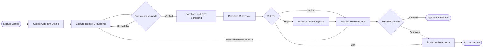

## SIGNUP — Signup Started

> A prospective customer begins an application through the web or mobile channel.

The application record is created on the first keystroke, not on submit. Partial applications are the single richest source of drop-off data, and discarding them means never learning where onboarding actually loses people.

| Captured | Purpose |
| --- | --- |
| Channel and device | Attribution and fraud signal |
| Timestamp | Regulatory record of first contact |
| Partial form state | Resume, and drop-off analysis |

**Owner:** Growth · **Emits:** `application.started`

## COLLECT — Collect Applicant Details

> Gathers legal name, date of birth, residential address, and tax identifiers.

Only what is legally required or operationally necessary is collected. Every additional field costs conversion measurably, so each one must be justified by a regulation or a decision it actually feeds.

- Legal name exactly as it appears on the identity document
- Date of birth, validated for the minimum age
- Residential address, normalised and checked for deliverability
- Tax identification number where the jurisdiction requires it

**Owner:** Onboarding · **Target:** under 3 minutes for the applicant

## DOCS — Capture Identity Documents

> The applicant photographs a government identity document and completes a liveness check.

Capture happens on the device camera with real-time guidance, because the dominant cause of verification failure is a poor photograph rather than a fraudulent one. Glare, crop, and focus are checked before upload.

The liveness check binds the person present to the document, which is what distinguishes verification from a stolen document being photographed.

This step receives two loop-backs: unreadable documents, and manual reviews requesting additional evidence. Both re-enter here.

**Owner:** Onboarding · **Receives loop-backs from:** document verification, manual review

## VERIFY — Documents Verified?

> Automated checks confirm the document is genuine, unexpired, and matches the applicant.

Verification runs three independent checks: document authenticity against known security features, data consistency between the document and the submitted details, and a biometric match between the liveness capture and the document photograph.

An unreadable submission is not a failure and is never treated as one. It returns to capture with a specific instruction, such as which corner was cut off. A genuine mismatch escalates rather than looping.

**Owner:** Identity operations · **Loops back to:** Capture Identity Documents

## SCREEN — Sanctions and PEP Screening

> The verified identity is screened against sanctions, watchlists, and politically exposed person lists.

Screening is mandatory and non-negotiable regardless of risk tier. It runs against the consolidated lists on every onboarding and is re-run periodically for the life of the relationship.

Fuzzy matching produces false positives by design, since the cost of a missed true match vastly exceeds the cost of a manual review. Every hit is adjudicated by a human and the adjudication is recorded permanently.

**Owner:** Compliance · **Regulatory basis:** anti-money-laundering obligations

## RISK — Calculate Risk Score

> A composite score is computed from geography, product, channel, screening results, and behaviour.

The model is deliberately explainable. A regulator, or a refused applicant, may ask why a decision was made, and "the model said so" is not a defensible answer.

| Factor | Weight |
| --- | --- |
| Jurisdiction risk rating | High |
| Product risk category | High |
| Screening adjudication outcome | High |
| Channel and device signals | Medium |
| Application behaviour anomalies | Medium |

**Owner:** Risk · **Property:** every score carries the factors that produced it

## TIER — Risk Tier

> The score routes the application to straight-through processing, manual review, or enhanced diligence.

Tiering is where the economics of onboarding are decided. The majority of applicants are low risk and should never meet a human, which is what makes it affordable to give genuine attention to the minority who need it.

Thresholds are reviewed quarterly against outcomes. A tier that never produces a refusal is set too loose; one that refuses good customers is set too tight.

**Owner:** Risk and Compliance · **Distribution target:** roughly 80% low, 15% medium, 5% high

## EDD — Enhanced Due Diligence

> High risk applications receive deeper investigation before any human review decision.

Enhanced diligence establishes source of funds and source of wealth, identifies beneficial ownership where the applicant is an entity, and gathers adverse media coverage.

This is slow, expensive, and correct. Rushing it is precisely how institutions end up in enforcement actions.

- Source of funds and source of wealth evidence
- Beneficial ownership to the required threshold
- Adverse media search across relevant jurisdictions and languages

**Owner:** Compliance · **Typical duration:** 3 to 10 business days

## MANUAL — Manual Review Queue

> A trained analyst reviews the full case file and either decides or requests more information.

The analyst sees everything: the documents, the screening adjudications, the risk factors, and the enhanced diligence findings if any. Partial context produces poor decisions and inconsistent outcomes.

When the file is incomplete, the analyst requests specific additional evidence and the case returns to document capture. Requests name exactly what is needed, because a vague request produces another incomplete submission.

**Owner:** Compliance operations · **Loops back to:** Capture Identity Documents

## OUTCOME — Review Outcome

> The analyst's decision: approve the relationship, or refuse it.

The decision and its full reasoning are recorded permanently. This record is the institution's evidence of a defensible process, and it is the first thing an examiner asks for.

Refusals are subject to a second-analyst check, because a wrongly refused applicant has no easy route to appeal and the reputational cost is asymmetric.

**Owner:** Compliance operations · **Retention:** the statutory record-keeping period

## PROVISION — Provision the Account

> Systems create the account, apply limits appropriate to the risk tier, and enable products.

Provisioning is where the risk assessment becomes operational. Transaction limits, product eligibility, and monitoring sensitivity are all set from the tier assigned earlier, so risk is expressed as controls rather than as a filed document.

Low-tier applicants arrive here directly from tiering without human involvement, which is the straight-through path the whole design optimises for.

**Owner:** Platform · **Target:** under 30 seconds

## ACTIVATE — Account Active

> The customer receives credentials, completes first login, and the relationship begins.

Activation completes onboarding and starts ongoing monitoring. Screening re-runs on a schedule, transaction monitoring begins immediately, and the risk score is refreshed as real behaviour accumulates.

The onboarding assessment is a starting position, not a permanent verdict. Behaviour after activation is more informative than anything gathered before it.

**Owner:** Onboarding · **Terminal state**

## REFUSED — Application Refused

> The application is declined and the applicant is notified within the regulatory window.

The notification says what is legally permitted, which in many jurisdictions is deliberately limited to avoid tipping off. Analysts do not improvise here; the wording is pre-approved by legal.

The full case file is retained for the statutory period. Refusal is a record-keeping obligation, not a deletion event.

**Owner:** Compliance · **Terminal state**
