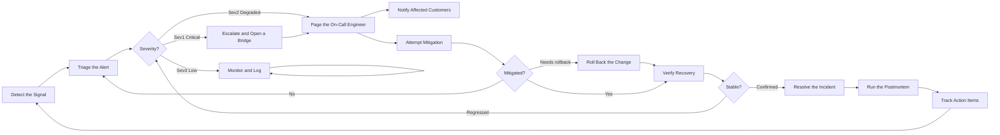

## DETECT — Detect the Signal

> Monitoring, synthetic checks, or a customer report indicate something is wrong in production.

Detection sources are ranked by how much they cost the business. An alert that fires before customers notice is worth far more than one that confirms what support already knows.

| Source | Typical share | Median time to detect |
| --- | --- | --- |
| Automated alerting | 70% | under 2 minutes |
| Synthetic monitoring | 15% | under 5 minutes |
| Customer report | 15% | 20 minutes or more |

This step also receives the outer loop: postmortem action items that improve detection land here as new or tuned alerts.

**Owner:** Platform · **Receives loop-backs from:** action item tracking

## TRIAGE — Triage the Alert

> A responder establishes what is broken, for whom, and how badly, before doing anything else.

Triage answers three questions: which user-facing capability is affected, what proportion of users are affected, and is it getting worse. Everything else can wait.

The strongest temptation in an incident is to start fixing before understanding, which routinely makes things worse. Triage exists specifically to resist that.

This step also receives failed mitigations. A mitigation that did not work means the diagnosis was wrong, so the correct response is to re-triage rather than to try another fix.

**Owner:** On-call responder · **Receives loop-backs from:** failed mitigation

## SEV — Severity?

> Classifies the incident, which determines who is woken up and how fast.

Severity is defined by customer impact, not by technical alarm. A crashed background worker nobody depends on is not a Sev1; a checkout that fails for 2% of users is.

- **Sev1** — critical function unavailable or data at risk; page immediately, open a bridge
- **Sev2** — degraded experience or a partial outage; page the on-call engineer
- **Sev3** — minor or contained; monitor and handle in business hours

Responders are explicitly authorised to over-classify. Downgrading later is cheap; discovering at hour three that this was always a Sev1 is not.

**Owner:** On-call responder · **Receives loop-backs from:** verification, when the fix regressed

## MONITOR — Monitor and Log

> Low severity issues are recorded and watched on a timer rather than escalated.

This step deliberately loops on itself. A Sev3 is re-checked on an interval, and the loop continues until it either resolves on its own or crosses a threshold that justifies escalation.

Sev3s are not ignored, they are queued. The log entry carries enough context that whoever picks it up in business hours does not start from nothing.

**Owner:** On-call responder · **Self-loop:** re-checked every 30 minutes

## ONCALL — Page the On-Call Engineer

> The service owner is paged with the triage summary already attached.

The page carries the triage findings, not just an alert name. An engineer woken at 3am should not have to reconstruct what a responder already established.

Acknowledgement is expected within five minutes. Unacknowledged pages escalate automatically to the secondary, then to the manager, because a page nobody answers is worse than no page at all.

**Owner:** Service owner · **Acknowledgement target:** 5 minutes

## ESCALATE — Escalate and Open a Bridge

> Sev1 incidents open a coordination bridge with an incident commander and defined roles.

The commander coordinates and does not debug. The moment the commander starts typing into a terminal, coordination stops, and coordination is the scarce resource in a large incident.

Roles are named explicitly at the start: commander, operations lead, communications lead, and scribe. Ambiguous roles produce duplicated work and dropped threads.

**Owner:** Incident commander · **Applies to:** Sev1 only

## COMMS — Notify Affected Customers

> Customer communication runs in parallel with the technical response, not after it.

The first update goes out before the cause is known, because customers care about acknowledgement and expected duration far more than root cause. Silence is interpreted as incompetence.

Updates follow a fixed cadence for the incident's duration, even when the update is that there is nothing new. A predictable rhythm is itself reassuring.

**Owner:** Communications lead · **Cadence:** every 30 minutes for Sev1

## MITIGATE — Attempt Mitigation

> Restore service by the fastest available means, which is rarely the same as fixing the bug.

Mitigation is explicitly not a fix. Failing over, shedding load, disabling a feature flag, or scaling out all restore service without understanding the defect, and understanding can happen once users are unblocked.

Every action is announced on the bridge before it is taken and recorded by the scribe. Two responders independently changing the same system is a common way to turn one incident into two.

**Owner:** Operations lead · **Principle:** restore first, understand second

## WORKED — Mitigated?

> Did service actually recover, and if not, does the change need rolling back?

The judgement is made on the customer-facing signal, not on whether the intervention completed. A deploy that succeeded while the error rate stayed flat has not mitigated anything.

Three outcomes: recovery confirmed, mitigation ineffective and the diagnosis must be revisited, or the incident is attributable to a recent change and rollback is the fastest safe path.

**Owner:** Operations lead · **Loops back to:** Triage the Alert

## ROLLBACK — Roll Back the Change

> Revert to the last known good state when a recent deployment is the probable cause.

Rollback is preferred over forward-fixing during an active incident. A forward fix is untested code written under pressure by tired people, which is how second incidents are created.

The rollback path is rehearsed in normal operations. A rollback executed for the first time during a Sev1 is not a rollback plan, it is an experiment.

**Owner:** Operations lead · **Target:** under 5 minutes

## VERIFY — Verify Recovery

> Confirm through independent signals that service is genuinely restored for real users.

Verification uses signals independent of whatever was changed. If a cache was flushed to mitigate, verification cannot rely on that cache's own metrics.

The bar is real user traffic behaving correctly, sustained for long enough to rule out a transient recovery. A metric that recovers for ninety seconds and then degrades again has not recovered.

**Owner:** Operations lead · **Minimum observation:** 15 minutes of clean signal

## STABLE — Stable?

> A sustained-recovery gate before anyone is allowed to declare the incident over.

Declaring victory early is one of the most common incident-response failures. It sends responders back to bed, dissolves the bridge, and forces a cold restart when the problem returns twenty minutes later.

A regression routes back to severity classification rather than to triage, because a recurrence often warrants a higher severity than the original.

**Owner:** Incident commander · **Loops back to:** Severity?

## RESOLVE — Resolve the Incident

> The incident is formally closed, the bridge stands down, and a final customer update is sent.

Closure is explicit and announced. Responders need a clear end so that on-call rotation and fatigue can be managed honestly.

The final customer update confirms resolution and commits to a follow-up if the incident warrants a public writeup.

**Owner:** Incident commander · **Emits:** the incident record with a full timeline

## POSTMORTEM — Run the Postmortem

> A blameless review of what happened, why the system allowed it, and what would have caught it sooner.

Blameless means the analysis targets the system rather than the individual. People act reasonably given the information and tooling available to them; if the outcome was bad, the information or tooling was inadequate.

The postmortem is scheduled within five business days, while memory is accurate, and the incident timeline is reconstructed from the scribe's log rather than from recollection.

**Owner:** Service owner · **Timebox:** within 5 business days

## ACTIONS — Track Action Items

> Action items get owners and due dates, and are tracked to completion like any other work.

An untracked action item is a postmortem that changed nothing. Each item has a single named owner, a due date, and a place in the normal backlog rather than a separate document nobody reopens.

Detection-related actions close the outer loop of this diagram, feeding directly back into the alerting that starts the next incident earlier.

**Owner:** Service owner · **Loops back to:** Detect the Signal
