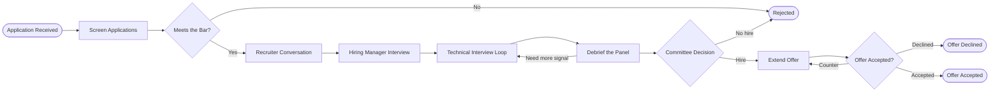

## APPLY — Application Received

> A candidate applies directly, is referred by an employee, or is sourced by a recruiter.

Every application enters the same pipeline regardless of source. Referrals and sourced candidates get faster response times but not a lower bar, which is the distinction that keeps referral programmes from quietly degrading hiring quality.

| Source | Typical share | Response target |
| --- | --- | --- |
| Direct application | 60% | 5 business days |
| Employee referral | 25% | 2 business days |
| Sourced | 15% | 2 business days |

**Owner:** Recruiting · **Emits:** an application record with the source attributed

## SCREEN — Screen Applications

> A structured review of the written application against the role's defined must-haves.

Screening uses the requirements written before the role opened, not impressions formed while reading. The must-haves are agreed with the hiring manager up front precisely so this step cannot drift.

- Evidence of the core competency, in any form
- No hard blockers such as work authorisation or location constraints the role cannot accommodate
- A second reviewer on every rejection near the line

**Owner:** Recruiting · **Target:** under 10 minutes per application

## FIT — Meets the Bar?

> The first real gate: is there enough evidence to justify the candidate's and the panel's time?

The question is not whether this person will get the job. It is whether a conversation is a reasonable use of an hour on both sides. Screening in too generously wastes candidate time, which is the more expensive error.

Rejections at this stage are sent within the response target with a clear, non-generic message. A candidate who is rejected well often applies again or refers someone.

**Owner:** Recruiting · **Outcome:** advance, or reject with a written reason

## RECRUITER — Recruiter Conversation

> A 30 minute call covering motivation, logistics, compensation range, and role expectations.

This call exists to surface mismatches early. Compensation range, location expectations, and start date are discussed explicitly, because discovering a gap at the offer stage wastes everyone's investment.

The recruiter also sells honestly: what the team is actually like, what is hard about the role, and what the first six months look like. Overselling here produces regretted attrition later.

**Owner:** Recruiting · **Duration:** 30 minutes

## HM — Hiring Manager Interview

> The hiring manager assesses experience depth, ways of working, and specific role fit.

The manager probes actual past work rather than hypotheticals. The most reliable predictor available in an interview is a detailed account of something the candidate genuinely did, examined closely enough that fabrication becomes obvious.

The manager also owns the candidate's experience from here on. A candidate should always know what happens next and when.

**Owner:** Hiring manager · **Duration:** 45 to 60 minutes

## LOOP — Technical Interview Loop

> Three to four structured interviews, each assessing one competency with a defined rubric.

Interviewers are assigned non-overlapping competencies so the panel gathers independent evidence rather than four opinions on the same thing. Each interviewer writes their assessment before seeing anyone else's, which prevents the first strong opinion from anchoring the rest.

Every candidate for the same role gets the same structure. Consistency is what makes comparison across candidates meaningful, and it is also the main defence against bias.

**Owner:** The interview panel · **Loops back from:** the debrief, when a competency was not adequately covered

## DEBRIEF — Debrief the Panel

> Interviewers meet, present their written evidence, and identify gaps in the assessment.

Written assessments are submitted before the meeting and are not editable afterwards. The discussion is about evidence, not impressions, and interviewers are expected to say when they lack signal rather than filling the gap with instinct.

When a competency genuinely was not assessed, the panel schedules one additional targeted interview rather than guessing. This loop is used sparingly, because an endless loop is its own answer.

**Owner:** Hiring manager · **Loops back to:** Technical Interview Loop

## DECIDE — Committee Decision

> A committee independent of the hiring manager makes the final hire or no-hire call.

Separating the decision from the hiring manager protects against the pressure of an open role. A manager who needs someone now is not the ideal judge of whether this particular person clears the bar.

The committee reviews written evidence against the rubric, not the panel's enthusiasm. The default is no hire, and the evidence must move it.

**Owner:** Hiring committee · **Default:** no hire, absent clear evidence

## OFFER — Extend Offer

> Compensation is set from the levelling guide and the offer is delivered verbally, then in writing.

The level comes from the panel's evidence and the levelling guide, not from what the candidate currently earns. The verbal conversation happens first so the candidate hears the reasoning and can ask questions before receiving a document.

Counters return to this step. Room to move is agreed with finance before the first offer, so a counter can be answered in days rather than weeks.

**Owner:** Recruiting and hiring manager · **Receives loop-backs from:** the negotiation

## NEGOTIATE — Offer Accepted?

> The candidate accepts, counters, or declines, and the counter path loops back to the offer.

Most negotiations are about one or two specific things: base compensation, start date, or a particular commitment about the role. Identifying which one it is, rather than assuming it is money, resolves most cases quickly.

A decline is recorded with its reason. A pattern of declines for the same reason is data about compensation bands or role design, not about individual candidates.

**Owner:** Recruiting · **Loops back to:** Extend Offer

## REJECT — Rejected

> A terminal state reached from screening or from the committee decision.

Every rejected candidate receives a response. Candidates who reached the interview loop receive it from a human, with enough substance to be useful, delivered within two business days of the decision.

Rejection is not permanent. Candidates who were close are flagged for future roles with a note explaining what would change the answer.

**Owner:** Recruiting · **Terminal state**

## DECLINED — Offer Declined

> The candidate turns down the offer and the requisition returns to the pipeline.

The declined reason is captured accurately, including when it is unflattering. Aggregated over a quarter, these reasons are the clearest available signal about competitiveness.

The relationship is maintained. A candidate who declined once and had a good experience is a strong future prospect and an even better referral source.

**Owner:** Recruiting · **Terminal state**

## ACCEPTED — Offer Accepted

> The candidate signs, and the process hands off to onboarding.

Acceptance is the start of a new risk window rather than the end of the process. The gap between signing and starting is where counter-offers and second thoughts happen, so contact continues through it.

The requisition closes and the panel receives the outcome, which is how interviewers calibrate over time.

**Owner:** Recruiting · **Terminal state**
