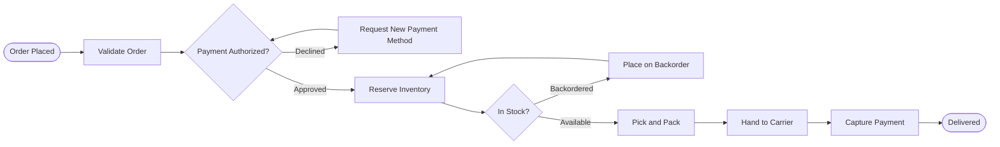

## START — Order Placed

> The customer has confirmed the cart, shipping address, and payment method at checkout.

The storefront writes an immutable order record and emits an `order.placed` event. Everything downstream reads from that record rather than from the session, so a customer closing the browser never loses an order.

| Field | Source |
| --- | --- |
| Line items | Cart service |
| Shipping address | Address book or guest form |
| Payment token | Gateway vault reference |

**Owner:** Storefront team · **Target:** under 2 seconds at p95

## VALIDATE — Validate Order

> Checks addresses, availability signals, pricing, and fraud score before any money moves.

Validation is intentionally cheap and runs before authorization, so obviously bad orders never reach the payment gateway and never count against authorization rate limits.

- Address normalization and deliverability check
- Repricing against the current catalog to catch stale cart prices
- Fraud score from the risk service; anything above the threshold routes to manual review

**Owner:** Order management · **Failure mode:** rejected orders return to the cart with a specific reason code.

## AUTH — Payment Authorized?

> The gateway places a hold on the full order total, including tax and shipping.

Authorization is a hold, not a charge. Funds are captured later, only once the parcel is actually handed to the carrier, which keeps the business on the right side of card network rules about charging before shipment.

Declines split into two groups. Soft declines (insufficient funds, temporary issuer block) are worth retrying with the same instrument. Hard declines (stolen card, closed account) must not be retried and route straight to a new payment method.

**Owner:** Payments · **Target:** under 1.5 seconds at p95

## RETRY — Request New Payment Method

> Asks the customer for a different card after a decline, then re-attempts authorization.

The customer receives an email and an in-app prompt with the decline reason expressed in plain language. The order stays open for 72 hours, holding its place in the fulfillment queue, before it is cancelled automatically.

This is a genuine loop: a customer may cycle through several instruments. The loop is capped at five attempts to avoid triggering issuer fraud heuristics.

**Owner:** Payments · **Loops back to:** Payment Authorized?

## RESERVE — Reserve Inventory

> Places a soft hold on each line item in the warehouse nearest the destination.

Reservation is what stops two customers buying the last unit. The hold is soft and expires after 30 minutes, so an abandoned or failed order releases stock automatically rather than requiring a compensating transaction.

Allocation prefers the warehouse that can ship the whole order in one parcel, falling back to a split shipment only when no single site holds everything.

**Owner:** Inventory · **Target:** under 500 milliseconds

## STOCK — In Stock?

> Confirms that every reserved line item is physically available at the allocated warehouse.

The reservation is optimistic and reads from the inventory ledger. This gate reconciles against the actual bin count, which can differ after damage, shrinkage, or a mis-scan on receipt.

A partial shortfall does not fail the order. Available lines proceed to picking while short lines go to backorder, and the customer is told exactly which items are delayed.

**Owner:** Inventory · **Failure mode:** short lines route to backorder rather than cancelling.

## BACKORDER — Place on Backorder

> Holds unavailable lines and re-attempts reservation when the replenishment shipment lands.

The customer is notified with a projected availability date drawn from the open purchase order. They can cancel the backordered lines at any point without affecting the lines already shipping.

When replenishment is received, the backorder queue is drained oldest-first, and each order re-enters reservation.

**Owner:** Inventory · **Loops back to:** Reserve Inventory

## PICK — Pick and Pack

> Warehouse staff pick each line, verify it by scan, and pack it into a right-sized carton.

Every unit is scanned at pick and again at pack. The double scan is the single largest driver of the mis-ship rate, so it is never skipped, even for single-line orders.

Cartonization picks the smallest box that fits, which reduces both dimensional-weight shipping cost and damage in transit.

**Owner:** Fulfillment · **Target:** same day for orders placed before the cut-off

## SHIP — Hand to Carrier

> The parcel is manifested, labelled, and physically transferred to the carrier.

The handoff scan is the legal and financial moment of shipment. It is what unlocks payment capture and starts the delivery clock the customer was quoted.

Manifest data goes to the carrier before the truck leaves, so tracking is live by the time the customer receives the shipment notification.

**Owner:** Fulfillment · **Emits:** `order.shipped`

## CAPTURE — Capture Payment

> Converts the existing authorization hold into an actual charge for the shipped amount.

Capture is for the shipped amount, not the ordered amount. A split or partial shipment captures only what left the building, and the remaining authorization stays open for the rest.

If the authorization has expired (holds typically last seven days), capture fails and the payment service re-authorizes silently before retrying.

**Owner:** Payments · **Failure mode:** re-authorize, then retry; escalate after two failures.

## DELIVERED — Delivered

> The carrier confirms delivery and the order reaches its terminal state.

Delivery confirmation closes the order, starts the return window, and releases the record to the analytics warehouse.

Post-delivery events such as returns, refunds, and warranty claims are handled by a separate flow and never reopen this one.

**Owner:** Order management · **Terminal state**
