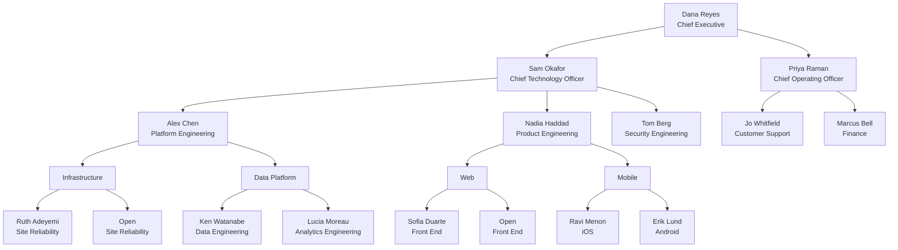

## CEO — Dana Reyes, Chief Executive

> Accountable for the company's direction, and the only role every other line eventually reports through.

Sets the annual objectives the rest of this chart is organised around, and owns
the two decisions nobody below can make alone: what the company will not do, and
where the next round of headcount goes.

| Reports | Scope |
| --- | --- |
| Chief Technology Officer | Everything that ships |
| Chief Operating Officer | Everything that keeps it running |

**Span of control:** 2 direct · **Reviews:** weekly with each direct

## CTO — Sam Okafor, Chief Technology Officer

> Owns what gets built and the technical direction it is built along.

Runs three engineering groups split by what they are accountable for rather than
by technology: the platform others build on, the product customers touch, and
the security posture both depend on.

- Owns the architecture review forum and its decision records
- Signs off anything that changes a system of record
- Holds the engineering hiring bar

**Span of control:** 3 direct · **Skip-levels:** monthly

## COO — Priya Raman, Chief Operating Officer

> Owns the operational side of the business: the customers already here, and the money.

Where the CTO's groups are organised around building, these are organised around
running. The split matters at review time: engineering is measured on delivery,
operations on retention and margin.

**Span of control:** 2 direct

## PLATFORM — Alex Chen, Platform Engineering

> Builds and runs what every other engineering group depends on.

Platform's customers are internal. Its work is judged on whether product teams
can ship without filing a ticket, which is why it owns both infrastructure and
the data platform rather than either in isolation.

**Owns:** build and deploy pipeline, environments, the data platform
**Target:** under ten minutes from merge to production

## PRODUCTENG — Nadia Haddad, Product Engineering

> Builds what customers actually touch, across web and mobile.

Split by surface rather than by feature, so each team owns its whole experience
end to end and can be held to it.

**Owns:** the customer-facing application · **Paired with:** Design and Product

## SECURITY — Tom Berg, Security Engineering

> Owns the security posture, and the authority to stop a release.

Deliberately reports to the CTO rather than into a delivery group, so that
stopping a release never costs someone their own team's deadline.

- Threat modelling on any design touching customer data
- Vulnerability management and the disclosure process
- The security review gate in the release pipeline

**Escalation:** direct to the Chief Executive when a release is held

## INFRA — Infrastructure

> Runs the compute, network, and environments everything else sits on.

Measured on availability and on how rarely anyone outside the team needs to
think about it. Carries the production on-call rotation.

**Target:** 99.9% availability · **On-call:** follow-the-sun

## DATA — Data Platform

> Owns the pipelines, the warehouse, and the definitions everyone reports against.

The definitions matter more than the pipelines: two teams computing "active
customer" differently is the failure this group exists to prevent.

**Owns:** ingestion, the warehouse, the metric layer

## WEB — Web

> Builds and runs the browser experience.

Owns its own performance budget and accessibility conformance rather than
delegating either, so both are release-blocking rather than aspirational.

**Target:** Core Web Vitals in the good band at p75

## MOBILE — Mobile

> Builds and runs the iOS and Android applications.

Ships on the app stores' timetable rather than the company's, which is why
release planning is owned here rather than centrally.

**Cadence:** fortnightly release train

## SUPPORT — Jo Whitfield, Customer Support

> First contact for customers, and the earliest signal that something is wrong.

Support sees production failures before monitoring does more often than anyone
is comfortable with, so its escalation path into engineering is direct.

**Owns:** the escalation path into engineering · **Target:** first response in one hour

## FINANCE — Marcus Bell, Finance

> Owns billing, revenue recognition, and the operating plan.

Sets the budget envelope that the rest of this chart is staffed within, and owns
the invoicing path that engineering's payment work feeds.

**Owns:** the operating plan, billing, and revenue reporting

## INFRA1 — Ruth Adeyemi, Site Reliability

> Carries the production on-call rotation and owns the incident review that follows.

Permanent staff. Owns the runbooks the rotation depends on, which is why the
role is filled rather than contracted: the knowledge has to stay in the team
between incidents.

**Reports to:** Infrastructure · **On-call:** primary rotation

## INFRA2 — Open, Site Reliability

> An open position: the second seat on the rotation, approved and unfilled.

A single-person rotation is not a rotation. This seat is funded in the current
plan and is the team's first constraint on taking further services.

**Status:** open, approved · **Blocks:** widening the on-call rotation

## DATA1 — Ken Watanabe, Data Engineering

> Owns the ingestion pipelines and the freshness guarantees reporting depends on.

Permanent staff. Works to the definitions the Data Platform group holds, and is
the escalation point when a pipeline lands late.

**Reports to:** Data Platform · **Target:** warehouse fresh within 15 minutes

## DATA2 — Lucia Moreau, Analytics Engineering

> On contract: builds the metric layer models the business reports against.

A contract engagement with a defined end, scoped to the metric layer rebuild.
Anything that must outlive the engagement is documented as it is built rather
than at the end.

**Status:** contract · **Ends:** with the metric layer rebuild

## WEB1 — Sofia Duarte, Front End

> Owns the browser experience, its performance budget, and its accessibility conformance.

Permanent staff. Holds both budgets as release-blocking rather than
aspirational, which is the reason they are owned here rather than centrally.

**Reports to:** Web · **Target:** Core Web Vitals in the good band at p75

## WEB2 — Open, Front End

> An open position: the second front-end seat, approved for the current plan.

The web surface is currently one deep. This seat exists so that a single
absence does not stop the release train.

**Status:** open, approved · **Blocks:** removing the single point of failure

## MOBILE1 — Ravi Menon, iOS

> Owns the iOS application and its place in the fortnightly release train.

Permanent staff. Owns App Store review turnaround as part of release planning,
which is why planning sits with the team rather than centrally.

**Reports to:** Mobile · **Cadence:** fortnightly

## MOBILE2 — Erik Lund, Android

> On contract: owns the Android application through the current release train.

A contract engagement covering Android delivery while the permanent role is
being recruited. Release knowledge is written down as it is used, so the
handover is not an event.

**Status:** contract · **Handover:** documented as it is built
