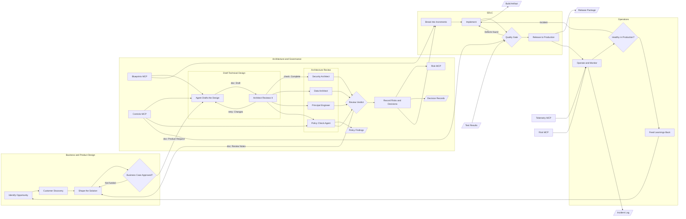

## OPP — Identify Opportunity

> A market signal, customer request, or strategic bet enters the funnel as a candidate opportunity.

Opportunities arrive from sales conversations, support ticket clusters, competitive moves, and the operations feedback loop at the far end of this diagram. They are logged in one place regardless of source, so the funnel reflects reality rather than whoever shouted loudest.

Each entry carries a one-line problem statement, the segment affected, and a rough revenue or retention hypothesis. Nothing more, because most opportunities die here and elaborate write-ups are wasted effort.

**Owner:** Product · **Cadence:** reviewed weekly

## DISCOVER — Customer Discovery

> Direct research with real users to confirm the problem exists and is worth solving.

Discovery is where most opportunities are killed, and that is the point. The bar is evidence from customers who are not already advocates, gathered by someone who is willing to hear a no.

- Five to eight structured interviews with the target segment
- Review of existing support and churn data for corroboration
- A written summary of what would have to be true for this to be worth building

**Owner:** Product and Design · **Typical duration:** two to three weeks

## SHAPE — Shape the Solution

> Turns a validated problem into a bounded solution with an explicit scope and appetite.

Shaping fixes the time budget first and lets scope flex inside it, rather than fixing scope and letting time flex. The output is a written pitch: the problem, the shape of the solution, deliberately excluded scope, and the known rabbit holes.

This step is also where rejected architecture reviews and unfunded business cases land. Both are reshaping signals, not failures, and they arrive here with the specific objection attached.

**Owner:** Product and Design · **Receives loop-backs from:** business case, architecture review

## BCASE — Business Case Approved?

> The funding gate: does the projected value justify the appetite and the opportunity cost?

The case is deliberately coarse. Precision here is false comfort, since the estimates feeding it are themselves rough. What matters is whether this is clearly better than the next-best use of the same team for the same period.

| Input | Source |
| --- | --- |
| Expected value | Product, from discovery |
| Cost of delay | Product and Finance |
| Rough delivery cost | Engineering |

**Owner:** Product leadership · **Outcome:** funded, or returned to shaping with the specific gap named.

## DRAFT — Agent Drafts the Design

> Engineering writes the design: components, data flow, interfaces, and the migration path.

The design document targets a reader who is competent but unfamiliar. It states what is being built, which existing systems it touches, what it deliberately does not do, and which decisions are reversible versus one-way doors.

Where the change touches a shared interface or a system of record, the design names the affected teams explicitly so review can pull them in.

**Owner:** Engineering · **Reviewed by:** the architecture forum

## SECREV — Security Architect

> Reviews the design for the security posture it creates, and can hold it alone.

Looks at what the design exposes, what it trusts, and where customer data comes
to rest. Holds a veto rather than a vote: a design that widens the attack
surface without saying so does not go forward on a majority.

**Asks:** what is newly exposed, what is newly trusted, where does the data rest

## DATAREV — Data Architect

> Reviews what the design does to the data: ownership, duplication, and the definitions everyone reports against.

The question is rarely whether the data can be moved. It is who owns it
afterwards, whether a second copy of a system of record has just been created,
and whether an existing metric quietly changes meaning.

**Asks:** who owns it, is this a second copy, does a definition move

## PRINC — Principal Engineer

> Reviews whether the design can actually be built and run by the team that owns it.

The review most often skipped and most often right. Judges the design against
the team's real capacity and on-call load, not against an idealised one, and
against what the codebase looks like today.

**Asks:** can this team build it, can this team run it at 3am

## POLICY — Policy Check Agent

> Runs the mechanical checks before the people meet, so the forum spends its time on judgement.

Checks the draft against the standards catalogue, the approved technology list,
the data residency rules, and the decision register for a prior contradicting
decision. Everything here is checkable without judgement, which is exactly why
a person should not be doing it.

**Runs:** on every draft, before the forum sits · **Blocks:** nothing on its own

## VERDICT — Review Verdict

> The four reviews come together: the design goes forward, or it goes back with notes.

Not a vote. The verdict records what each reviewer raised and what was decided
about it, which is what makes the notes usable when the work comes back.

A rejection returns to shaping rather than to design, because a design rejected
on architectural grounds usually needs its scope reconsidered rather than its
diagram redrawn. It goes back carrying the review notes, so the product team is
answering specific objections rather than guessing at them.

**Owner:** Architecture forum · **Goes back to:** Shape the Solution, with notes

## RISK — Record Risks and Decisions

> Approved designs record their architecture decisions and accepted risks in the permanent register.

Every approved design produces decision records naming the choice, the alternatives considered, and the reasoning. Six months later this is the only artifact that explains why the system looks the way it does.

Accepted risks are logged with an owner and a review date. An accepted risk with no owner is an ignored risk.

**Owner:** Architecture forum · **Artifact:** decision records and the risk register

## PLAN — Break Into Increments

> The approved design is decomposed into increments that each ship something usable.

Increments are sliced so each one can reach production independently. A slice that cannot ship alone is not a slice, it is a phase, and phases hide integration risk until the end.

Sequencing puts the riskiest technical unknown first, so a wrong assumption surfaces while there is still budget to respond to it.

**Owner:** Engineering · **Output:** an ordered increment plan

## BUILD — Implement

> Engineers build the increment, with tests written alongside the code rather than after it.

This step receives two loop-backs: defects found at the quality gate, and production incidents from operations. Both re-enter here because both are resolved by changing code, and routing them through planning again would only add latency.

Work in progress is capped so that finishing beats starting. A team with six things half-done has shipped nothing.

**Owner:** Engineering · **Receives loop-backs from:** quality gate, production health

## VERIFY — Quality Gate

> Automated and exploratory testing decide whether the increment is fit to release.

The gate is automated wherever the answer is objective: tests, coverage thresholds, security scanning, and performance budgets. Exploratory testing covers what automation cannot, which is whether the thing is actually good.

Defects found here return to implementation with a reproduction, not a description. A defect report without a reproduction is a rumour.

**Owner:** Engineering and QA · **Loops back to:** Implement

## RELEASE — Release to Production

> The increment is deployed behind a flag and rolled out progressively.

Release and launch are separated. Code reaches production behind a flag, is verified in the real environment, then is exposed to a small percentage of traffic before general availability.

Rollback is rehearsed, not theorised. A release path whose rollback has never been executed is a release path with an unknown rollback.

**Owner:** Engineering · **Target:** rollback in under five minutes

## OPERATE — Operate and Monitor

> The team that built it runs it, with alerting tied to user-visible behaviour.

Monitoring watches what users experience, not just what servers report. A healthy CPU graph next to a broken checkout is a monitoring failure.

- Service level objectives with explicit error budgets
- Alerts that page only for conditions a human must act on now
- A dashboard that answers "is it working" in one screen

**Owner:** The delivery team · **Principle:** you build it, you run it

## HEALTH — Healthy in Production?

> Continuous judgement on whether the change is behaving as designed under real load.

Health is assessed against the objectives set at design time, not against a general sense of things being fine. Error budget burn, latency at the tail, and the support ticket rate are the three signals that matter most.

An unhealthy verdict routes straight back to implementation, carrying the incident context with it. This is the longest loop in the diagram and the most important one.

**Owner:** The delivery team · **Loops back to:** Implement

## LEARN — Feed Learnings Back

> What was learned in production becomes the next opportunity, closing the outer loop.

This is the step organisations skip, and skipping it is why the same mistakes recur. Production reveals things discovery could not: which features go unused, where users get stuck, and which assumptions were wrong.

Findings are written as new opportunities and enter the funnel on equal footing with any other candidate, which keeps the lifecycle a cycle rather than a pipeline.

**Owner:** Product · **Loops back to:** Identify Opportunity

## CRITIQUE — Architect Reviews It

> A person reads what the agent drafted and either sends it back with changes or passes it on.

The draft comes from an agent working from the product request; the judgement
about whether it is right does not. This is the loop where most of the design
actually happens: the agent is fast at producing a complete document and poor at
knowing which constraints matter here, and the architect is the reverse.

| Sent back for | Passed on when |
| --- | --- |
| A constraint the agent could not know | The trade-offs are stated, not just the choice |
| A trade-off asserted rather than argued | Every system of record it touches is named |
| An integration the draft invented | The risks are ones the review can act on |

**Owner:** Architecture · **Typical loops:** two or three before it goes forward
